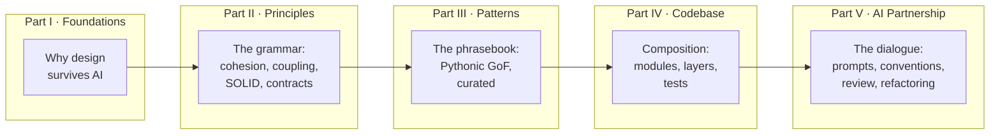
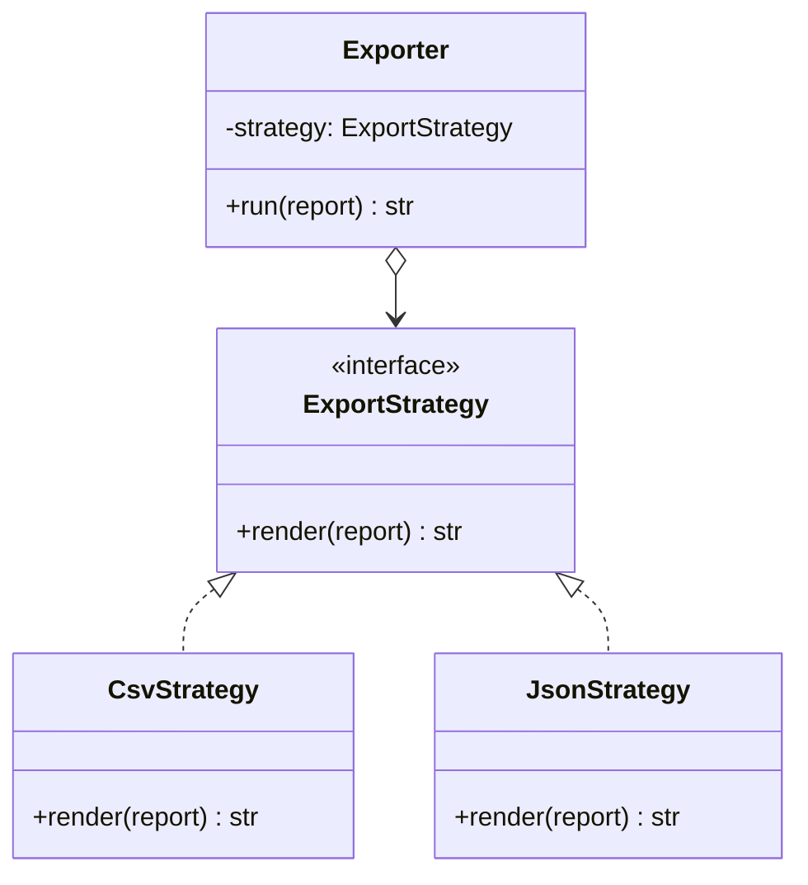

# Book Design Document

## *Software Design for Programmers & AI Coding Agents*

> **Working subtitle:** *A Shared Vocabulary for Building Clean, Sustainable Codebases — With Humans and AI as Partners*

**Format:** Astro Starlight site · Mermaid diagrams · Python 3.10+ examples
**Scope:** Codebase-level design (functions, classes, modules, packages) — *not* distributed-systems architecture
**Audience:** Intermediate programmers who code with AI assistants (Claude Code, Copilot, etc.) and want to direct them with precision

---

## 1. The Thesis (What Makes This Book Unique)

Ronald Mak's book teaches design to a human writing code by hand. This book starts from a different premise:

> **Design vocabulary is a communication protocol.** Pattern names, principle names, and design terms are *compression* — one precise word transmits an entire structural intent. This vocabulary is time-tested, language-portable, and — crucially — **shared between humans and AI coding agents**, because agents were trained on the same decades of literature.

Three consequences shape the whole book:

1. **Naming is leverage.** "Refactor this to the Strategy pattern with functions as strategies" achieves in one sentence what fifty lines of vague natural language cannot. The reader learns design concepts *and* the exact phrases that activate them in an agent.
2. **Review is the new core skill.** When an agent writes most of the code, the human's job shifts from *typing* to *judging*. Every concept is taught with a review lens: how to recognize it done well, done badly, and over-applied.
3. **Right-sizing is the recurring discipline.** AI agents' most common design sin is *over-engineering* — premature abstractions, unnecessary interfaces, pattern-for-pattern's-sake. The book teaches "when NOT to use" as rigorously as "when to use."

### Positioning vs. Mak's *Software Design for Python Programmers*

| Dimension | Mak's book | This book |
|---|---|---|
| Audience | Human writing code by hand | Human + AI agent pair |
| Patterns | GoF translated to Python, class-heavy | Pythonic-first (functions, protocols, generators, `match`) |
| UML | Primary diagram language | Mermaid (renders natively in docs, agents can read/write it) |
| Requirements/use cases | Two full chapters | Out of scope (codebase-level focus) |
| Recursion/threading | Two chapters | Dropped (algorithms, not design vocabulary) |
| Codebase structure | Not covered | Part IV: modules, packages, dependency direction, tiers |
| AI collaboration | One short section (§1.9) | The book's spine: every chapter + all of Part V |

---

## 2. Book Flow at a Glance



**Narrative arc:** *Why → Grammar → Phrasebook → Composition → Dialogue.*
Parts II–IV give the reader the language; Part V teaches them to *speak* it fluently with an agent. But the reader doesn't wait until Part V to practice — every chapter ends with an **🤖 AI Collaboration** section, so the dialogue skill builds continuously.

---

## 3. Full Table of Contents

### Part I — Foundations: Why Design Survives the AI Era

**Chapter 1 · Design Is Communication**
- 1.1 What is software design? (decisions about structure, made before and during coding)
- 1.2 The new audience: your code is read by humans, tools, *and* AI agents
- 1.3 Design vocabulary as compression — the protocol thesis
- 1.4 A taste: one prompt, two outcomes (vague prompt vs. design-vocabulary prompt, same agent)
- 1.5 What this book covers (codebase level) and what it doesn't (system architecture)
- 🤖 *AI Collaboration:* why agents respond to canonical names; the danger of agents' eagerness to please

**Chapter 2 · The Two Enemies: Change and Complexity**
- 2.1 All design serves one goal: keeping software *soft* (cheap to change)
- 2.2 Complexity: essential vs. accidental (Brooks) · **Ousterhout as named pillar** (*A Philosophy of Software Design*): complexity = "anything related to the structure of a software system that makes it hard to understand and modify the system"; understanding is the binding constraint
- 2.3 Ousterhout's three symptoms — **change amplification, cognitive load, unknown unknowns** — taught as *review vocabulary* (questions you can ask an agent verbatim: "does this diff amplify change?")
- 2.4 Coupling and cohesion — the two master metrics (intuition first, formalism in Part II)
- 2.5 Change leaks: how one edit ripples through a badly coupled codebase · complexity is *incremental* (Ousterhout's zero-tolerance argument; pairs with Ch 1's "unmade decisions accrete")
- 2.6 A worked disaster: a small reporting script grows into a tangle
- 2.7 Tactical vs. strategic programming (Ousterhout), AI-twisted: an unconstrained agent is the ultimate tactical programmer — strategy must come from you
- 🤖 *AI Collaboration:* agents amplify whatever structure exists — good or bad ("garbage in, garbage at scale")

**Chapter 3 · The Design Loop with an AI Partner**
- 3.1 Iteration was always the way (Mak's insight, accelerated)
- 3.2 The loop: *intend → express → generate → review → refine*
- 3.3 Where design thinking lives in each phase
- 3.4 Worked iteration: a task-tracker module, four rounds with an agent
- 3.5 Backtracking is cheap now — use it
- 🤖 *AI Collaboration:* prompts for each loop phase; asking the agent to *propose designs before writing code*

---

### Part II — Principles: The Grammar of Design

**Chapter 4 · Cohesion and the Single Responsibility Principle**
- One reason to change · god classes/modules · textual analysis (nouns → classes, verbs → methods) · cohesion at function, class, and module level
- 🤖 vocabulary: *"single responsibility," "split by responsibility," "one reason to change"*

**Chapter 5 · Coupling and the Principle of Least Knowledge**
- Types of coupling · Law of Demeter ("don't talk to strangers") · dependency direction · tell-don't-ask
- 🤖 vocabulary: *"loose coupling," "Law of Demeter violation," "tell, don't ask," "invert this dependency"*

**Chapter 6 · Encapsulation and Information Hiding**
- Public surface vs. private implementation · properties vs. getters/setters (Pythonic) · dangerous setters · "but is it really hidden?" (Python's consenting-adults convention) · information-hiding lineage: Parnas → Ousterhout, with a preview of **deep modules** (value = functionality behind the interface ÷ cost of the interface; full treatment in Ch 16)
- 🤖 vocabulary: *"hide the implementation," "narrow the public API," "make this immutable"*

**Chapter 7 · No Surprises: Least Astonishment and Contracts**
- Naming as contract · off-by-one and misnamed functions · performance surprises (list vs. tuple vs. array vs. generator) · preconditions, postconditions, invariants — lightweight contracts with type hints, assertions, and docstrings
- 🤖 vocabulary: *"precondition," "postcondition," "invariant," "fail fast," "make illegal states unrepresentable"*

**Chapter 8 · Extension Without Modification**
- Open-Closed Principle · Liskov Substitution (proper subclasses) · is-a vs. has-a · **composition over inheritance** · code to the interface · ABC vs. `Protocol` (when to use which) · dependency inversion in one page
- 🤖 vocabulary: *"open for extension," "Liskov violation," "prefer composition," "extract an interface (ABC)," "code to the interface"*

**Chapter 9 · The Counterweights: YAGNI, KISS, and Right-Sizing**
- Every principle has a failure mode when over-applied · premature abstraction · the three tiers (Simple / Modular / Full) and how to choose · over-engineering warning signs (interfaces with one implementation, pass-through layers, DTOs that mirror entities 1:1)
- 🤖 vocabulary: *"YAGNI," "keep it simple," "no premature abstraction," "right-size for a script/prototype"* — **this is the chapter readers will quote most at their agents**

---

### Part III — Patterns: The Phrasebook (Pythonic & Curated)

Each pattern chapter follows the standard template (§4 below). Chapters are grouped by the classic **Creational / Structural / Behavioral** triad (taught as vocabulary), and within each family patterns are paired by the *problem they solve*. Every chapter includes the Pythonic alternative that often beats the classical class-based form.

#### Creational

**Chapter 10 · Creating Objects: Factories and Singleton**
- Factory *function* first (the Pythonic default) · Factory Method when subclasses must decide · Abstract Factory for families · registries and `dict` dispatch as lightweight factories
- Singleton (demoted to a section here, deliberately): module-level instance as the Pythonic form; why agents over-use Singleton and how to push back

#### Structural

**Chapter 11 · Integrating and Simplifying: Adapter and Façade**
- Adapter: making third-party code fit your interface (`Protocol` shines here)
- Façade: one friendly door to a messy subsystem
- Both reframed through Ousterhout: a Façade is precisely a **depth-adding move** (simple interface over powerful functionality); an Adapter that adds no depth is a pass-through layer wearing a pattern name (ties back to Ch 9's warning-sign catalog)
- These two are the *most useful patterns for AI-era codebases* — agents constantly glue libraries together

**Chapter 12 · Structuring Objects: Composite and Decorator**
- Composite: uniform treatment of trees (report sections, file systems)
- Decorator pattern vs. Python's `@decorator` syntax — same idea, different mechanics; when each applies

#### Behavioral

**Chapter 13 · Encapsulating Algorithms: Strategy and Template Method**
- Strategy: classical form → **functions as strategies** (first-class functions make this trivial in Python) → when classes still win (stateful strategies)
- Template Method: the skeleton-algorithm pattern; ABC hooks
- Choosing between them (composition vs. inheritance, again)
- *Written first as the template/voice exemplar; was numbered Ch 10 before the triad regroup.*

**Chapter 14 · Reacting to Change: Observer and State**
- Observer: publish/subscribe at codebase scale; callbacks and `Event` patterns
- State: state machines as classes vs. `Enum` + `match` dispatch
- Mermaid `stateDiagram` as the design artifact

**Chapter 15 · Traversal and Dispatch: Iterator and Visitor — and Their Python Replacements**
- Iterator: the protocol (`__iter__`/`__next__`), generators as the idiomatic form
- Visitor: classical double-dispatch → structural `match` as the modern alternative

---

### Part IV — Codebase Design: Composing the Whole

**Chapter 16 · Modules and Packages as Design Units**
- A module is a cohesion boundary · public API via `__init__.py` and `__all__` · import hygiene (no circular imports, no deep reach-ins) · god modules · naming the layers of a package
- **Deep vs. shallow modules (Ousterhout) as the chapter's organizing metric**: a deep module offers much functionality behind a simple interface; a shallow one's interface costs as much as its implementation · glossary rows: *deep module*, *shallow module*
- The AI-era addition this book can own: **deep modules are token-efficient** — an agent can use one from its interface alone, without reading the implementation; shallow modules force every reader, human or agent, to page everything in. Depth was always good design; context windows made it measurable

**Chapter 17 · Dependency Direction and the Three Tiers**
- The dependency rule at codebase scale (stable things shouldn't depend on volatile things) · Simple tier (single module, functions) · Modular tier (`core/`, `infra/`, `api/`, constructor injection at boundaries) · Full tier (domain → application → adapters, composition root) · evolving *between* tiers as a project grows
- Mermaid dependency diagrams as living documentation

**Chapter 18 · Tests as Executable Design Contracts**
- Tests are the design document an agent can run · test pyramid at codebase scale · mocking interfaces (ABCs), not implementations · how good design makes testing easy — and how hard-to-test code is a design smell the agent can detect for you

---

### Part V — Designing with an AI Partner

**Chapter 19 · The Prompt Phrasebook: Expressing Design Intent**
- Anatomy of a design-aware prompt: *context + constraint + vocabulary + scope*
- Prompt patterns: "propose before coding," "explain the trade-off," "show me two designs," "apply pattern X but right-size it"
- Negative constraints matter: *"no new dependencies," "no new abstraction layers," "don't touch the public API"*
- The full vocabulary tables from Parts II–IV, consolidated

**Chapter 20 · Encoding Conventions: CLAUDE.md, AGENTS.md, and Skills**
- Why per-prompt instructions don't scale — persistent context does
- What belongs in an agent-conventions file: architecture tier, naming conventions, interface style (ABC + `I*` prefix or `Protocol`), dependency rules, forbidden patterns
- A complete worked example: conventions file for a Modular-tier Python project
- Design docs the agent can read: Mermaid diagrams in the repo as shared ground truth

**Chapter 21 · Reviewing AI-Generated Code Through Design Lenses**
- The review checklist, organized by Part II principles
- Agent failure-mode catalog: premature abstraction · god functions from "do everything" prompts · Singleton abuse · pass-through layers · duplicated-then-diverged code · plausible-but-wrong names
- Severity triage: what to fix now vs. later
- Asking the agent to review its own code — and why you still get the last word

**Chapter 22 · Refactoring as a Dialogue**
- Tidy-first: small structural changes before behavioral ones
- Finding seams · extracting interfaces · moving logic inward — each as a prompt pattern
- Incremental migration between tiers, with the agent doing the mechanical work
- A capstone walkthrough: refactoring a real-shaped messy module to Modular tier, full transcript-style dialogue

---

### Appendices

- **A · The Design Glossary-Phrasebook** — every term in the book: *definition → why it matters → exact prompt phrasing → anti-phrase (what to say to prevent over-application)*
- **B · Prompt Template Library** — copy-paste templates keyed to chapters
- **C · Mermaid Cookbook for Design Docs** — classDiagram, flowchart, stateDiagram, sequenceDiagram recipes used throughout the book
- **D · Building This Book: Astro Starlight Setup** — meta-appendix: how the book itself is built (Starlight + Mermaid + code tabs), so readers can replicate the publishing pipeline

---

## 4. The Chapter Template (Recurring Structure)

Consistency is itself a design statement — readers (and agents pointed at the book) should know exactly where to find things. Every *concept chapter* (Parts II–IV) follows this skeleton:

```
┌──────────────────────────────────────────────────────────────┐
│ 1. THE ITCH          A short, concrete pain scenario         │
│                      (from the running example or everyday   │
│                      dev tasks — domain-neutral)             │
│ 2. THE CONCEPT       Definition + Mermaid diagram            │
│ 3. BEFORE / AFTER    Python code: the tangle → the design    │
│ 4. PYTHONIC NOTES    How Python's features change the        │
│                      classical form (functions, Protocols,   │
│                      dataclasses, match, generators)         │
│ 5. WHEN NOT TO USE   Right-sizing: the over-application      │
│                      failure mode, with a counter-example    │
│ 6. 🤖 AI COLLABORATION                                       │
│    6a. Vocabulary table   term → what it tells the agent     │
│    6b. Prompt templates   2–4 copy-paste prompts             │
│    6c. Review checklist   what to verify in agent output     │
│    6d. Agent failure modes  known over/mis-applications      │
│ 7. TRY IT WITH YOUR AGENT   A hands-on exercise: give your   │
│                      agent a starter file + a prompt, then   │
│                      review the result against the checklist │
│ 8. KEY TAKEAWAYS     3–5 bullets + glossary terms added      │
└──────────────────────────────────────────────────────────────┘
```

Pattern chapters (Part III) extend section 2–3 with Mak-style sub-beats, which work well: *Desired design features → Before → After → Generic model (Mermaid classDiagram)* — plus a *"Choosing between X and Y"* section when the chapter pairs patterns.

### Worked sample of the template: Chapter 13 (Strategy), abridged

**1. The Itch.** Your report-export module supports three output formats (CSV, JSON, Markdown) via a growing `if/elif` chain inside one `export()` function. A fourth format request just arrived. Every addition risks the existing three.

**2. The Concept.**



**3. Before / After.** (`if/elif` chain → injected strategy.)

**4. Pythonic Notes.** In Python, a strategy is often just a function:

```python
from collections.abc import Callable

ExportStrategy = Callable[[Report], str]

def to_csv(report: Report) -> str: ...
def to_json(report: Report) -> str: ...

FORMATS: dict[str, ExportStrategy] = {
    "csv": to_csv,
    "json": to_json,
}

def export(report: Report, strategy: ExportStrategy) -> str:
    return strategy(report)
```

Reach for a class-based strategy only when the strategy carries state or needs multiple methods.

**5. When NOT to use.** Two stable branches that will never grow → keep the `if`. The pattern pays rent only when variation is *expected*.

**6. 🤖 AI Collaboration.**

| You say | The agent hears |
|---|---|
| "Refactor to the Strategy pattern" | Extract the varying algorithm behind a common interface; inject it |
| "Use functions as strategies" | Skip the class hierarchy; use callables + a registry dict |
| "Keep the dispatch table closed for modification" | New profiles register; existing code untouched (OCP) |

*Prompt template:*
> "This module selects behavior with an `if/elif` chain on `format`. Refactor to the **Strategy pattern using functions as strategies** and a registry dict. Keep the public function signature unchanged. Do **not** introduce new classes or dependencies. Show the diff and explain the trade-off in two sentences."

*Review checklist:* □ public API unchanged · □ each strategy independently testable · □ registry is the single growth point · □ no abstract base class unless strategies are stateful

*Agent failure modes:* builds a full ABC hierarchy for two functions (over-engineering) · invents a config system nobody asked for · renames the public function "for clarity."

**7. Try It.** Starter file `export.py` provided; run the prompt; grade the output against the checklist.

**8. Key Takeaways.** …

---

## 5. The "AI Vocabulary" Thread — How It Accumulates

The book's signature asset is **Appendix A**, but it's *built* chapter by chapter. Each chapter contributes rows; by the end the reader owns a complete phrasebook:

```
Chapter 4  ──► "single responsibility", "split by responsibility"
Chapter 5  ──► "loose coupling", "Law of Demeter", "tell don't ask"
Chapter 8  ──► "composition over inheritance", "code to the interface"
Chapter 9  ──► "YAGNI", "right-size this", "no premature abstraction"   ◄── the brakes
Chapter 13 ──► "Strategy pattern", "functions as strategies"
   ⋮                              ⋮
Appendix A ──► the consolidated glossary-phrasebook
```

Each glossary entry has **four fields** (this is the differentiator — most glossaries stop at two):

1. **Definition** — what the term means
2. **Why it matters** — the design force it addresses
3. **Prompt phrasing** — the exact words that reliably invoke it in an agent
4. **Anti-phrase** — the counter-instruction that prevents over-application (e.g., for Factory: *"but only if there are ≥2 concrete types; otherwise direct construction"*)

---

## 6. Astro Starlight Structure

```
book/
├── astro.config.mjs              # starlight + mermaid integration
├── package.json
└── src/
    └── content/
        └── docs/
            ├── index.mdx                     # landing: the thesis
            ├── part-1-foundations/
            │   ├── 01-design-is-communication.mdx
            │   ├── 02-change-and-complexity.mdx
            │   └── 03-the-design-loop.mdx
            ├── part-2-principles/
            │   ├── 04-cohesion-srp.mdx
            │   ├── 05-coupling-least-knowledge.mdx
            │   ├── 06-encapsulation.mdx
            │   ├── 07-no-surprises-contracts.mdx
            │   ├── 08-extension-without-modification.mdx
            │   └── 09-counterweights-right-sizing.mdx
            ├── part-3-patterns/
            │   ├── 10-factories.mdx                  # Creational (+ Singleton)
            │   ├── 11-adapter-and-facade.mdx          # Structural
            │   ├── 12-composite-and-decorator.mdx     # Structural
            │   ├── 13-strategy-and-template-method.mdx # Behavioral
            │   ├── 14-observer-and-state.mdx          # Behavioral
            │   └── 15-iterator-visitor-python-replacements.mdx # Behavioral
            ├── part-4-codebase/
            │   ├── 16-modules-packages.mdx
            │   ├── 17-dependency-direction-tiers.mdx
            │   └── 18-tests-as-contracts.mdx
            ├── part-5-ai-partnership/
            │   ├── 19-prompt-phrasebook.mdx
            │   ├── 20-encoding-conventions.mdx
            │   ├── 21-reviewing-ai-code.mdx
            │   └── 22-refactoring-as-dialogue.mdx
            └── appendices/
                ├── a-glossary-phrasebook.mdx
                ├── b-prompt-templates.mdx
                ├── c-mermaid-cookbook.mdx
                └── d-starlight-setup.mdx
```

### Starlight conventions to adopt

- **Sidebar:** one `sidebar` group per Part in `astro.config.mjs`, with `badge: 'AI'` on Part V to highlight the signature content.
- **Mermaid:** use the `astro-mermaid` integration (or `rehype-mermaid` for build-time SVG rendering — better for print/PDF export later). Diagrams live inline in `.mdx` as fenced ` ```mermaid ` blocks so agents reading the repo can parse them.
- **Recurring sections as components:** build small MDX components so the template stays consistent and restyleable:
  - `<AICollab>` — the 🤖 section wrapper (distinct background color)
  - `<VocabTable>` — the "you say / agent hears" table
  - `<PromptCard>` — copy-button prompt template
  - `<TryIt>` — exercise block with a link to the starter file
  - Starlight's built-in `<Aside type="caution">` for "When NOT to use"
- **Code tabs:** Starlight's `<Tabs>` for *Before / After / Pythonic* variants of each example.
- **Frontmatter pattern:**

```yaml
---
title: "Strategy & Template Method"
description: "Encapsulating algorithms — and telling your agent which form to use."
sidebar:
  order: 10
---
```

- **Companion repo:** an `examples/` GitHub repo with one folder per chapter: `before.py`, `after.py`, `test_*.py`, and `EXERCISE.md` — so "Try It With Your Agent" exercises are one `git clone` away.

---

## 7. Writing-Order Recommendation

Don't write linearly. Suggested order:

1. **Chapter 13 (Strategy)** first — it's the clearest pattern, and writing it forces you to finalize the chapter template and MDX components. (Written first; numbered 10 until the Part III triad regroup moved it to 13.)
2. **Chapter 9 (Counterweights)** second — it defines the book's voice (pragmatic, anti-over-engineering) and you'll reference it from everywhere.
3. **Chapter 1** third — the thesis chapter is easier to write once you've *lived* the template.
4. Then Parts II → III → IV in order, accumulating glossary rows as you go.
5. **Part V last** — it synthesizes everything, and your own experience using the vocabulary while writing Parts II–IV becomes its raw material.
6. Appendix A assembles itself if you maintain the glossary rows per chapter from day one (keep them in a single `glossary.yaml` and render Appendix A from it — eat your own design dog food).

---

## 8. Authoring Workflow: Claude Code as the Author

The book will be drafted by Claude in the Claude Code harness, with the human as **editor-in-chief**. This is not incidental — it makes the book *its own case study*: Part V can quote real excerpts from the book repo's own conventions file. Design the authoring pipeline with the same care as the book.

### 8.1 The book repo's `CLAUDE.md` (the author's contract)

The repo root carries a conventions file the agent reads on every session. It should encode:

```
CLAUDE.md (book repo)
├── VOICE & STYLE
│   ├── Tone: pragmatic, warm, anti-dogmatic; principles always paired
│   │   with their over-application failure mode
│   ├── Person: "you" = the reader; "your agent" = the AI partner
│   └── No domain-specific examples; use the running example or
│       everyday dev scenarios (files, configs, orders, notifications)
├── STRUCTURE RULES
│   ├── Every concept chapter follows the 8-section template (§4)
│   ├── Every chapter MUST add rows to glossary.yaml (4 fields each)
│   └── MDX components: <AICollab>, <VocabTable>, <PromptCard>, <TryIt>
├── CODE RULES
│   ├── Python 3.10+, full type hints, runnable
│   ├── Every example has a matching test in examples/chNN/test_*.py
│   └── Before/After variants in Starlight <Tabs>
├── DIAGRAM RULES
│   ├── Mermaid only; classDiagram for structure, stateDiagram for
│   │   State pattern, flowchart for processes
│   └── Max ~7 nodes per diagram; split rather than cram
└── FORBIDDEN
    ├── No new chapter sections outside the template
    ├── No unexplained jargon before its chapter introduces it
    └── No example > 40 lines in prose (longer code → companion repo)
```

### 8.2 Per-chapter writing loop

```
 Human (editor)                      Claude Code (author)
 ──────────────                      ────────────────────
 1. Chapter brief ──────────────►    2. Propose outline + glossary
    (goals, key beats,                  rows + example sketch
     vocabulary to add)                       │
 3. Approve / redirect ◄─────────────────────┘
        │
        └────────────────────────►   4. Draft full chapter (.mdx)
                                      5. Write + run example code
                                         and tests (pytest)
                                      6. Build check (astro build)
                                              │
 7. Editorial pass ◄──────────────────────────┘
    (voice, accuracy, judgment calls)
        │
        └── merge ──► next chapter
```

Practical conventions: one chapter per branch/PR · `glossary.yaml` updated in the same PR as the chapter (CI fails if a chapter adds vocabulary terms not present in the glossary) · `pytest examples/` and `astro build` as CI gates — the tests-as-contracts idea from Chapter 18, applied to the book itself.

### 8.3 Consistency safeguards across sessions

Claude Code sessions are stateless between chapters, so consistency must live in artifacts, not memory:

- **`CLAUDE.md`** — voice, rules, forbidden moves (above)
- **`glossary.yaml`** — single source of truth for all vocabulary; Appendix A renders from it
- **`docs/chapter-template.mdx`** — a skeleton file the agent copies to start each chapter
- **`STYLE-SAMPLES.md`** — 2–3 approved excerpts of finished prose as the voice reference
- The finished **Chapter 13** (Strategy) serves as the gold-standard exemplar; its path is referenced from `CLAUDE.md`

---

## 9. Open Decisions for the Editor

1. **Title.** Candidates: *Design in Dialogue* · *The Shared Vocabulary* · *Software Design for Humans and AI* · *Speak Design* — pick the one that feels right.
2. **The running example.** The book needs one recurring, domain-neutral case study that grows across chapters. Recommended: a small **order-processing module** ("checkout-lite") — it naturally exercises most patterns (Strategy: pricing/shipping rules · State: order lifecycle · Observer: order events · Factory/Adapter: payment providers · Façade: the checkout API). Alternatives: a task tracker, a file organizer, a notification service. Individual chapters may still use one-off everyday examples (exporters, parsers, configs) where clearer.
3. **ABC + `I*` prefix vs. `Protocol`-first.** The book could teach both with a decision rule (you control both sides → ABC; retrofitting third-party code → Protocol), which is what Chapter 8 currently assumes. Settle the default before Chapter 8 is drafted, and record it in the book repo's `CLAUDE.md`.
4. **Exercises with which agent?** Prompts can be agent-neutral, with a sidebar noting Claude Code / Copilot specifics — or fully Claude Code-flavored. Agent-neutral ages better.
5. **i18n / translated editions?** Starlight supports i18n natively; worth deciding early because it affects how idiomatically the vocabulary tables are phrased.
