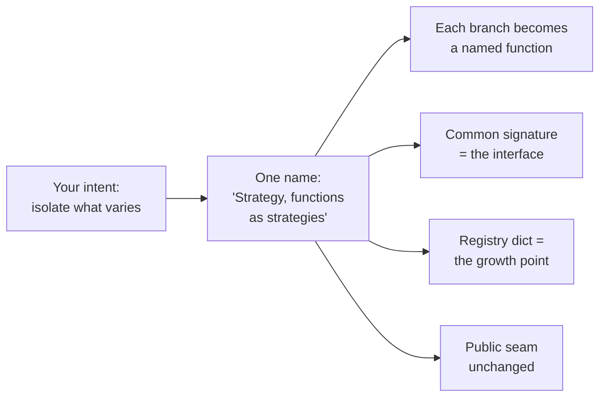

import { Tabs, TabItem, Aside } from '@astrojs/starlight/components';
import AICollab from '../../../components/AICollab.astro';
import VocabTable from '../../../components/VocabTable.astro';
import PromptCard from '../../../components/PromptCard.astro';
import TryIt from '../../../components/TryIt.astro';

## The Experiment

We begin with an experiment, because this book's central claim should be checkable
before it is believable.

The subject is a 35-line file, `discounts.py`, from checkout-lite — a small
order-processing module that will grow with us through this book. Its heart is a
function that has been accumulating discount rules the way such functions do:

```python
def apply_discount(order: Order, kind: str) -> float:
    """Return the order total after the given discount."""
    if kind == "none":
        return order.subtotal
    elif kind == "ten_percent":
        return order.subtotal * 0.90
    elif kind == "coupon5":
        return max(order.subtotal - 5.00, 0.0)
    elif kind == "member":
        if order.is_member:
            return order.subtotal * 0.85
        return order.subtotal
    else:
        raise ValueError(f"unknown discount: {kind}")
```

We placed identical copies in two empty directories — no conventions file, no
project context, nothing but the file — and gave a fresh coding agent one prompt
in each. The first prompt is the one most developers actually write:

> **Prompt A:** Clean up `discounts.py` and make it more maintainable. Edit the
> file in place.

The second says what it wants in design vocabulary:

> **Prompt B:** Refactor `apply_discount` in `discounts.py` to the **Strategy
> pattern using functions as strategies** and a **registry dict**. Keep the
> public function signature unchanged. Do not introduce new classes or
> dependencies. Edit the file in place.

Both outcomes are archived verbatim in `examples/ch01/experiment/`, along with
the methodology. Here is what should embarrass the premise of this chapter: **both
prompts came back with the same core design.** Each branch extracted into a small
named function, a dict mapping each kind to its function, and `apply_discount`
reduced to a lookup and a call:

```python
_DISCOUNT_STRATEGIES: dict[str, Callable[[Order], float]] = {
    "none": _no_discount,
    "ten_percent": _ten_percent,
    "coupon5": _coupon5,
    "member": _member,
}
```

No strawman, then. A modern agent, pointed at thirty-five clean lines, has good
enough taste to find this shape on its own. If vague prompts produced garbage, the
case for design vocabulary would be easy and temporary — the next model release
would erase it. The real case is in what differed, and it will still be true when
the agents are far better than today's.

Three differences, all on the record:

**Prompt A changed behavior without asking.** Its version raises
`ValueError: unknown discount: 'bogus' (expected one of: coupon5, member, none,
ten_percent)`. An improvement — and a silent change to an observable contract.
Any caller, test, or log parser matching the old message just broke, and nothing
in the agent's cheerful summary said *breaking* anywhere. Prompt B's version
raises character-for-character what the original raised, and its reply said so:
*"re-raising a `KeyError` as the same `ValueError` as before."*

**Prompt A decided its own scope.** Alongside the refactor came an editorial on
`float` money and two offers: a pytest file, or a migration to `Decimal` —
*"Would you like me to…?"* All reasonable. All unrequested. The agent, given a
vague goal, filled the vacuum with its own judgment about what you meant.

**The review burden differed in kind, not degree.** With Prompt B you knew what
to check before reading a line: signature unchanged? registry the only growth
point? no new classes? The prompt *was* the checklist. With Prompt A, the only
way to learn what the agent had decided — including the broken error contract —
was to read everything and reconstruct its reasoning. Same good code; entirely
different verification problem.

That is the claim of this book in miniature. **Design vocabulary did not make the
agent smarter. It fixed the contract of the change** — and turned review from
discovery into verification.

One more thing before we generalize, because it matters for how you should read
every example in this book: this experiment is a snapshot. The agent you use is
already better than the one we ran; its taste will keep improving, and nobody can
reliably predict which of today's failure modes will survive the next release.
That is precisely why this chapter is not about the agent. Contracts beat taste
not because taste is poor but because **taste is not addressable** — you cannot
review against it, point at it in a diff, or hold it constant between two runs.
The principle holds while the models change underneath it.

## What Software Design Is

Software design is the set of decisions about *structure*: what pieces exist,
what each one knows about the others, and what can change independently of what.
Two properties make these decisions worth a book.

First, **they get made whether or not anyone makes them.** The `if/elif` chain
above embodies a design decision — "all discount logic lives in one function's
control flow" — that nobody decided. It accreted. Most bad design is not wrong
decisions but unmade ones, defaulted into existence one small edit at a time.

Second, **words are the cheapest medium design is ever expressed in.** A design
discussed in vocabulary costs a sentence to propose, compare, or reject. The same
design discovered halfway through an implementation costs a rewrite. This was
true when the discussion partner was a colleague at a whiteboard; it is more
true now that the partner can type four hundred lines a minute. The faster code
gets cheap, the more valuable the sentence becomes — because the sentence is
where you can still afford to be wrong.

Why do these decisions matter so much? John Ousterhout's *A Philosophy of
Software Design* gives the deepest answer: the greatest limitation in writing
software is not syntax or tooling but **our ability to understand the systems we
create**. Complexity — "anything related to the structure of a software system
that makes it hard to understand and modify the system" — is the thing design
exists to fight. This book agrees, and adds a communication clause: every
structural decision either manages complexity or manufactures it, and vocabulary
is how those decisions get proposed, judged, and transmitted — to colleagues, and
now to agents — while they still cost sentences instead of rewrites. Chapter 2
takes up the enemy itself.

## The New Audience

Your code has always had more readers than executors. The compiler never cared
about your names; your colleagues lived by them. To that audience of humans and
tools, the last few years added a third reader — and it is the strangest of the
three.

An agent reads like a human: it infers intent from names, follows conventions,
imitates the structure it finds. But it reads at tool speed and tool volume —
the whole codebase, every session, without fatigue — and then it *writes back*,
at the same speed, in the style of what it read. Your codebase is not just read
by the agent; it is the agent's training ground for this project. Structure,
good or bad, becomes the context every future change is conditioned on. (Chapter
2 examines what this amplification does to a codebase's two great enemies,
change and complexity.)

Writing for this audience is not a new discipline with new rules. It is the old
discipline with the stakes raised: every structural decision you make is now
also an instruction.

## Vocabulary as Compression

Count what Prompt B's key phrase actually transmitted. *"Strategy pattern using
functions as strategies, with a registry dict"* expanded, in the agent's hands,
into at least a dozen coordinated decisions: extract each branch · one function
per rule · a common signature · the dict as the single growth point · dispatch
by lookup · public seam untouched · no class ceremony. Eleven words; a dozen
decisions; zero loss.



Compression like this only works when both sides share the codebook. Yours came
from books, code review, and painful experience. The agent's came from training
on decades of the same literature — the pattern catalogs, the principle essays,
the millions of codebases that used these names in earnest. When you say
*Strategy*, you are not teaching the agent anything; you are addressing
something it already knows, precisely enough to act on.

This is why we call design vocabulary a **protocol**. It was always one — it is
why pattern names were invented, why design books have glossaries, why senior
engineers can disagree efficiently. Two things changed. The other side of the
conversation now types as fast as it reads. And the protocol became continuous:
not a whiteboard session before coding, but a running dialogue during it, where
every named constraint is enforceable and every unnamed one is up for grabs.

The rest of this book is that codebook, organized for transmission: not just
what each term means, but the exact phrasing that invokes it and — just as
important — the phrasing that reins it in.

## The Catch: Eagerness to Please

The protocol has a failure mode, and it is built into the partner's character.
Agents are trained to be helpful, and helpfulness leaks: into your framing
(name a pattern, and the agent will likely apply it whether or not it fits — it
will not often answer *"Strategy is overkill here, keep the if"* unless you
make that answer easy), into your gaps (vague scope gets filled with unrequested
improvements, as Prompt A showed), and into your confidence (propose a bad
design fluently and the agent will compliment it on the way to implementing it).

So hold two truths at once. A pattern name is the most precise instruction you
can give an agent — and **a pattern name is a hypothesis, not a command**. Saying
"Strategy" makes Strategy happen; it does not make Strategy *right*. The judgment
about fit stays with you, which is why this book pairs every term with its
anti-phrase (*"but only if…"*, *"right-size this"*, *"keep the if"*), and why
Chapter 9 — the brakes — may be the most-quoted chapter in it. The vocabulary
makes your intent powerful exactly when your intent is correct. Nothing in the
protocol checks that part. That is the reviewer's job, and the reviewer is you.

## What This Book Covers — and What It Doesn't

This book lives at the **codebase level**: functions, classes, modules, packages
— the territory between a single line of code and a deployed system.

```
        ┌──────────────────────────────────────────────┐
        │   services · queues · deployments · scaling  │   ← not this book
        ├──────────────────────────────────────────────┤
        │   packages ── modules ── classes ── functions│   ← this book
        ├──────────────────────────────────────────────┤
        │   statements · expressions · syntax          │   ← any Python book
        └──────────────────────────────────────────────┘
```

Distributed-systems architecture has its own excellent literature; almost none
of it helps when the question is "how should these four modules relate." Yet the
codebase level is where you and your agent spend nearly every working hour, and
where an agent's structural choices compound fastest.

The five parts form one sentence: **why** design survives the AI era (Part I) ·
the **grammar** — cohesion, coupling, contracts (Part II) · the **phrasebook** —
patterns, Pythonic and curated (Part III) · the **composition** — modules,
dependencies, tests (Part IV) · the **dialogue** — prompting, conventions,
review, refactoring with an agent (Part V). Every chapter along the way ends
with an 🤖 AI Collaboration section, so the dialogue skill builds continuously
rather than waiting for Part V. Python carries the examples; the vocabulary is
older than Python and will outlive all of us.

## 🤖 AI Collaboration

<AICollab>

### Vocabulary

The full phrasebook accumulates chapter by chapter. These four meta-phrases are
the ones this chapter has already earned:

<VocabTable>

| You say | The agent hears |
|---|---|
| "Refactor to [pattern], using [the form you want]" | The canonical structure, in the variant you chose — not the agent's default |
| "Keep the public signature / API / error messages unchanged" | The observable contract is frozen; everything else may move |
| "Do not introduce new classes / dependencies / layers" | A hard boundary on scope — the vacuum a vague prompt leaves gets filled |
| "Explain the trade-off in two sentences" | Surface your decisions so the reviewer verifies instead of discovers |

</VocabTable>

### Anatomy of the prompt that worked

Prompt B was not clever; it was *structured*. Worth dissecting once, because
every prompt template in this book has the same skeleton:

<PromptCard title="Prompt B, annotated">

Refactor `apply_discount` in `discounts.py` **[scope: one function, named]** to
the Strategy pattern using functions as strategies and a registry dict
**[vocabulary: the design, in one phrase]**. Keep the public function signature
unchanged **[contract: what must not move]**. Do not introduce new classes or
dependencies **[negative constraint: the failure mode, pre-empted]**.

</PromptCard>

### Review habits — the first three

- [ ] Never accept a diff you couldn't explain to a colleague. "The agent wrote
      it" is not an explanation; you are the author of record.
- [ ] Ask what *observable behavior* changed — signatures, return values, error
      messages, output formats — and verify the answer against the diff, not
      the agent's summary.
- [ ] Read the agent's reply against your prompt's constraints. Prompt B's reply
      reported compliance point by point; that is what a verifiable change
      sounds like.

### Agent failure modes

One family this chapter, all siblings of eagerness:

- **Filling the vacuum.** Vague scope returns unrequested improvements — better
  error messages, offered test suites, editorial opinions. Each may be good;
  none was asked for; all must be reviewed.
- **Pattern on command.** Name a pattern and it appears, fit or no fit. The
  agent rarely pushes back on your framing unless explicitly invited to
  (*"tell me if this pattern is overkill here"*).
- **The agreeable reviewer.** Asked to assess its own (or your) design, the
  agent leans positive. Ask it to *argue against* the design instead; the
  pushback is where the information is.

</AICollab>

<TryIt starter="examples/ch01/experiment/">

Run this chapter's experiment on your own code — the claims should survive
contact with your codebase, not just ours. Pick a messy file a colleague would
recognize, make two copies, and give your agent the vague prompt in one and a
design-vocabulary prompt in the other (steal Prompt B's skeleton: scope ·
vocabulary · contract · negative constraint). Then compare, honestly: in which
direction did review feel like *verification*, and in which like *discovery*?
Keep your two outputs; Chapter 3 will give you a loop for turning the comparison
into a habit. Our runs — prompts, outputs, methodology — are archived at the
starter path above.

</TryIt>

## Key Takeaways

- Software design is the set of decisions about structure — and they get made
  whether or not anyone makes them deliberately. Words are the cheapest medium
  those decisions will ever be expressed in.
- Your code now has three readers — humans, tools, and agents — and the third
  writes back, amplifying whatever structure it finds.
- Design vocabulary is compression over a shared codebook: one precise phrase
  transmits a dozen coordinated decisions. It doesn't make the agent smarter;
  **it fixes the contract of the change**, turning review from discovery into
  verification.
- Agents improve with every release and their behavior on any given day is a
  snapshot — but contracts beat taste regardless of how good taste gets,
  because taste is not addressable. The principle outlives the models.
- A pattern name is a hypothesis, not a command. The vocabulary transmits your
  intent; it cannot validate it. That job is review, and it stays yours.
- **Glossary terms added:** *design vocabulary.*
