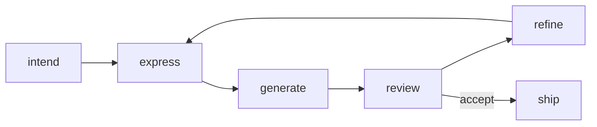

import { Tabs, TabItem, Aside } from '@astrojs/starlight/components';
import AICollab from '../../../components/AICollab.astro';
import VocabTable from '../../../components/VocabTable.astro';
import PromptCard from '../../../components/PromptCard.astro';
import TryIt from '../../../components/TryIt.astro';

Chapter 1 fired two prompts and read what came back. But a prompt fired once is a
move, not a game. Real work with an agent is a *conversation*: you express intent,
read the result, and steer — again, and again, until the design is right. Chapter 1
showed the opening move. This chapter shows the whole game, and it does so with a
single iteration we actually ran, round by round, against a deliberately modest
model.

## The Move and the Game

Recall checkout-lite's discount tangle from Chapter 1, and the vague prompt that a
developer actually types: *"clean this up."* The agent returns something. Now what?

That "now what" is the entire subject of this chapter. You can accept the diff —
and many people do, because it looks plausible and the tests are green. Or you can
treat the first result as what it actually is: a *draft*, the agent's opening
offer, the start of a negotiation about structure. The developers who get good
work from agents are not the ones with magic first prompts. They are the ones who
keep going — who have a *loop*.

## Iteration Was Always the Way

None of this is new. Ronald Mak, writing for programmers working by hand, built his
whole approach to design around iteration: you do not get structure right on the
first try, so you sketch, build, learn, and revise. Every serious account of design
says some version of the same thing. What the agent changed is not the *need* to
iterate but its *cost*. A round that used to take an afternoon — rewrite the module,
rerun it, see how it feels — now takes the length of a reply.

That acceleration is a gift with a sharp edge. When a round is nearly free, you can
iterate faster than you can *think* — accept, accept, accept, riding the agent's
momentum until you have four hundred lines you never really chose. Cheap iteration
only compounds into good design if each round is *deliberate*: if you know which
part of the loop you are in and what that part is for. So let us name the parts.

## The Loop

Five phases, closing back on themselves:



Each phase is where a different kind of thinking lives — and only two of the five
are the agent's:

- **intend** — *yours.* What am I actually trying to do, and what complexity am I
  managing (Chapter 2)? The phase people skip, and the source of most bad prompts.
- **express** — *yours, and the highest-leverage phase.* Turn intent into words the
  agent can act on: vocabulary, constraints, scope (Chapter 1). What you fix here,
  the agent will not get wrong.
- **generate** — *the agent's.* Fast, tireless, and cheap enough to redo.
- **review** — *yours, and where judgment earns its keep.* Hold the result against
  the Chapter 2 symptoms: does this amplify change? what must I understand to touch
  it? what did it decide silently?
- **refine** — *the hinge.* Feed the review back as a redirect, or backtrack and
  re-express. Then around again.

The loop is simple to draw and easy to abandon under the pressure of a green
checkmark. The rest of this chapter is one turn of it, in full, so you can see what
each phase actually feels like.

## A Worked Iteration

We gave a coding agent a small, real task in checkout-lite: add an **itemized cost
breakdown** — subtotal, member discount, tax, shipping, total — for showing a
customer. The starting code was clean: a `pricing.py` with small, composable rate
functions (`member_discount`, `tax_for`, `shipping_for`) and an `order_total` that
composes them.

The point of this section is honesty about the rhythm, so two notes on method. We
ran this against a deliberately *modest* model, not the strongest available — if the
loop only pays off with a weak partner, that is worth knowing; if it pays off even
with a capable one, that is worth knowing too. And the whole exchange is archived
verbatim in `examples/ch03/iteration/`. What follows is trimmed for length (`[…]`),
not edited.

### Round 1 — intend, then express

The intent: surface the numbers that already exist inside `order_total` without
recomputing them. The expression made one deliberate move — *propose before
coding*:

<PromptCard title="Round 1 prompt">

Read `models.py` and `pricing.py`. I want to show customers an itemized breakdown
of an order's cost — subtotal, member discount, tax, shipping, and total. Before
writing any implementation, **propose a design**: the function, its signature, what
it returns, and how it relates to the existing pricing code. Don't write the
implementation yet.

</PromptCard>

That single constraint — *don't write code yet* — changed everything downstream.
The agent proposed a structured result that reused the existing helpers:

> The computation already does everything needed (discount, tax, shipping), but
> discards the intermediate values. We need a way to surface those intermediates
> *without duplicating the math.* […] a frozen `PricingBreakdown` dataclass […]
> `order_total` can then become a one-liner that delegates.

This is worth pausing on. The obvious code-first prompt — *"add a function that
returns a cost breakdown"* — invites the agent to recompute tax and shipping inside
the new function, duplicating logic that already lives in `pricing.py`. By asking
for a design first, we never got that mess; the agent reasoned its way past it on
its own. **The cheapest bug to fix is the one a constraint prevents.**

### Round 2 — generate, then review

We approved the design and let it implement. The code matched the proposal: a clean
`price_order` reusing the three helpers, `order_total` reduced to a one-line shim.
The tests passed. By the green-checkmark standard, done.

It was not done. Reading the result — the *review* phase — one detail snagged. Each
field was rounded on its own, while the total was computed from the *unrounded*
numbers. So the receipt's own lines did not always add up to its own total. A
forty-cent order for a member showed:

```
discounted  0.03
tax         0.00
shipping    5.00
            ────
total       5.04     ← but 0.03 + 0.00 + 5.00 = 5.03
```

No test caught this, because the agent had written tests that checked each number
against the agent's own formula — green, and wrong in exactly the place the formula
was wrong. This is the Chapter 2 *unknown unknown* in the flesh: the rounding policy
was decided silently, by no one, and surfaced only because a human read the code
asking "what did this decide that I didn't ask it to?"

### Round 3 — refine

We fed the defect back as a concrete redirect — the failing case, and the rule it
violated:

<PromptCard title="Round 3 prompt">

The breakdown's own fields don't always sum to its total: each field is rounded
independently while `total` uses the unrounded values. A $0.04 US member order
shows `0.03 + 0.00 + 5.00 = 5.03` but `total = 5.04`. A receipt whose lines don't
add up is a bug. Fix it so the displayed fields sum to the displayed total.

</PromptCard>

The agent rounded the components before summing — and, unprompted, made a genuinely
good call: it kept *tax* computed on the unrounded amount, because tax is a legal
charge on the real figure, not on a display-rounded approximation. The bottom line
now reconciled. A smaller residual remained on the discount line, which a final
round closed — and which we asked it to lock with a test asserting the invariant
directly, rather than checking numbers against a formula.

### What the loop bought

The model was not stupid; its Round 1 design was better than many humans would
sketch. The loop's value did not come from a weak partner — it came from the fact
that *no* partner, however strong, could have anticipated the rounding interaction
from the prompt alone. The defect was discoverable only by generating something
concrete and reading it. That is the whole argument for the loop, and it does not
weaken as models improve: **review is not how you compensate for a bad agent; it is
how design gets made when the work is real.**

## Backtracking Is Cheap Now

Round 3 was a *redirect* — refine forward from a mostly-good draft. The loop's other
move is to *backtrack*: throw the draft away and re-express. By hand, backtracking
felt like failure, because it cost an afternoon. With an agent it costs a sentence,
which means you should do it far more readily than instinct says.

Two habits make this safe and routine. Keep the agent's work on a throwaway branch
so discarding a direction is `git checkout .`, not surgery. And ask for divergence
on purpose — *"show me two designs before you build either"* — so you are choosing
between concrete options, not marrying the first one. Cheap to try, cheap to undo:
explore more than you would have when each experiment cost real time.

## The Loop Is a Harness in Miniature

The loop has a useful echo at a larger scale. There is a growing practice — captured
well in an essay on **harness engineering** at martinfowler.com — that studies the
systems built *around* a coding agent to make its output trustworthy. Its governing
equation is **Agent = Model + Harness**: the model is the part you don't control and
that keeps improving; the harness is everything you build around it. This is the
same durability Chapter 1 claimed for design vocabulary, in two words — and it sorts
your tools into two kinds worth naming, because we will use the distinction through
the rest of the book.

A **guide** acts *before* the agent does — feedforward. The Round 1 constraint
("propose first") was a guide; so are conventions files, type hints, and the design
vocabulary itself. Guides raise the quality of the first attempt. A **sensor** acts
*after* — feedback. Round 2's review was a sensor; so are tests, type checkers, and
CI. Sensors catch what guides could not anticipate. The worked iteration needed
both: the guide steered the agent past the duplication mess, and the sensor caught
the rounding bug the guide could never have foreseen. Neither alone suffices —
guides without sensors never learn they failed; sensors without guides repeat the
same mistakes.

And one move in our iteration was the loop's most strategic: when the "it must
reconcile" concern recurred, we did not just fix it — we asked for a *test* that
asserts the invariant, promoting a one-off catch into a permanent sensor. That
promotion — from a correction you make once to a guide or sensor that makes it for
you forever — is the **steering loop**, and it is how a codebase gets easier to work
in over time instead of harder. This book is its own example: a formatting
correction the editor gave once now lives as a rule in the repo's conventions file,
caught automatically ever after. Chapter 20 builds guides deliberately; Chapter 21
builds sensors. Here, just hold the two words.

<Aside type="note" title="A boundary worth stating">
Harness engineering, taken fully, reaches into CI pipelines, fitness functions, and
production monitoring — systems engineering one level above code design. This book
borrows its *vocabulary* (guide, sensor, the steering loop) because it sharpens how
we talk about the loop, but keeps its own scope: the design of code, and the shared
language for directing it. We take the words, not the whole perimeter.
</Aside>

## 🤖 AI Collaboration

<AICollab>

### Vocabulary

The loop's phases are also prompt shapes. Each row turns a phase into a move.

<VocabTable>

| You say | The agent hears |
|---|---|
| "Propose a design before writing code" | Surface the structure for review while it's still cheap to change (a guide) |
| "Show me two designs and the trade-off" | Don't marry the first option; make the fork explicit |
| "What did this decide that I didn't ask for?" | Hunt the silent defaults — the review phase, as a question |
| "Lock that with a test asserting the invariant" | Promote this correction into a sensor (the steering loop) |

</VocabTable>

### Prompt templates

<PromptCard title="Propose before coding (the loop's opening move)">

I want to [intent]. Before writing any implementation, propose a design: the
function(s) and signatures, what they return, and how they relate to the existing
code. List one alternative and the trade-off. Don't write code yet.

</PromptCard>

<PromptCard title="Review against the symptoms">

Review the code you just wrote as if you were a critical reviewer who didn't write
it. Where would one change force edits in several places? What must I understand to
modify it safely? What behavior did you decide that I never specified? Point to
lines; don't fix anything yet.

</PromptCard>

### Review checklist

- [ ] Did you run the **intend** phase, or react to the agent's framing?
- [ ] Did you spend the **express** phase on constraints, or only the goal?
- [ ] Did you read the result for silent decisions — not just run the tests?
- [ ] When a correction recurred, did you promote it into a guide or a sensor?

### Agent failure modes

- **The convincing first draft.** The opening offer is plausible and passes its own
  tests, which is precisely what makes accepting it on sight dangerous. Plausible is
  not reviewed.
- **Tests that test the bug.** An agent that writes the code *and* its tests can
  encode the same wrong assumption in both. Green proves consistency with itself,
  not correctness. Prefer tests that assert an independent *invariant*.
- **Momentum.** Each reply nudges you to accept and continue. The loop is a
  deliberate pause against that current; the pause is the skill.

</AICollab>

<TryIt starter="examples/ch03/iteration/">

Run your own four-round iteration. Take a small feature in code you know and give
your agent the **propose-before-coding** prompt — then *don't* accept the first
implementation. Review it for one silent decision, redirect, and go again until you
would sign your name to it. Keep a log of each round. Afterward, name them: which
prompts were guides (preventing) and which were sensors (catching)? Our full
transcript — four real rounds against a modest model, including the bug that passed
its own tests — is archived at the path above.

</TryIt>

## Key Takeaways

- A first result is a draft, not an answer. The skill is the **loop** —
  *intend → express → generate → review → refine* — not the perfect opening prompt.
- Iteration was always how design got made; the agent only collapsed the cost of a
  round. Cheap rounds help only when each one is deliberate.
- The two phases that are yours — **express** (highest leverage) and **review**
  (where judgment lives) — are where design happens. Generation is the cheap part.
- Review is not damage control for a weak agent. Even a strong one cannot anticipate
  what only shows up in concrete, read code — like a rounding policy decided
  silently. **The loop is how real design gets made, at any model strength.**
- Sort your tools into **guides** (feedforward — prevent) and **sensors** (feedback
  — catch), and when a correction recurs, promote it into one. That is the
  **steering loop** — how a codebase gets softer over time.
- **Glossary terms added:** *the design loop · propose before coding · guide and
  sensor (feedforward / feedback) · steering loop.*
