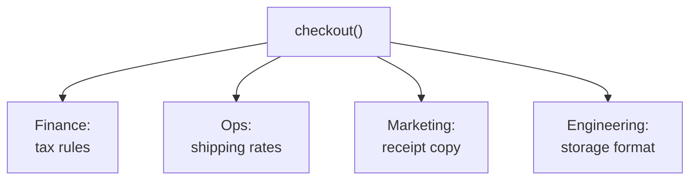

import { TabItem, Aside } from '@astrojs/starlight/components';
import LangTabs from '../../../components/LangTabs.astro';
import AICollab from '../../../components/AICollab.astro';
import VocabTable from '../../../components/VocabTable.astro';
import PromptCard from '../../../components/PromptCard.astro';
import TryIt from '../../../components/TryIt.astro';

Chapter 2 named two metrics by intuition and promised them a formal home. This is
the first of those homes. **Cohesion** — how strongly the parts of a unit belong
together — is the force this chapter makes precise, and the **Single Responsibility
Principle** is how you act on it. We pick up exactly where Chapter 2's disaster left
off: the `checkout()` function that does everything.

<Aside type="tip" title="Two languages, one design">
From here on, code listings come in **Python** and **TypeScript** — pick the tab you
think in (your choice sticks across the whole book). The point of showing both is the
book's thesis made visible: the *design* is the constant; the language is just the
syntax it's written in.
</Aside>

## The Itch

You have a one-line job: Germany raised its VAT, so the rate goes from 0.19 to 0.20.
Thirty seconds of work. You open `checkout()` and find the tax line — sitting three
inches above a block of email-sending code and just below a member-discount branch,
with a JSON file write at the bottom.

<LangTabs>
  <TabItem label="Python">

```python
def checkout(order: Order, payment_token: str, send_email: bool = True) -> float:
    total = order.subtotal
    if order.customer.is_member:
        total = total * 0.85
    if order.country == "DE":
        total = total + total * 0.19    # <- the one line you came to change
    # ... shipping branches ...
    # ... eight lines of email ...
    # ... a JSON file read, append, write ...
```

  </TabItem>
  <TabItem label="TypeScript">

```typescript
function checkout(order: Order, paymentToken: string, sendEmail = true): number {
  let total = subtotal(order);
  if (order.customer.isMember) {
    total = total * 0.85;
  }
  if (order.country === "DE") {
    total = total + total * 0.19; // <- the one line you came to change
  }
  // ... shipping branches ...
  // ... eight lines of email ...
  // ... a JSON file read, append, write ...
}
```

  </TabItem>
</LangTabs>

The edit itself is trivial. The *fear* is not. To be sure changing the tax line
breaks nothing, you have to convince yourself it doesn't interact with the discount
above it, the shipping below it, the email, or the file write. None of those things
has anything to do with German tax law — yet all of them are now your problem,
because they share a body with the line you came to fix. That fear, multiplied
across every future change, is what low cohesion costs.

## The Concept

**Cohesion** measures how strongly the elements inside a unit — a function, a class,
a module — belong together. High cohesion: everything here serves one purpose, and
a reader can hold the whole unit as a single idea. Low cohesion: the unit is a
drawer where unrelated things were dropped because the drawer was open.

The **Single Responsibility Principle** turns that fuzzy "belong together" into a
test you can apply: *a unit should have one reason to change.* And the sharpest way
to count reasons is to count **actors** — the people or roles who could request a
change. Look at `checkout()` through that lens:



Four actors pull on one function. Finance changes a tax rate; marketing rewrites the
receipt; ops renegotiates a carrier; engineering swaps JSON for a database. Each is a
*separate reason to change*, and any of them can break the others by accident,
because the code gives them no separate place to stand. "Does too much" is not an
aesthetic complaint — it is this, precisely: more than one actor, more than one
reason to change, all sharing one body.

Cohesion applies at every level. A *function* should do one thing; a *class* should
model one concept; a *module* should own one area of responsibility. SRP is the same
principle at whichever level you point it.

## Before / After

The cure is not cleverness — it is *separation*. Give each responsibility its own
cohesive home, and let a thin `checkout` orchestrate them. No patterns yet (those
are Part III); just one principle, applied.

### Before

One function, four actors — finance (tax), ops (shipping), marketing (email), and
engineering (storage) all sharing a single body:

<LangTabs>
  <TabItem label="Python">

```python
def checkout(order: Order, payment_token: str, send_email: bool = True) -> float:
    total = order.subtotal
    if order.customer.is_member:
        total = total * 0.85
    if order.country == "US":
        total = total + total * 0.07
    elif order.country == "DE":
        total = total + total * 0.19
    # ... more tax branches, shipping branches, gift wrap ...
    total = round(total, 2)
    print(f"Charging {payment_token} for {total:.2f}")
    if order.customer.is_member and send_email:
        # ... eight lines building and sending an email ...
        ...
    # ... read orders.json, append, write it back ...
    return total
```

  </TabItem>
  <TabItem label="TypeScript">

```typescript
function checkout(order: Order, paymentToken: string, sendEmail = true): number {
  let total = subtotal(order);
  if (order.customer.isMember) {
    total = total * 0.85;
  }
  if (order.country === "US") {
    total = total + total * 0.07;
  } else if (order.country === "DE") {
    total = total + total * 0.19;
  }
  // ... more tax branches, shipping branches, gift wrap ...
  total = Math.round(total * 100) / 100;
  console.log(`Charging ${paymentToken} for ${total.toFixed(2)}`);
  if (order.customer.isMember && sendEmail) {
    // ... eight lines building and sending an email ...
  }
  // ... read orders.json, append, write it back ...
  return total;
}
```

  </TabItem>
</LangTabs>

### After

One responsibility per file, then a thin function to orchestrate them. **Pricing**
answers to finance — pure money math, no I/O, so it tests in isolation:

<LangTabs>
  <TabItem label="Python">

```python
# pricing.py — one actor: finance (the money math). No I/O.
from models import Order

TAX_RATES = {"US": 0.07, "DE": 0.19, "JP": 0.10}
EU_COUNTRIES = ("DE", "FR", "NL")

def member_discount(subtotal: float, is_member: bool) -> float:
    return subtotal * 0.85 if is_member else subtotal

def tax_for(amount: float, country: str) -> float:
    return amount * TAX_RATES.get(country, 0.0)

def shipping_for(country: str, gift_wrap: bool) -> float:
    if country == "US":
        base = 5.00
    elif country in EU_COUNTRIES:
        base = 9.90
    else:
        base = 24.90
    return base + (3.50 if gift_wrap else 0.0)

def order_total(order: Order) -> float:
    discounted = member_discount(order.subtotal, order.customer.is_member)
    tax = tax_for(discounted, order.country)
    shipping = shipping_for(order.country, order.gift_wrap)
    return round(discounted + tax + shipping, 2)
```

  </TabItem>
  <TabItem label="TypeScript">

```typescript
// pricing.ts — one actor: finance (the money math). No I/O.
import { type Order, subtotal } from "./models";

const TAX_RATES: Record<string, number> = { US: 0.07, DE: 0.19, JP: 0.1 };
const EU_COUNTRIES = ["DE", "FR", "NL"];

export const memberDiscount = (sub: number, isMember: boolean): number =>
  isMember ? sub * 0.85 : sub;

export const taxFor = (amount: number, country: string): number =>
  amount * (TAX_RATES[country] ?? 0);

export const shippingFor = (country: string, giftWrap: boolean): number => {
  let base: number;
  if (country === "US") base = 5.0;
  else if (EU_COUNTRIES.includes(country)) base = 9.9;
  else base = 24.9;
  return base + (giftWrap ? 3.5 : 0);
};

export const orderTotal = (order: Order): number => {
  const discounted = memberDiscount(subtotal(order), order.customer.isMember);
  const tax = taxFor(discounted, order.country);
  const shipping = shippingFor(order.country, order.giftWrap);
  return Math.round((discounted + tax + shipping) * 100) / 100;
};
```

  </TabItem>
</LangTabs>

**Notify** answers to marketing — the receipt copy, with the email I/O quarantined at
the edge:

<LangTabs>
  <TabItem label="Python">

```python
# notify.py — one actor: marketing (the receipt message).
import smtplib
from email.message import EmailMessage
from models import Order

def receipt_body(order: Order, total: float) -> str:
    return f"Thanks {order.customer.name}! You paid {total:.2f}."

def send_receipt(order: Order, total: float) -> None:
    msg = EmailMessage()
    msg["Subject"] = "Your checkout-lite receipt"
    msg["To"] = order.customer.email
    msg.set_content(receipt_body(order, total))
    try:
        with smtplib.SMTP("localhost", 25, timeout=1) as smtp:
            smtp.send_message(msg)
    except OSError:
        pass  # a failed email must never block a sale
```

  </TabItem>
  <TabItem label="TypeScript">

```typescript
// notify.ts — one actor: marketing (the receipt message).
import { sendMail } from "./transport"; // the SMTP edge, isolated
import { type Order } from "./models";

export const receiptBody = (order: Order, total: number): string =>
  `Thanks ${order.customer.name}! You paid ${total.toFixed(2)}.`;

export const sendReceipt = (order: Order, total: number): void => {
  try {
    sendMail({
      to: order.customer.email,
      subject: "Your checkout-lite receipt",
      body: receiptBody(order, total),
    });
  } catch {
    // a failed email must never block a sale
  }
};
```

  </TabItem>
</LangTabs>

**Persistence** answers to engineering — how orders are stored, and nothing else:

<LangTabs>
  <TabItem label="Python">

```python
# persistence.py — one actor: engineering (how orders are stored).
import json
from pathlib import Path
from models import Order

ORDERS_FILE = Path("orders.json")

def save_order(order: Order, total: float) -> None:
    record = {"customer": order.customer.name, "total": total}
    existing = json.loads(ORDERS_FILE.read_text()) if ORDERS_FILE.exists() else []
    existing.append(record)
    ORDERS_FILE.write_text(json.dumps(existing, indent=2))
```

  </TabItem>
  <TabItem label="TypeScript">

```typescript
// persistence.ts — one actor: engineering (how orders are stored).
import { existsSync, readFileSync, writeFileSync } from "node:fs";
import { type Order } from "./models";

const ORDERS_FILE = "orders.json";

export const saveOrder = (order: Order, total: number): void => {
  const record = { customer: order.customer.name, total };
  const existing: unknown[] = existsSync(ORDERS_FILE)
    ? (JSON.parse(readFileSync(ORDERS_FILE, "utf8")) as unknown[])
    : [];
  existing.push(record);
  writeFileSync(ORDERS_FILE, JSON.stringify(existing, null, 2));
};
```

  </TabItem>
</LangTabs>

**Checkout** answers to one last actor — the workflow itself. It owns the *sequence*,
not the steps' internals, so it reads like a table of contents:

<LangTabs>
  <TabItem label="Python">

```python
# checkout.py — one actor: the order workflow (the sequence of steps).
import pricing
import notify
import persistence
from models import Order

def checkout(order: Order, payment_token: str, send_email: bool = True) -> float:
    total = pricing.order_total(order)
    print(f"Charging {payment_token} for {total:.2f}")
    if order.customer.is_member and send_email:
        notify.send_receipt(order, total)
    persistence.save_order(order, total)
    return total
```

  </TabItem>
  <TabItem label="TypeScript">

```typescript
// checkout.ts — one actor: the order workflow (the sequence of steps).
import { type Order } from "./models";
import { orderTotal } from "./pricing";
import { sendReceipt } from "./notify";
import { saveOrder } from "./persistence";

export const checkout = (order: Order, paymentToken: string, sendEmail = true): number => {
  const total = orderTotal(order);
  console.log(`Charging ${paymentToken} for ${total.toFixed(2)}`);
  if (order.customer.isMember && sendEmail) {
    sendReceipt(order, total);
  }
  saveOrder(order, total);
  return total;
};
```

  </TabItem>
</LangTabs>

Now the German VAT change touches exactly one file — `pricing.py` / `pricing.ts` —
and a reader opening it sees only money math, with no email or disk to reason around.
The `checkout` that remains reads like a table of contents: price, charge, notify,
save. This After is not invented for the chapter; it is where the clean pricing module
you met in Chapter 3 actually came from. The full code in both languages, with tests
proving the split changed no behavior, is in `examples/ch04/`.

## Language Notes

Both languages reach the same split, and from the same starting heuristic: the home
for a responsibility is a **file**, not necessarily a class.

<LangTabs>
  <TabItem label="Python">

In many languages, "give each responsibility a home" means "make a class." In Python
it usually means **make a module**. A module is already a cohesion boundary: it
groups related functions, exposes a public surface, and hides helpers behind a
leading underscore — all without a single `class` keyword. `pricing.py` is highly
cohesive and contains no classes at all.

This matters because the classic object-oriented heuristic — *nouns become classes,
verbs become methods* — over-fires in Python. Not every noun earns a class. A
`TaxCalculator` class with one method and no state is a function wearing a costume;
`tax_for(amount, country)` says the same thing with less ceremony. The reliable
smell is a class named `Manager`, `Processor`, `Helper`, or `Util`: these are rarely
concepts: they are drawers, and a drawer is low cohesion with a capital letter. When
you see one, ask what *actual* responsibility it holds — the answer usually splits it
into a real module and a couple of honest functions.

  </TabItem>
  <TabItem label="TypeScript">

A TypeScript **module is a file**, and that file is the cohesion boundary in exactly
the same way. One concern per file; `export` is the public surface, and anything left
un-exported is private — the leading-underscore convention made into a language rule.
`pricing.ts` groups its functions and exports the few that callers need, no `class`
required. Plain functions plus `readonly` types carry the design that a Python module
carries with functions and frozen dataclasses.

The grab-bag smell is identical, only the names shift: a `*Manager`, `*Service`, or
`utils.ts` file is the drawer wearing a `.ts` extension — a place where unrelated
helpers accumulate because the file was already open. A particular TypeScript trap is
the **barrel file** (`index.ts` that re-exports everything): handy for a genuinely
cohesive package, but when a barrel re-exports four unrelated concerns it just gives
low cohesion a tidy front door. Ask the same question you'd ask in Python — *what one
responsibility does this file own?* — and let the answer, not the noun, decide the
split.

  </TabItem>
</LangTabs>

## When NOT to Use

<Aside type="caution" title="Right-sizing">
SRP has an over-applied form, and Chapter 9 already named it: the confetti of tiny
classes. Push "one reason to change" to its zealous extreme and you shatter a
coherent thing into a `PriceMultiplier`, a `DiscountApplier`, a `TaxAdder`, and a
`ShippingResolver` — ten three-line files where one cohesive `pricing` module
belonged. Now a reader chasing the total opens six files instead of one, and you have
*traded* low cohesion for its mirror image: things that genuinely belong together,
forced apart.

Cohesion is symmetric. Merging unrelated concerns is the disease this chapter treats;
splitting related ones is the same disease wearing the cure's clothes. The question
is never "can this be split?" — almost anything can. It is "do these parts change for
*different* reasons?" If they change together, for the same actor, they belong
together. Split by responsibility, not by line count.
</Aside>

## 🤖 AI Collaboration

Cohesion is one of the rare areas where agents err in *both* directions, and which
direction depends entirely on your prompt. "Do everything in one function" yields a
god function; "fully apply SRP" yields confetti. The vocabulary below is how you aim
between them.

<AICollab>

### Vocabulary

<VocabTable>

| You say | The agent hears |
|---|---|
| "This function does too much — split by responsibility" | Find the distinct reasons-to-change and give each its own home |
| "What are the responsibilities here? Group by actor" | Enumerate the change-drivers before touching code |
| "One reason to change per module" | Cohesion as the target; SRP as the test |
| "Extract the \_\_\_ concern into its own module" | A surgical, named cut — not a wholesale reorganization |
| "Keep cohesive things together — don't over-fragment" | The brake: split by responsibility, not by line count |

</VocabTable>

### Prompt templates

<PromptCard title="Identify, then split">

This module does several things. First, **list the responsibilities** in it and the
actor each answers to (who would request a change to it). Then propose a split that
gives each responsibility its own module, leaving a thin function to orchestrate.
Do **not** create single-method classes, and do **not** split anything whose parts
change for the same reason. Show the proposed file layout before writing code.

</PromptCard>

<PromptCard title="Pull one concern out">

Extract only the [persistence / notification / pricing] concern from this function
into its own module, behind a small named function. Leave everything else exactly as
it is. The goal is one clean cut, not a refactor of the whole file.

</PromptCard>

### Review checklist

- [ ] Each new unit has **one reason to change** — name the actor for each
- [ ] The core logic (e.g. pricing) is testable with **no I/O** — proof it's isolated
- [ ] No `Manager` / `Processor` / `Helper` / `Util` names hiding a drawer
- [ ] No single-method classes that should have been functions
- [ ] Nothing was split whose parts change *together* (over-fragmentation)

### Agent failure modes

- **The god function.** A "do all of this" prompt yields one long function with
  every concern inline — the Before of this chapter, freshly generated. Name the
  responsibilities up front so the agent has seams to cut along.
- **The confetti.** A "fully apply SRP" prompt over-fragments into single-purpose
  classes. The brake is explicit: *split by responsibility, not by line count.*
- **The costume class.** The agent wraps a single function in a `Calculator` or
  `Service` class for "structure." Ask whether it holds state or has more than one
  method; if not, it's a function.

</AICollab>

<TryIt starter="examples/ch04/py/before.py">

Hand your agent the `checkout()` tangle (Python: `examples/ch04/py/before.py` ·
TypeScript: `examples/ch04/ts/before.ts`), or a `ReportBuilder` from your own code that
formats, computes, *and* writes a file. Run the **identify-then-split** prompt and
read its responsibility list first — is it grouping by *actor*, or just by paragraph?
Then grade the result against the checklist, watching both failure directions at
once: did a god function survive, and did anything get split that should have stayed
whole? Our worked split, in both languages with behavior-preserving tests, is in
`examples/ch04/`.

</TryIt>

## Key Takeaways

- **Cohesion** is how strongly a unit's parts belong together; low cohesion is what
  made the one-line tax change frightening.
- The **Single Responsibility Principle** operationalizes it: one reason to change
  per unit. Count reasons by counting **actors** — finance, ops, marketing, and
  engineering should not share one function.
- Split **by responsibility, not by line count.** The home for a responsibility is
  often a *file/module*, not a class — a Python module, a TypeScript file; a
  `Manager`/`Helper` class (or a `utils.ts`) is often a drawer in disguise.
- The payoff is testable in isolation: once pricing is its own concern, you can
  verify it with no email server and no filesystem.
- Cohesion is symmetric — over-fragmenting related parts is as harmful as merging
  unrelated ones. (Chapter 9's confetti, revisited.)
- **Glossary terms added:** *cohesion · single responsibility principle (SRP) · one
  reason to change · god object.*
