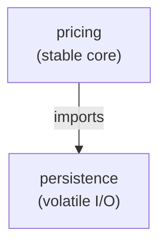
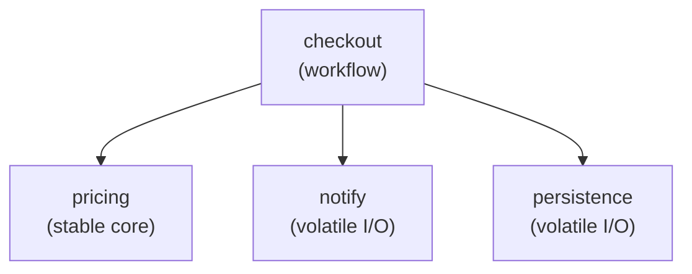

import { TabItem, Aside } from '@astrojs/starlight/components';
import LangTabs from '../../../components/LangTabs.astro';
import AICollab from '../../../components/AICollab.astro';
import VocabTable from '../../../components/VocabTable.astro';
import PromptCard from '../../../components/PromptCard.astro';
import TryIt from '../../../components/TryIt.astro';

Chapter 4 gave cohesion its formal home — what belongs *inside* a unit. This chapter
gives coupling its home — what happens *between* units. They are Chapter 2's two
master metrics, and they pull in tension: split a god function into cohesive pieces
and you have just created relationships between those pieces. Coupling is the
discipline of keeping those relationships thin. The whole chapter rests on one idea:
**know as little as the job allows.**

## The Itch

Marketing wants VIP customers to get free shipping over $100. The membership data
lives a few hops away — an order has a customer, who has a membership, which has a
tier — so you write the obvious check:

<LangTabs>
  <TabItem label="Python">

```python
def free_shipping(order: Order) -> bool:
    return order.customer.membership.tier == "gold" and order.subtotal >= 100
```

  </TabItem>
  <TabItem label="TypeScript">

```typescript
function freeShipping(order: Order): boolean {
  return order.customer.membership.tier === "gold" && subtotal(order) >= 100;
}
```

  </TabItem>
</LangTabs>

It works, ships, and looks harmless. Then, a quarter later, membership gets
remodeled: tiers move under a new `Plan` object, or `tier` becomes an enum. This
line breaks — and it is not alone. The same `order.customer.membership.tier` reach
was copied into the receipt, the analytics export, and three other features, because
it was the obvious thing to write each time. One small change to a distant class,
and edits ripple across the codebase.

You have seen this exact shape before. It is Chapter 2's **change amplification**,
and now we can name its cause. That one line *knows too much*: to compute free
shipping it has learned the entire path from order to tier — the existence and shape
of three classes it has no real business knowing. Knowledge is coupling, and this
line is coupled to everything it touched on the way to `tier`.

## The Concept

**Coupling** is how much one unit must know about another to do its job. The
**Principle of Least Knowledge** is the goal: each unit should know as little about
the others as the task allows. Coupling is never zero — units that collaborate must
share *something* — so the discipline is not eliminating it but keeping it at the
loosest rung that still works.

A practical ladder, loosest to tightest:

- **Data coupling** — you pass exactly the value needed: `tax_for(amount, country)`.
  The callee knows a float and a string, nothing more. This is the rung to aim for.
- **Stamp coupling** — you pass a whole object when one field would do. Now the
  callee depends on that object's *shape*, and changes to the shape can reach it.
- **Content coupling** — you reach into another unit's internals:
  `order.customer.membership.tier`. The tightest, most brittle rung — a change
  anywhere along the chain can break you. This is the itch above.

Two techniques keep you near the top of the ladder. The **Law of Demeter** —
"don't talk to strangers" — says a unit should talk only to its *immediate friends*,
not reach through them to friends-of-friends. The tell-tale is a chain of dots
through distinct objects, often called a *train wreck*: `a.b().c().d()`. And
**tell, don't ask** says: don't pull an object's data out to make a decision *about
that object* — tell the object, and let it decide. Asking couples you to the data;
telling couples you only to a question.

## Before / After

The VIP feature shows both techniques in one move. Instead of reaching through the
graph and deciding for the order, we let each object answer for what it owns.

### Before

The caller knows the whole path — `order → customer → membership → tier` — and
pulls the subtotal out to decide for the order:

<LangTabs>
  <TabItem label="Python">

```python
# the caller knows the whole path: order -> customer -> membership -> tier
def free_shipping(order: Order) -> bool:
    return order.customer.membership.tier == "gold" and order.subtotal >= 100
```

  </TabItem>
  <TabItem label="TypeScript">

```typescript
// the caller knows the whole path: order -> customer -> membership -> tier
export function freeShipping(order: Order): boolean {
  return order.customer.membership.tier === "gold" && subtotal(order) >= 100;
}
```

  </TabItem>
</LangTabs>

### After

Each object answers for what it owns, talking only to an immediate friend, and the
caller asks one object one question:

<LangTabs>
  <TabItem label="Python">

```python
# Membership answers about tiers; Customer about status; Order about its offer.
class Membership:
    def is_gold(self) -> bool:
        return self.tier == "gold"

class Customer:
    def is_vip(self) -> bool:
        return self.membership.is_gold()          # one hop, to a friend

class Order:
    def qualifies_for_free_shipping(self) -> bool:
        return self.customer.is_vip() and self.subtotal >= 100

# the caller now asks one object one question:
def free_shipping(order: Order) -> bool:
    return order.qualifies_for_free_shipping()
```

  </TabItem>
  <TabItem label="TypeScript">

```typescript
// Membership answers about tiers; Customer about status; Order about its offer.
class Membership {
  constructor(readonly tier: "standard" | "gold") {}
  get isGold(): boolean {
    return this.tier === "gold";
  }
}

class Customer {
  constructor(readonly membership: Membership) {}
  get isVip(): boolean {
    return this.membership.isGold; // one hop, to a friend
  }
}

class Order {
  constructor(readonly customer: Customer, readonly subtotal: number) {}
  get qualifiesForFreeShipping(): boolean {
    return this.customer.isVip && this.subtotal >= 100;
  }
}

// the caller now asks one object one question:
export function freeShipping(order: Order): boolean {
  return order.qualifiesForFreeShipping;
}
```

  </TabItem>
</LangTabs>

No object reaches past an immediate friend, and the decision lives with the data it
concerns. The payoff is concrete: the knowledge of *how membership is shaped* now
exists in exactly one place — `Membership` — instead of scattered across every
caller. When tiers get remodeled next quarter, `is_gold` (TS: `isGold`) changes and
nothing else does. The `examples/ch05/py/` and `examples/ch05/ts/` tests prove it the
hard way: the after's `free_shipping` / `freeShipping` contains neither the word
`membership` nor `tier`, so the graph can be rebuilt beneath it without the caller
ever knowing.

## Dependency Direction

Coupling has not just a tightness but a *direction* — and direction is where
codebase-scale design begins. When module A imports module B, A depends on B: a
change to B can break A, but not the reverse. Read every arrow in this section the
same way — **`A --> B` means "A depends on B"** — so the question for each dependency
is which way the arrow should point.

The rule: **depend toward stability.** Code that changes rarely (your core domain
rules) should not depend on code that changes often (I/O, frameworks, formats). In
arrow terms: **the stable core should have arrows pointing *at* it, never *out of*
it.**

Here is the wrong way. Someone wants `pricing` to log every price it computes, so
they reach for `persistence` and import it into `pricing`:



The arrow points *out of* the core, toward a volatile detail. Now change the storage
format — swap JSON for a database — and `pricing` can break, though the money math
never moved. And `pricing` can no longer be tested without the persistence layer
present. A stable thing has been made hostage to a volatile one. That is backwards.

Here is the right way — the same modules, every arrow reversed onto the core:



Every arrow points *toward* `pricing`, and none point out of it — which is exactly
why Chapter 4 could test it in total isolation. Note what is deliberately *not* a
violation here: the `checkout` workflow depending on the concrete `notify` and
`persistence`. Something has to call I/O, and orchestration code depending on details
is fine at this scale. Making even `checkout` depend on *abstractions* so those
details become swappable is the *dependency inversion* of Chapter 8, and its
codebase-scale form is the tiers of Chapter 17. For now, hold the simpler heuristic:
arrows point toward the stable, the core points outward at nothing, and no arrow ever
forms a cycle.

## Language Notes

<LangTabs>
  <TabItem label="Python">

Python offers no resistance to a train wreck — `a.b.c.d` is one fluent expression,
and nothing at compile time objects. Least Knowledge in Python is therefore a
*discipline*, not something the language enforces. Two features make the disciplined
version pleasant. Methods make tell-don't-ask natural, and `@property` makes it
nearly free: `order.is_vip` can be a computed question that reads like an attribute,
so callers ask without paying for a method call's ceremony.

The honest caveat: **not every dot is a Demeter violation.** `order.customer.name`
to print a name is fine. Fluent interfaces that return `self` —
`query.filter(...).order_by(...)` — are dots by design, not strangers. A dataclass
reaching its own fields is not talking to anyone. The Law of Demeter is about
coupling to *structure that will hurt you when it changes* — a chain across
independently-evolving objects — not a literal ban on the dot operator. Count the
*owners* in the chain, not the dots.

  </TabItem>
  <TabItem label="TypeScript">

TypeScript objects to a train wreck no more than Python does: `a.b.c.d` type-checks
happily as long as the shapes line up, so Least Knowledge stays a *discipline* the
language won't keep for you. What TypeScript adds is one sharp warning the compiler
*will* give you for free. Turn on `strictNullChecks` (it rides along with `strict`)
and a chain like `order.customer?.membership?.tier` lights up with the optional-chain
question marks the data forces on you — every `?.` is the type system showing you,
in syntax, exactly how far you are reaching and how many ways the path can be empty.
A long ladder of `?.` is the train wreck made visible.

Three TS-native moves keep the disciplined version clean. A **getter** gives you
Python's `@property` exactly: `get isVip()` reads like a field at the call site, so
"ask the object a question" costs no visible ceremony. **`readonly` fields** (and
`readonly` array types) let an object expose state without inviting a caller to reach
in and mutate it — the data is visible but not yours to poke. And when you genuinely
want a hard wall, **`#private` fields** are enforced at runtime, not a naming
convention: a stranger *cannot* read `order.#tier`, so the only way through is the
question you chose to offer.

The same honest caveat holds, with a TS twist. Not every dot is a violation:
`order.customer.name` to render a name is fine, and fluent builders that return
`this` — `query.filter(...).orderBy(...)` — are dots by design. Because the types are
**structural**, a method that takes `{ tier: string }` already depends on nothing
more than that one field's shape — the narrowest parameter type *is* your statement
of Least Knowledge, written where the compiler can check it. Ask for the smallest
shape the job needs, and count the *owners* in the chain, not the dots.

  </TabItem>
</LangTabs>

## When NOT to Use

<Aside type="caution" title="Right-sizing">
Both techniques have a runaway form.

**Demeter zealotry** breeds a forest of pass-through methods. Taken literally
through a deep graph, "add a method so callers don't reach" gives you
`Order.customer_country_code()` that forwards to `Customer.country_code()` that
forwards to `address.country.code` — three delegating one-liners replacing one
honest access (Chapter 9's pass-through layer, multiplied). Add a delegating method
where the coupling is real and the shape is likely to change; a deep chain that
*needs* wrapping at every level is usually telling you the object graph itself is
too deep — flatten the model instead.

**Tell-don't-ask versus cohesion.** Pushed hard, "put the behavior on the object"
migrates *everything* onto the data object until `Order` computes tax, sends email,
and formats receipts — a god object, exactly the Chapter 4 violation we just cured.
The two principles genuinely pull against each other. The referee is ownership: put
the decision on the object **when the decision is about that object's own state**
(`order.qualifies_for_free_shipping` — yes); keep it out when the behavior belongs to
another actor (emailing the receipt — no, that is `notify`'s job). And pure data
crossing a boundary — a DTO, a config record — is allowed to have no behavior at all.
</Aside>

## 🤖 AI Collaboration

Agents reach through object graphs as readily as people do — a train wreck is often
the most direct way to get a value, and "direct" reads as "efficient." They are also
prone to the over-corrections above when you ask for a fix without bounding it.

<AICollab>

### Vocabulary

<VocabTable>

| You say | The agent hears |
|---|---|
| "Reduce the coupling here" | Minimize what each unit must know about the others (Least Knowledge) |
| "This is a train wreck — fix the Law of Demeter violation" | Stop reaching through objects; talk only to immediate friends |
| "Tell, don't ask" | Move the decision onto the object that owns the data; stop extracting fields to decide |
| "Pass the value, not the whole object" | Drop from stamp coupling to data coupling — depend on a float, not a shape |
| "Which way should this dependency point?" | Depend toward the stable; flag arrows from core to volatile |

</VocabTable>

### Prompt templates

<PromptCard title="Find and fix train wrecks (bounded)">

Find Law of Demeter violations in this module — chains that reach through more than
one object (`a.b.c.d`). Fix each by adding a method on the object that owns the data,
so callers ask one question. Do **not** create pass-through methods at every level,
and if a chain is deep, tell me whether the object graph itself should be flattened
instead of wrapped.

</PromptCard>

<PromptCard title="Ask-then-decide → tell-don't-ask">

This code pulls fields out of an object and then decides something about that object.
Refactor to tell-don't-ask: put the decision on the object as a method or property,
and have the caller ask it. Only do this where the decision is about that object's
own state — don't move behavior that belongs to a different concern onto it.

</PromptCard>

### Review checklist

- [ ] No chain reaching through more than one *owner* (`a.b.c.d`)
- [ ] Decisions about an object's state live *on* that object
- [ ] Callers depend on small values or single questions, not object shapes
- [ ] Dependencies point toward the stable; the core imports nothing volatile
- [ ] No pass-through wrapper added where a direct access was honest

### Agent failure modes

- **The wrapper forest.** Asked to fix Demeter, the agent adds a delegating method at
  every level of a deep graph — trading a train wreck for a stack of pass-throughs.
  Bound it: *fix the caller; flatten the graph if it's deep; don't wrap every hop.*
- **The god object.** Asked for tell-don't-ask, it piles unrelated behavior onto the
  data class until cohesion (Chapter 4) is gone. Ownership is the test.
- **Premature inversion.** Hearing "dependency," the agent introduces an interface
  and inverts a dependency nobody needed inverted — Chapter 9's eager abstraction,
  pointed at coupling. Direction is worth fixing; *inversion* needs a reason.

</AICollab>

<TryIt starter="examples/ch05/py/before.py">

Take `before.py` (or a module of your own with a `a.b.c.d` chain) and run the
**find-and-fix train wrecks** prompt. Read the result against two opposite failures
at once: did a real train wreck survive, *and* did the agent grow a forest of
pass-through methods to eliminate one? Then ask the deeper question the chapter
raises: was the right fix to add a method, or to flatten an object graph that was too
deep to begin with? Our worked refactor and its Least-Knowledge tests are in
`examples/ch05/py/` (Python) and `examples/ch05/ts/` (TypeScript).

</TryIt>

## Key Takeaways

- **Coupling** is how much one unit must know about another; the **Principle of Least
  Knowledge** says know as little as the job allows. It is Chapter 2's second master
  metric, and the price you pay for the cohesion of Chapter 4.
- Aim down the ladder: prefer **data coupling** (pass the value) over stamp coupling
  (pass the object) over content coupling (reach into internals — the train wreck).
- The **Law of Demeter** (talk only to immediate friends) and **tell, don't ask**
  (decide on the object that owns the data) are both ways to know less. The payoff:
  knowledge of a structure lives in one place, so changing it touches one place.
- Coupling has a **direction** — depend toward the stable, never core-on-volatile,
  never a cycle. Inversion is Chapter 8; tiers are Chapter 17.
- Right-size both techniques: Demeter can breed pass-through forests, and
  tell-don't-ask can breed god objects (Chapter 4, undone). Ownership is the referee.
- **Glossary terms added:** *coupling · Law of Demeter (Principle of Least Knowledge)
  · tell, don't ask · dependency direction.*
