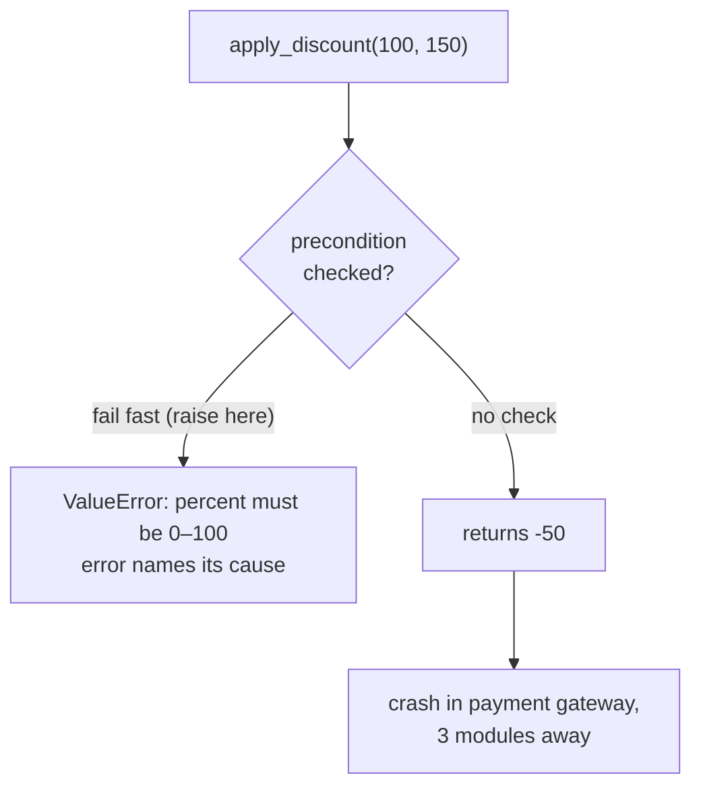

import { Tabs, TabItem, Aside } from '@astrojs/starlight/components';
import AICollab from '../../../components/AICollab.astro';
import VocabTable from '../../../components/VocabTable.astro';
import PromptCard from '../../../components/PromptCard.astro';
import TryIt from '../../../components/TryIt.astro';

Chapter 6 hid an invariant *inside* an object so the outside world couldn't break
it. But objects and functions collaborate, and every boundary between them is a
promise: this name, these parameters, this return type all tell a caller what to
expect. This chapter is about keeping those promises — and about failing loudly,
right where you stand, when one is broken. The principle that governs it has a name:
**least astonishment.** Code should do what it says.

## The Itch

Here is a function used all over checkout-lite:

```python
def apply_discount(price: float, percent: float) -> float:
    return price - price * percent / 100
```

What is `percent`? The name suggests a percentage, but nothing says whether to pass
`20` for twenty percent or `0.2`. So callers guess, and they guess differently. One
team writes `apply_discount(100, 20)` and gets `80`. Another writes
`apply_discount(100, 0.2)`, expecting twenty percent off, and gets `99.80` — a 0.2%
discount, silently wrong, shipped to production where it quietly under-charges for a
quarter.

And it gets worse. `apply_discount(100, 150)` returns `-50` — a negative price, no
error, no complaint. That value flows into the cart, into the payment request, and
finally crashes the payment gateway with an error about *negative amounts* — three
modules away from the discount that caused it. The engineer paged at 2 a.m. starts
debugging payments, because that is where the explosion happened, not where the bomb
was planted.

Both failures share one root: the function made a promise in its name and signature
that it neither clarified nor kept. The reader was *astonished* — and astonishment,
in code, is just the gap between what a name leads you to expect and what the code
actually does.

## The Concept

The **Principle of Least Astonishment** says a unit should behave the way a
reasonable reader of its name and signature expects. Close the gap and bugs that
lived in the gap disappear. The way you close it is with **contracts** — the
promises a function makes, stated explicitly:

- A **precondition** is what must be true for the call to be valid — the *caller's*
  responsibility. For our function: `0 <= percent <= 100`.
- A **postcondition** is what the function guarantees in return — *its*
  responsibility. Here: the result is non-negative and rounded to cents.
- An **invariant** is what stays true throughout — across a loop, or across an
  object's whole life (Chapter 6's cart, whose total always equalled its discounted
  items).

And the rule that makes contracts bite is **fail fast**: when a precondition is
violated, stop *immediately, at the boundary*, with an error that names its own
cause. The alternative — returning a plausible-but-wrong value — is what sent our
negative price on its long journey to the wrong stack trace.



The distance between the bug and its symptom is the cost of not failing fast. Closing
that distance is most of what this chapter buys you.

## Before / After

The fix is to write the promise down and enforce it: a name that states its units, a
docstring that states the contract, a precondition that fails fast, and a defined
postcondition.

<Tabs>
  <TabItem label="Before">

```python
def apply_discount(price: float, percent: float) -> float:
    return price - price * percent / 100
```

  </TabItem>
  <TabItem label="After">

```python
def apply_percentage_discount(price: float, percent: float) -> float:
    """Return `price` reduced by `percent` percent.

    Precondition:  0 <= percent <= 100.
    Postcondition: result is non-negative and rounded to cents.
    """
    if not 0.0 <= percent <= 100.0:
        raise ValueError(f"percent must be in [0, 100], got {percent}")
    result = round(price * (1 - percent / 100), 2)
    assert result >= 0.0, "postcondition: a discount cannot create a negative price"
    return result
```

  </TabItem>
</Tabs>

The name now says `percentage`, so the units stop being a guess. The precondition
`raise`s on bad input — at the boundary, naming the cause. And the postcondition is
not just documented but *checked*. Which raises the question every Python contract
eventually asks: why `raise` for the first check and `assert` for the second?

## Pythonic Notes

Python gives you three lightweight tools for contracts, and one rule for choosing
between two of them that prevents a real production bug.

**Type hints** are the cheapest contract — checked before the code even runs, by your
type checker (a *guide*, in Chapter 3's terms). `percent: float` is weak, but types
can do far more, which we will come back to in a moment.

**`assert` versus `raise` — the rule that matters most.** Use `raise` (a real
exception like `ValueError`) for **preconditions on external or untrusted input**: it
must *always* run. Use `assert` only for **internal invariants and postconditions you
believe cannot fail** — a sanity check on your own logic. The reason is sharp:
`python -O` strips every `assert` from the bytecode. An `assert` guarding real input
silently vanishes in production, taking your validation with it. That is why, above,
the *precondition* on the caller's `percent` is a `raise`, while the *postcondition*
on our own arithmetic is an `assert` — the postcondition is a statement about code we
control, and if it ever fails, that is a bug in us, not bad input from them.

**Docstrings** state the contract in words, for the human caller and for the agent
reading your repo as context.

### Parse, don't validate

There is a move stronger than checking input: making invalid input *impossible to
pass in the first place*. Alexis King named it **"parse, don't validate."** A
*validator* inspects a value and hands the same wide type onward — after
`apply_percentage_discount` checks `percent`, it is still just a `float`, and the
next function that receives it has no proof it was ever checked, so it is tempted to
check again. A *parser* instead turns the input into a **narrower type that carries
the proof**:

```python
@dataclass(frozen=True)
class Percent:
    """A parsed percentage: if one exists, it is valid."""
    value: float

    def __post_init__(self) -> None:
        if not 0.0 <= self.value <= 100.0:
            raise ValueError(f"percent must be in [0, 100], got {self.value}")

def discount(price: float, percent: Percent) -> float:
    return round(price * (1 - percent.value / 100), 2)
```

Now `discount` does no checking, because it cannot receive an invalid percentage — an
invalid `Percent` cannot be *constructed*. You validate once, at the boundary, where
the raw float becomes a `Percent`; everything downstream takes the proven type and
trusts it. This is the constructive form of *make illegal states unrepresentable*,
and it dissolves the assert-versus-raise tension entirely: you `raise` once, in the
parser, and afterward there is nothing left to re-check.

Be honest about Python, though: this is not Haskell. The type system is gradual and
unenforced at runtime, so the guarantee does not live in the compiler — it lives in
the **value object that validates once at construction**. The type hint `Percent`
then documents the proof and lets a type checker flag code that ignores it. Parse,
don't validate, Python-style, means *constructed value objects with validated
boundaries*, not faith in `mypy`. (A stringly-typed argument with a few fixed values
has a lighter parser: an `Enum` or `Literal`, so `"shiped"` simply cannot be passed.)

## When NOT to Use

<Aside type="caution" title="Right-sizing">
Chapter 9 names the failure mode: contracts curdling into **assertion walls** —
defensive checks on every function, including private helpers that only ever receive
data your own validated code produced. That is motion, not safety, and it has a
readability and performance cost. The discipline is **validate at the boundary, trust
inside it**: check where untrusted input *enters* the system, and let the interior
rely on the guarantee. Parse-don't-validate is what makes that trust safe — but it
has its own runaway form, **value-object soup**: a bespoke type for every primitive,
`FirstName` and `MiddleName` and `Suffix`, until the code drowns in wrappers that
guard no real invariant. That is Chapter 4's confetti and Chapter 6's accessor
ceremony in a new costume. Parse at *meaningful* boundaries, for values with *real*
invariants; a plain `str` for a name is correct, and a docstring that merely restates
the type hint is noise.
</Aside>

## 🤖 AI Collaboration

Agents are fluent at producing confident names — which is exactly the risk: a
function called `get_user` that also writes to the database reads perfectly and
astonishes completely. They also tend to reach for `assert` to validate input
(wrong) and to scatter defensive checks (overkill). The vocabulary below steers both.

<AICollab>

### Vocabulary

<VocabTable>

| You say | The agent hears |
|---|---|
| "Add a precondition that fails fast" | `raise` at the boundary on invalid input; don't return a wrong value |
| "State the pre/postconditions in the docstring" | Write the contract down for the next caller |
| "Use `assert` only for internal invariants" | Not for input validation — `-O` strips it |
| "Parse, don't validate" | Turn input into a type that carries its own proof; trust it after |
| "Make illegal states unrepresentable" | Use a value object / `Enum` / `Literal` so the bad value can't exist |
| "This name is misleading" | The behavior doesn't match the promise — rename or split |

</VocabTable>

### Prompt templates

<PromptCard title="Add a contract, fail fast">

This function does no validation. Add a precondition that `raise`s a `ValueError` at
the boundary on invalid input (not an `assert` — it must survive `python -O`), state
the pre- and postconditions in the docstring, and make the name reflect what it
actually does and in what units. Don't add defensive checks to functions that only
receive already-validated data.

</PromptCard>

<PromptCard title="Parse, don't validate">

Replace this repeated validation with a parsed value object: a small `frozen`
dataclass (or an `Enum`/`Literal` if it's a fixed set) that validates once in
`__post_init__`, so an invalid value cannot be constructed. Change the downstream
functions to take that type and stop re-checking.

</PromptCard>

### Review checklist

- [ ] Does the name match the behavior — no hidden side effects (a `get_` that writes)?
- [ ] Preconditions on external input use `raise`, and fail at the boundary?
- [ ] Is `assert` used *only* for internal invariants/postconditions?
- [ ] Where a value has a real invariant, is it a parsed type rather than re-checked?
- [ ] Reverse check: any defensive walls on already-trusted internal data?

### Agent failure modes

- **`assert` for input.** The agent guards external input with `assert`; it works in
  tests and silently vanishes under `-O`. Insist on `raise` for preconditions.
- **The confident misnomer.** It names a function for what you asked, not for what the
  code does — `validate_order` that also saves it. Chapter 1's plausible-but-wrong,
  wearing a function name. Read the body against the name.
- **Error swallowing.** Instead of failing fast, it returns `None` or a default on bad
  input, pushing the crash downstream. Fail at the source.
- **The defensive wall.** Asked for "robust" code, it validates every argument of
  every helper. Boundary, not everywhere.

</AICollab>

<TryIt starter="examples/ch07/before.py">

Take the uncontracted `apply_discount` (or a function of your own with an ambiguous
argument) and run the **add-a-contract** prompt. Check the result on the two axes this
chapter cares about: did the agent use `raise` for the precondition (not `assert`),
and did it stop at the boundary rather than walling every helper? Then try the
**parse-don't-validate** prompt and see whether the downstream code genuinely stops
re-checking. Our worked version — contract, fail-fast, and a `Percent` that can't be
constructed invalid — is in `examples/ch07/`.

</TryIt>

## Key Takeaways

- The **Principle of Least Astonishment**: code should behave as its name and
  signature promise. A bug in the gap between promise and behavior is the most
  expensive kind, because it hides in plain sight.
- Make promises explicit as **contracts**: preconditions (the caller's duty),
  postconditions (yours), invariants (always true). And **fail fast** — stop at the
  boundary with an error that names its cause, instead of letting a wrong value crash
  far away.
- In Python: `raise` for preconditions on external input (always runs); `assert`
  *only* for internal invariants (`-O` strips it); docstrings for the words.
- **Parse, don't validate**: turn input into a type that carries its own proof, so
  downstream code can't receive an invalid value and never re-checks. In Python the
  proof lives in a value object validated at construction, not in the compiler.
- Right-size it: validate at the boundary and trust inside; don't build assertion
  walls or a bespoke type for every primitive.
- **Glossary terms added:** *Principle of Least Astonishment · precondition ·
  postcondition · invariant · fail fast · parse, don't validate.*
