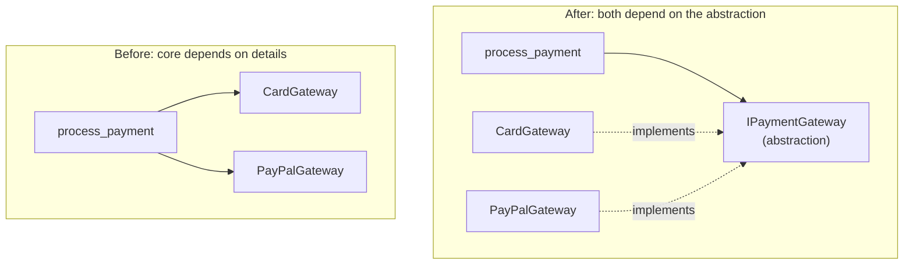

import { TabItem, Aside } from '@astrojs/starlight/components';
import LangTabs from '../../../components/LangTabs.astro';
import AICollab from '../../../components/AICollab.astro';
import VocabTable from '../../../components/VocabTable.astro';
import PromptCard from '../../../components/PromptCard.astro';
import TryIt from '../../../components/TryIt.astro';

This chapter closes Part II by answering a question the earlier ones kept circling:
once the code is cohesive, loosely coupled, encapsulated, and contracted — how do you
*grow* it without breaking it? The answer is a cluster of related principles that
share one instinct: **add code, don't edit it.** They are also the theory beneath
Part III. Every pattern you are about to meet is one of these principles, named and
crystallized — so learn the principles here, and the patterns will feel like old
friends.

## The Itch

checkout-lite takes card and PayPal payments through one function:

<LangTabs>
  <TabItem label="Python">

```python
def process_payment(method: str, amount: float) -> Receipt:
    if method == "card":
        return Receipt("card", amount, ...)
    elif method == "paypal":
        return Receipt("paypal", amount, ...)
    else:
        raise ValueError(f"unknown payment method: {method}")
```

  </TabItem>
  <TabItem label="TypeScript">

```typescript
function processPayment(method: string, amount: number): Receipt {
  switch (method) {
    case "card":
      return { provider: "card", amount, confirmation: "..." };
    case "paypal":
      return { provider: "paypal", amount, confirmation: "..." };
    default:
      throw new Error(`unknown payment method: ${method}`);
  }
}
```

  </TabItem>
</LangTabs>

Today the requirement is crypto. So you open `process_payment` — the most
safety-critical function in the system, the one that moves money — and add a branch.
To extend the system, you had to *modify* its core, re-testing everything that
already worked to make room for something new. Next quarter it will be bank
transfers, and you will be back in this same function again. The code is **closed for
extension and open for modification** — exactly the wrong way round.

## The Concept

The **Open-Closed Principle** names the goal: software should be *open for extension,
closed for modification.* You should be able to add behavior by adding new code, not
by editing code that already works. The reason is risk: every edit to tested code can
break it; new code added alongside cannot.

The mechanism is a stable thing to build against — **code to the interface, not the
implementation.** If `process_payment` depends on an *abstraction* — "something that
can charge" — rather than on concrete providers, then a new provider is a new
implementation of that abstraction, and the core never moves.

That move has a direction, and it is the one Chapter 5 promised to explain. Here it
is — **dependency inversion**:



Before, the high-level policy (`process_payment`) depended on low-level details
(concrete gateways) — so details could break policy, and new details meant editing
policy. After, *both* depend on the abstraction `IPaymentGateway`. The arrows from the
concrete gateways now point *up* at the interface: the dependency has been inverted.
Policy is insulated from details, which is exactly what lets you add details freely.

Two more principles round this out. **Composition over inheritance**: you build the
seam by *injecting* an object the core *has* (`process_payment` is given a gateway),
not by *subclassing* what the core *is*. The test is "is-a versus has-a" — a
`CardGateway` *is a* payment gateway (inheritance fits), but checkout *has a* gateway
(composition fits). Prefer composition, because an injected dependency is swappable at
runtime and carries none of inheritance's fragility. And **Liskov substitution**: when
you *do* use subtypes, every subtype must be substitutable for its base — honoring the
base's contract, in Chapter 7's exact sense (no stronger preconditions, no weaker
postconditions, no surprising exceptions). A subtype that inherits the name but breaks
the promise is a bug wearing a valid type.

## Before / After

### Before

<LangTabs>
  <TabItem label="Python">

```python
def process_payment(method: str, amount: float) -> Receipt:
    if method == "card":
        return Receipt("card", amount, f"card-{int(amount * 100)}")
    elif method == "paypal":
        return Receipt("paypal", amount, f"pp-{int(amount * 100)}")
    else:
        raise ValueError(f"unknown payment method: {method}")
```

  </TabItem>
  <TabItem label="TypeScript">

```typescript
function processPayment(method: string, amount: number): Receipt {
  switch (method) {
    case "card":
      return { provider: "card", amount, confirmation: `card-${Math.round(amount * 100)}` };
    case "paypal":
      return { provider: "paypal", amount, confirmation: `pp-${Math.round(amount * 100)}` };
    default:
      throw new Error(`unknown payment method: ${method}`);
  }
}
```

  </TabItem>
</LangTabs>

### After

<LangTabs>
  <TabItem label="Python">

```python
from abc import ABC, abstractmethod

class IPaymentGateway(ABC):
    @abstractmethod
    def charge(self, amount: float) -> Receipt:
        """Charge `amount`. Postcondition: returns a Receipt for that amount."""

class CardGateway(IPaymentGateway):
    def charge(self, amount: float) -> Receipt:
        return Receipt("card", amount, f"card-{int(amount * 100)}")

class PayPalGateway(IPaymentGateway):
    def charge(self, amount: float) -> Receipt:
        return Receipt("paypal", amount, f"pp-{int(amount * 100)}")

def process_payment(gateway: IPaymentGateway, amount: float) -> Receipt:
    return gateway.charge(amount)   # never edited again, whatever you add
```

  </TabItem>
  <TabItem label="TypeScript">

```typescript
// We own both sides, so we declare an interface and `implements` it for intent —
// though TS, being structural, would accept a matching class without the keyword.
interface IPaymentGateway {
  charge(amount: number): Receipt; // postcondition: a Receipt for that amount
}

class CardGateway implements IPaymentGateway {
  charge(amount: number): Receipt {
    return { provider: "card", amount, confirmation: `card-${Math.round(amount * 100)}` };
  }
}

class PayPalGateway implements IPaymentGateway {
  charge(amount: number): Receipt {
    return { provider: "paypal", amount, confirmation: `pp-${Math.round(amount * 100)}` };
  }
}

function processPayment(gateway: IPaymentGateway, amount: number): Receipt {
  return gateway.charge(amount); // never edited again, whatever you add
}
```

  </TabItem>
</LangTabs>

Adding crypto is now a new class implementing `IPaymentGateway` — `process_payment`
is never touched. The `examples/ch08/` tests prove it literally: a `CryptoGateway`
*defined inside the test*, which the core has never heard of, flows through
`process_payment` and works. That is "extension without modification" as a passing
test, not a slogan.

If this shape feels familiar, it should: it is the skeleton of half of Part III.
Strategy (Chapter 13) is this applied to interchangeable *algorithms*; the Factory of
Chapter 10 decides *which* gateway to construct; the Adapter of Chapter 11 wraps a
provider whose SDK doesn't match your interface. They are all this principle, named.

## Choosing: ABC vs. `Protocol`

This is a **Python-side decision** — and it is worth meeting head-on, because the two
languages in this book disagree about whether it even exists. In Python you must
*choose*. The interface above is an **abstract base class** — a gateway must explicitly
inherit `IPaymentGateway`. Python offers a second way to declare an interface, the
**`Protocol`**, which matches by *shape* rather than by name: anything with a
compatible `charge` method satisfies it, with no inheritance at all. Which to use is a
real decision, and this book settles it with one rule:

> **You control both sides → ABC. You're retrofitting code you don't own → `Protocol`.**

Use an **ABC** (the default) when you define both the interface and its
implementations: the inheritance is explicit, the contract is declared in one place,
and a missing method is an error at construction. Use a **`Protocol`** when you need
something you *can't* make inherit your base — a third-party SDK, a class from another
package — to satisfy your interface anyway. Because `Protocol` is structural, that
foreign class fits the moment it has the right shape, untouched. This is why
`Protocol` shines in Chapter 11's Adapter, where the whole job is making code you
don't own fit an interface you do.

In TypeScript there is no such fork in the road, because **interfaces are structural by
default**. A class satisfies an `interface` whether or not it writes `implements`, and
a foreign object with the right shape just works — TS's lone `interface` does the job of
*both* the ABC and the `Protocol` at once. So the decision the rule above settles for
Python simply doesn't arise; `implements` is an optional note of intent, not the thing
that makes the type fit. The design idea — *code to the interface* — is identical in
both languages; only the question of how conformance is established differs.

## Language Notes

Both languages reach the same seam — code to an abstraction, inject what you have —
but they get there with different machinery, and the differences are themselves the
lesson.

<LangTabs>
  <TabItem label="Python">

The lightest interface in Python is not a class at all — it's a `Callable`. When the
abstraction has a single method, a function *is* the interface, and "inject an
implementation" means "pass a function" (Chapter 13's functions-as-strategies, seen
from the principle side). Reach for an ABC when the interface has several methods or
the implementations carry state; reach for a function when it doesn't.

Composition needs no machinery, either. "Dependency injection" sounds like a
framework; in Python it is a parameter — `process_payment(gateway, amount)` *is*
injection, and that is the whole technique (Chapter 9's "a parameter is the cheapest
seam"). And a duck-typing caveat: Python will not *enforce* Liskov or
code-to-the-interface for you — a subtype that breaks the contract still runs. These
are disciplines; a `Protocol` plus a type checker is how you make them visible before
runtime does.

  </TabItem>
  <TabItem label="TypeScript">

TypeScript collapses the choice Python makes you weigh: **interfaces are structural by
default.** Declare `interface IPaymentGateway { charge(amount: number): Receipt }` once
and it serves as both the ABC and the `Protocol` — a class with the right shape fits it
*whether or not* it writes `implements`, and so does a plain object literal you never
wrote a class for:

```typescript
interface IPaymentGateway {
  charge(amount: number): Receipt;
}

// No `implements`, inherits nothing of ours — yet assignable by shape alone.
class InHouseGateway {
  charge(amount: number): Receipt {
    return { provider: "inhouse", amount, confirmation: `ih-${Math.round(amount * 100)}` };
  }
}

// A foreign object with no class at all fits too — structural typing in action.
const wallet: IPaymentGateway = {
  charge: (amount) => ({ provider: "wallet", amount, confirmation: `w-${amount}` }),
};
```

So `implements` in TypeScript is a *note of intent*, not the thing that makes the type
fit — it earns you a clearer compiler error when you forget a method, nothing more.
Write it on classes you own for documentation; rely on the structural match for foreign
shapes (the Adapter move, Chapter 11). Composition is just as lightweight: a constructor
parameter *is* the injection — `new Checkout(gateway)` hands the dependency in, no
framework required. And Liskov is the same contract idea word for word: a subtype that
type-checks but returns the wrong thing at runtime is a bug wearing a valid type, which
is why the chapter's tests run every substitute through one shared contract.

  </TabItem>
</LangTabs>

## When NOT to Use

<Aside type="caution" title="Right-sizing">
This is the principle agents over-apply most, so the brake matters here more than
anywhere. **An interface with one implementation is not Open-Closed — it is
speculation** (Chapter 9, exactly). The `if/elif` on payment method is *fine* while
there is one or two of them and no third in sight; the abstraction earns its place
when a real second axis of variation arrives, the way Chapter 13's discount rules did
after the change-log demanded them. Build the seam on evidence, not on a hunch that
"we might add providers someday."

And the cluster has its own over-corrections. Don't ban inheritance — it is right for
a genuine *is-a* and for Template Method (Chapter 13); "prefer composition" is a lean,
not a law. Don't invert *every* dependency — invert at real boundaries (volatile,
external, swappable things like payment providers), not between two stable functions
that will always change together. Dependency inversion at the wrong seam is just
indirection with a grand name.
</Aside>

## 🤖 AI Collaboration

This chapter's principles are the ones an agent reaches for too eagerly — extracting
interfaces, inverting dependencies, and building hierarchies are exactly what "good
design" looks like in the training data. Your job at review is as often to *restrain*
as to request.

<AICollab>

### Vocabulary

<VocabTable>

| You say | The agent hears |
|---|---|
| "Make this open-closed" | Extend by adding code, not editing; introduce a seam |
| "Code to the interface" | Depend on an abstraction, not a concrete class |
| "Extract an interface (ABC)" | A declared base class — you own all the implementations |
| "Use a Protocol here" | Structural typing — for code you don't own / can't subclass |
| "Prefer composition over inheritance" | Inject what it *has*; don't subclass what it *is* |
| "Check this for a Liskov violation" | Does the subtype honor the base's contract? |
| "Depend on the abstraction" | Invert the dependency — point policy at the interface |

</VocabTable>

### Prompt templates

<PromptCard title="Make it open-closed (right-sized)">

This `if/elif` grows a branch for every new [provider/type]. Make it open-closed:
extract an interface and inject implementations, so a new case is a new class and this
function is never edited again. Use an **ABC** (we own all the implementations). Do
this **only if** there are already two or more real cases — if there's only one, leave
the conditional and tell me so.

</PromptCard>

<PromptCard title="Wrap code we don't own (Protocol)">

We need this third-party [SDK/class] to satisfy our interface, but we can't make it
inherit our base. Define a **`Protocol`** with the methods we depend on, and type our
code against that — structural typing, no inheritance. Don't modify the third-party
class.

</PromptCard>

<PromptCard title="Liskov check">

Review these subclasses against their base class's contract. Flag any Liskov
violation: a subtype that strengthens a precondition, weakens a postcondition, returns
a different type, or raises an exception the base doesn't promise.

</PromptCard>

### Review checklist

- [ ] Does adding a case mean adding a *class*, not editing the core function?
- [ ] Does the core depend on the abstraction, not the concrete implementations?
- [ ] Is every subtype substitutable — same contract, no surprises (Liskov)?
- [ ] ABC for code you own, `Protocol` for code you don't — chosen per the rule?
- [ ] **Is there more than one real implementation?** If not, the interface is premature.

### Agent failure modes

- **The one-implementation interface.** The agent extracts an `IThing` with a single
  `Thing` behind it, for a variation that is hypothetical. Premature OCP — Chapter 9.
  Ask how many implementations exist *today*.
- **Inheritance for has-a.** It subclasses to reuse code (`Checkout(PaymentGateway)`)
  where it should inject. Wrong relationship; prefer composition.
- **The Liskov violation.** A subtype returns `None`, raises a new exception, or
  quietly narrows what it accepts — type-checks, breaks callers. Test substitutes
  against one shared contract.
- **Inversion everywhere.** It introduces abstractions between stable internal pieces
  that have no reason to vary independently. Invert at real boundaries only.

</AICollab>

<TryIt starter="examples/ch08/py/before.py">

Take the `if/elif` (or `switch`) `process_payment` and run the
**make-it-open-closed** prompt (starter — Python: `examples/ch08/py/before.py` ·
TypeScript: `examples/ch08/ts/before.ts`). Verify the payoff the chapter promised: can
you add a brand-new implementation without touching the core function? Then push on the
two failure directions — did the agent extract an interface that has only one
implementation (premature), and would a deliberately broken subtype (one that returns
the wrong thing) pass the same contract test the good ones do? Our worked version, with
the OCP and Liskov tests, is in `examples/ch08/` (`py/` and `ts/`).

</TryIt>

## Key Takeaways

- The **Open-Closed Principle** is the goal: extend by *adding* code, not editing
  tested code. **Add code, don't edit it.**
- The mechanism is **code to the interface** plus **dependency inversion**: point the
  core at an abstraction so new implementations slot in without touching it — the
  inverted arrow Chapter 5 promised.
- Build the seam with **composition** (inject what it *has*) over inheritance
  (subclass what it *is*); when you do inherit, keep subtypes **Liskov**-substitutable
  — honoring the base contract (Chapter 7).
- **ABC for code you own; `Protocol` for code you don't.** That one rule settles the
  interface-style question for the whole book.
- Right-size hardest here: an interface with one implementation is speculation, not
  design. Abstract on evidence of real variation.
- These principles are the skeletons of Part III's patterns — Strategy, Factory,
  Adapter are each one of them, named.
- **Glossary terms added:** *Open-Closed Principle · Liskov Substitution Principle ·
  composition over inheritance · dependency inversion principle · code to the
  interface.*
