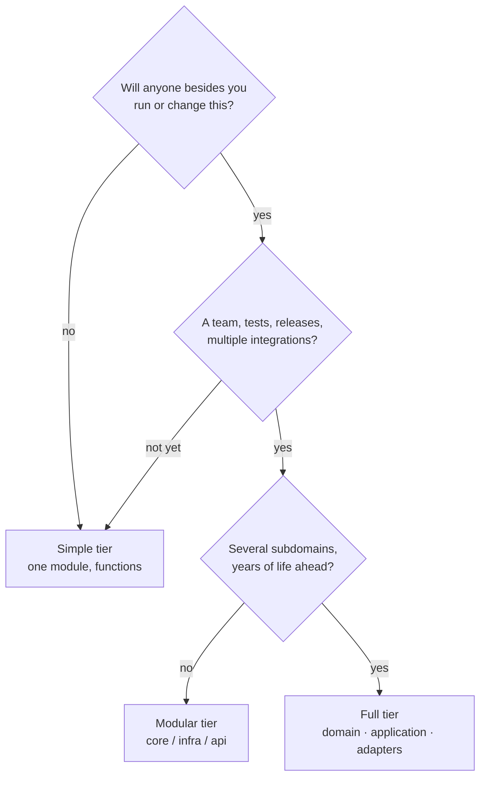

import { TabItem, Aside } from '@astrojs/starlight/components';
import LangTabs from '../../../components/LangTabs.astro';
import AICollab from '../../../components/AICollab.astro';
import VocabTable from '../../../components/VocabTable.astro';
import PromptCard from '../../../components/PromptCard.astro';
import TryIt from '../../../components/TryIt.astro';

<Aside type="note" title="The running example: checkout-lite">
Throughout the book we grow one small order-processing module, **checkout-lite**:
customers build an `Order` of line items, a price is computed (discounts, tax,
shipping), payment is taken, and a receipt goes out. It is deliberately ordinary —
the design pressure comes not from the domain but from *change*.
</Aside>

Every chapter in this part has taught you to add structure: split this, hide that,
extract an interface. This chapter teaches the opposite reflex, and in the AI era
it is the one you will use most. Agents rarely under-engineer. Asked for a feature,
they deliver structure — confidently, plausibly, and in quantities nobody ordered.
The skill this chapter builds is *sizing*: knowing how much design a piece of code
has earned.

## The Itch

You ask your agent for something small:

> "Orders disappear when the process exits. Save completed orders to disk so we can
> reload them later."

What comes back is a tour:

```
orders/
├── repository.py           # IOrderRepository (ABC)
├── json_repository.py      # JsonOrderRepository(IOrderRepository)
├── repository_factory.py   # OrderRepositoryFactory
├── serializers.py          # OrderSerializer, LineItemSerializer
├── settings.py             # StorageSettings, reads environment variables
└── __init__.py             # wires it all together
```

Three hundred lines answering a thirty-line question. And here is the trap: **every
piece is individually defensible.** The interface decouples storage from callers —
true. The factory centralizes construction — true. The settings object makes paths
configurable — true. You learned all of this in Chapters 4 through 8, and your
agent learned it from the same decades of literature. Each argument is sound; the
sum is indefensible. You can't review it in one sitting. The flexibility points all
face futures nobody asked about — a second storage backend, a different
serialization format — while the actual request was *"don't lose my orders."*

The agent isn't wrong about *how*. It's wrong about *how much*.

## The Concept

### Principles are forces, not laws

Every principle in this part of the book describes a force, and every force, pushed
past its purpose, inverts:

| Principle | Over-applied, it becomes |
|---|---|
| Cohesion, SRP (Ch. 4) | A confetti of ten-line classes; navigation replaces reading |
| Low coupling, Demeter (Ch. 5) | Wrapper layers that only forward calls |
| Encapsulation (Ch. 6) | Getter/setter ceremony around plain data |
| Contracts (Ch. 7) | Assertion walls around code that cannot fail |
| Open-Closed, interfaces (Ch. 8) | Speculative seams: ABCs with one implementation |

There is no principle whose maximum is its optimum. Good design is not applying
principles hard; it is balancing forces for *this* codebase, at *this* point in its
life. The two counterweights that do the balancing have names — and like every name
in this book, they work as well in a prompt as in your head.

### YAGNI: the case against speculation

**YAGNI** — *You Aren't Gonna Need It* — says: build for today's requirement, not
for the future you imagine. It is not an argument against thinking ahead; it is an
empirical claim about how imagined futures behave. They are usually wrong — and
wrong in direction, not just in timing. An abstraction built for the variation you
guessed will actively resist the variation that actually arrives, because now the
new requirement must be threaded through structure that was shaped for something
else. That is why Sandi Metz's line has become a proverb: *prefer duplication over
the wrong abstraction.* Duplication is a debt you can see and repay any time. The
wrong abstraction is a debt that compounds while telling you it's an asset.

The sharp edge of YAGNI — sharp enough that we'll return to it twice more in this
chapter — is the line between **speculation** and **evidence**. "We might need
another storage backend someday" is speculation; delete the interface. "Marketing
has requested four discount rules in two quarters" is evidence; build the seam.
YAGNI forbids the first and *demands* the second, because refusing to build a seam
the change-log is begging for is its own kind of guess about the future.

### KISS: the simplest thing that works

**KISS** — *Keep It Simple* — is YAGNI's quieter sibling. Among designs that
satisfy today's requirement, prefer the one with the fewest moving parts: the
fewest concepts a reader must hold in their head before the code makes sense.
Simple is not the same as easy, and emphatically not the same as short — a clever
one-liner can be the least simple thing in a module. The test is always the reader:
how much must they already know before this code explains itself?

### The three tiers: a sizing vocabulary

"Right-size it" needs sizes. The book uses three, and the names are worth
memorizing because they compress an entire structural budget into one word:

- **Simple tier** — one module. Functions and plain value types, the standard
  library first, configuration as parameters. Most scripts, prototypes, and
  internal tools live their whole lives here, correctly.
- **Modular tier** — one package with named layers (`core/`, `infra/`, `api/`),
  dependencies pointing inward, constructor injection at the boundaries. For code
  with a team, tests, releases, and more than one integration.
- **Full tier** — domain / application / adapters with a composition root. For
  long-lived products with several subdomains, where the cost of the ceremony is
  repaid monthly.



Two things about this dial. First, it has a default: **start at Simple and promote
on evidence** — moving up a tier later is mechanical work your agent is good at
(Chapter 17 shows how), while tearing out an unearned Full-tier skeleton is
miserable. Second, the tier is a *declaration*, not a feeling. Say it out loud, put
it in the conventions file, open prompts with it. Most over-engineering arguments
between you and your agent are really an undeclared disagreement about tier.

### The warning-sign catalog

Over-engineering announces itself. The recurring signs, all of which you have now
seen in the wild:

- An interface (ABC or Protocol) with **exactly one implementation** and no second
  in sight
- A layer that **only forwards** calls to the layer below
- DTOs that mirror your entities **field for field**
- A **config system** for three constants that have never changed
- A factory that can only ever produce **one type**
- A deep folder tree sheltering **five files**
- Names like `Manager`, `Helper`, `Util`, `Processor` — vocabulary that exists to
  hold indirection rather than meaning

None of these is a crime in isolation; each is a question. The question is always
the same: *what change, expected on what evidence, does this structure serve?* No
answer, no structure.

## Before / After

For the only time in this book, the After is *shorter* than the Before. That
inversion is the chapter. Here is the order-persistence cathedral — abridged; the
full tour is in `examples/ch09/` — next to what the request actually needed.

### Before

The cathedral: an interface, a factory, a serializer hierarchy, and a settings
object, all guarding a single JSON file.

<LangTabs>
  <TabItem label="Python">

```python
class IOrderRepository(ABC):
    @abstractmethod
    def save(self, orders: list[Order]) -> None: ...
    @abstractmethod
    def load(self) -> list[Order]: ...

class JsonOrderRepository(IOrderRepository):
    def __init__(self, settings: StorageSettings) -> None:
        self._path = Path(settings.storage_dir) / settings.filename
        self._serializer = OrderSerializer()   # delegates to LineItemSerializer

    def save(self, orders: list[Order]) -> None:
        payload = [self._serializer.to_dict(o) for o in orders]
        self._path.write_text(json.dumps(payload, indent=2))

    def load(self) -> list[Order]:
        payload = json.loads(self._path.read_text())
        return [self._serializer.from_dict(d) for d in payload]

class OrderRepositoryFactory:
    @staticmethod
    def create(kind: str = "json") -> IOrderRepository:
        if kind == "json":
            return JsonOrderRepository(StorageSettings.from_env())
        raise ValueError(f"unknown repository kind: {kind}")
```

  </TabItem>
  <TabItem label="TypeScript">

```typescript
export interface IOrderRepository {
  save(orders: readonly Order[]): void;
  load(): Order[];
}

export class JsonOrderRepository implements IOrderRepository {
  private readonly path: string;
  private readonly serializer = new OrderSerializer(); // delegates to LineItemSerializer

  constructor(settings: StorageSettings) {
    this.path = join(settings.storageDir, settings.filename);
  }

  save(orders: readonly Order[]): void {
    const payload = orders.map((o) => this.serializer.toJSON(o));
    writeFileSync(this.path, JSON.stringify(payload, null, 2));
  }

  load(): Order[] {
    const payload = JSON.parse(readFileSync(this.path, "utf-8")) as Record<string, unknown>[];
    return payload.map((d) => this.serializer.fromJSON(d));
  }
}

export class OrderRepositoryFactory {
  static create(kind = "json"): IOrderRepository {
    if (kind === "json") return new JsonOrderRepository(storageSettingsFromEnv());
    throw new Error(`unknown repository kind: ${kind}`);
  }
}
```

  </TabItem>
</LangTabs>

### After

What the request actually needed: two functions and the platform's own JSON.

<LangTabs>
  <TabItem label="Python">

```python
import json
from pathlib import Path

from models import LineItem, Order

def save_orders(orders: list[Order], path: Path) -> None:
    payload = [
        {
            "items": [{"name": i.name, "price": i.price} for i in o.items],
            "is_member": o.is_member,
        }
        for o in orders
    ]
    path.write_text(json.dumps(payload, indent=2))

def load_orders(path: Path) -> list[Order]:
    return [
        Order(
            items=[LineItem(**item) for item in entry["items"]],
            is_member=entry["is_member"],
        )
        for entry in json.loads(path.read_text())
    ]
```

  </TabItem>
  <TabItem label="TypeScript">

```typescript
import { readFileSync, writeFileSync } from "node:fs";
import { type LineItem, type Order } from "./models";

export function saveOrders(orders: readonly Order[], path: string): void {
  const payload = orders.map((o) => ({
    items: o.items.map((i) => ({ name: i.name, price: i.price })),
    isMember: o.isMember,
  }));
  writeFileSync(path, JSON.stringify(payload, null, 2));
}

export function loadOrders(path: string): Order[] {
  const payload = JSON.parse(readFileSync(path, "utf-8")) as {
    items: LineItem[];
    isMember: boolean;
  }[];
  return payload.map((entry) => ({
    items: entry.items.map((item) => ({ name: item.name, price: item.price })),
    isMember: entry.isMember,
  }));
}
```

  </TabItem>
</LangTabs>

Same behavior. The same tests pass against both — `examples/ch09/py/test_ch09.py`
and `examples/ch09/ts/ch09.test.ts` run every assertion through the cathedral and
the two functions and demand identical results. Roughly eighty percent of the code
is gone.

Walk through what the cathedral was selling. A second storage backend? The
interface and factory wait for one that was never requested. Configurable paths?
Look at the After's signature: `path` is a parameter. **The caller already chooses
the path — a function argument is the cheapest seam there is.** That observation
generalizes further than it looks: passing a dependency in as a parameter is
dependency injection in its entire essence, before any framework gets involved. A
serializer hierarchy? The format never varies. Every flexibility the cathedral
promises, the After either already has — for free — or correctly refuses to pay
for.

## Language Notes

Both languages ship a Simple-tier toolkit in the box — and reaching past it for a
framework is exactly the over-engineering this chapter warns against. The toolkit
differs in syntax but not in spirit: a module for a boundary, a function for
behavior, a plain value for data, the platform for infrastructure.

<LangTabs>
  <TabItem label="Python">

Right-sizing is easier in Python than in almost any language, which makes
over-engineered Python especially gratuitous. The Simple tier's toolkit is the
language itself:

- **A module is already a boundary.** It namespaces, it encapsulates (underscore
  prefix for private helpers), it has an import-able public API. A class that only
  groups functions is a module wearing a costume.
- **A function is already an object.** It can be passed, stored, and injected —
  which is why so many classical patterns deflate to plain functions in Python
  (Part III makes a sport of this).
- **A `dataclass` is already a DTO** — `frozen=True` and you have an immutable
  value type in one line. A hierarchy of hand-written data carriers buys nothing.
- **A `dict` is already a config object**, and a parameter with a default is
  already a setting. Reach for a settings framework when settings *behave* —
  validation, layering, reloading — not when three constants need a home.
- **The stdlib is already your infrastructure layer** — `json`, `pathlib`,
  `sqlite3`, `csv` cover most persistence a Simple-tier tool will ever need. Every
  dependency is a small marriage: ongoing costs, breaking changes, security
  surface. Default to not marrying.

</TabItem>
<TabItem label="TypeScript">

TypeScript tempts you toward ceremony — the ecosystem is full of frameworks eager
to own your boundaries — so the discipline is to notice that the Simple tier is
already in your hands:

- **A module is already a boundary.** A `.ts` file with a few `export`s namespaces,
  hides its un-exported helpers, and presents an import-able public API. A class
  that only groups functions is a module wearing a costume — the same costume,
  whatever the language.
- **A function is already a value.** It can be passed, stored, and injected, which
  is why structural typing lets a strategy be a bare arrow with no `implements`
  (Part III makes a sport of this).
- **A `type` or `interface` is already a DTO.** `readonly` fields give you an
  immutable value shape with no class and no decorator. A hierarchy of hand-written
  data carriers — or a class where an object literal would do — buys nothing.
- **A plain object or `Record` is already a config object**, and a parameter with a
  default is already a setting. Reach for a config framework when settings *behave*
  — validation, layering, reloading — not when three constants need a home.
- **The platform is already your infrastructure layer** — `JSON`, `fetch`, and
  `node:fs` cover most persistence and I/O a Simple-tier tool will ever need before
  any dependency is warranted. Every dependency is a small marriage: ongoing costs,
  breaking changes, a wider security surface. Default to not marrying.

</TabItem>
</LangTabs>

## When NOT to Use

<Aside type="caution" title="Right-sizing the brakes themselves">
YAGNI has its own over-application failure mode, and it is just as expensive as
the cathedral. Three boundaries:

**Some things are never YAGNI.** Tests, honest names, and module boundaries cost
little now and are brutal to retrofit. "We don't need tests yet" is not
right-sizing; it is borrowing against the very future YAGNI claims to respect.

**Evidence overrides the brake.** When the change-log shows four discount-rule
requests in two quarters, building the seam is right-sizing, not speculation — the
Strategy pattern (Chapter 13) opens with exactly that case. Deleting a seam the evidence demands is
the same mistake as building one it doesn't, with the sign flipped.

**Under-engineering has a body count too.** The 800-line script with no functions,
no names, and no seams is not "simple" — it has merely hidden its complexity where
no structure can light it. Simple means *fewest concepts*, not *least structure*.
</Aside>

## 🤖 AI Collaboration

This is the vocabulary you will use most with your agent — not because agents
under-design, but because they don't. Trained on decades of enterprise codebases
and pattern literature, an agent's reflex under uncertainty is to add structure:
it reads as diligence. These phrases are the counter-instruction.

<AICollab>

### Vocabulary

<VocabTable>

| You say | The agent hears |
|---|---|
| "YAGNI — don't build that yet" | Delete or omit speculative structure; today's requirement only |
| "Keep it simple" / "KISS" | Prefer the direct implementation with the fewest moving parts |
| "No premature abstraction" | No interface, factory, or layer until ≥2 concrete cases exist |
| "Right-size this for a script / an internal tool / a production service" | Sets the structural budget (tier) for everything that follows |
| "Start at the Simple tier" | One module, functions + plain value types, the platform's library first, config as parameters |
| "Inline this layer" | Remove the pass-through; let callers talk to the real thing |

</VocabTable>

### Prompt templates

<PromptCard title="The right-sizing preamble — paste atop any feature request">

Context: this is an internal tool at the **Simple tier** — one module, the
platform's standard library only. Implement the feature below with **no new
abstractions, layers, or
dependencies** unless at least two concrete uses exist *today*. If you are tempted
to add flexibility, do not build it — list it under a "Deferred" heading at the
end of your reply instead.

</PromptCard>

<PromptCard title="The de-engineering audit">

Review this module for over-engineering: interfaces with one implementation,
layers that only forward, DTOs that mirror entities, factories with one product, a
config system for constants. Propose the **simplest equivalent that keeps behavior
identical** — the existing tests must stay green. Show what gets deleted, and
report the line count before and after.

</PromptCard>

<PromptCard title="Two designs with a horizon">

Propose two designs for this feature — (a) minimal, for today's requirement only,
and (b) extensible. For each, estimate the cost of the most likely next change.
This code has an expected lifespan of [N months/years] and [one maintainer / a
team]. Recommend one and justify it in three sentences. **Do not write code yet.**

</PromptCard>

### Review checklist

When your agent comes back, check:

- [ ] Every abstraction has ≥2 users *today* — count them
- [ ] No layer that only forwards calls
- [ ] The diff size is proportional to the request
- [ ] Each new dependency is justified in one sentence
- [ ] Flexibility you didn't ask for is listed as "Deferred", not built
- [ ] Tests and clear names survived — the brake never deletes those

### Agent failure modes

- **The eager cathedral.** The default reflex: asked for persistence, delivers a
  repository pattern; asked for an HTTP call, delivers a client abstraction with
  retry policy injection. The preamble above is the standing counterweight.
- **The enterprise reflex.** Repository/service/DTO — the trio appears as a unit,
  whatever the size of the problem. Watch for it whenever the words "service" or
  "layer" appear unrequested.
- **The hedge.** The agent builds the simple version but festoons it with
  `# TODO: make configurable` and commented-out extension points. That is
  speculation in comment form; the "Deferred" list belongs in the conversation,
  not the code.
- **The over-applied brake.** Told "YAGNI", the agent deletes the seam your
  change-log justifies, or the tests, or the error handling. Counter-phrase:
  *"YAGNI applies to speculation, not evidence — keep the tests, keep the
  validated seams."* The brake needs brakes; that is the whole lesson of the
  chapter, pointed at yourself.

</AICollab>

<TryIt starter="examples/ch09/py/exercise/settings.py">

This exercise is inverted: your agent's job is to make the starter *smaller*. The
starter is checkout-lite's configuration "system" — a provider interface, a chain
of providers, a factory, and a cached singleton, all in service of three values
with defaults. Its tests pass, and they pin only the behavior that matters
(defaults, environment override, types) — **not** the ceremony. Run the
**de-engineering audit** prompt against it. The tests must stay green; expect well
over half the code to disappear. Grade with the review checklist, then ask the
question the catalog always asks: what change, on what evidence, did each deleted
piece serve? Full instructions in `examples/ch09/py/exercise/EXERCISE.md`
(TypeScript twin: `examples/ch09/ts/exercise/settings.ts`).

</TryIt>

## Key Takeaways

- Every principle in this book inverts when over-applied. There is no principle
  whose maximum is its optimum — design is balancing forces, not maximizing them.
- **YAGNI targets speculation, not evidence.** Imagined futures are usually wrong
  in direction; the wrong abstraction then resists the change that actually comes.
  But when the change-log demands a seam, YAGNI demands you build it.
- **Declare the tier** — Simple, Modular, or Full — before code is written. Start
  Simple, promote on evidence; most arguments about over-engineering are
  undeclared disagreements about tier.
- A function parameter is the cheapest seam there is, and every language ships a
  Simple-tier toolkit — modules, functions, plain value types — that makes the
  smallest design more capable than it looks.
- The brake has a failure mode too: tests, honest names, and module boundaries are
  never YAGNI.
- **Glossary terms added:** *YAGNI · KISS · premature abstraction · right-sizing ·
  the three tiers (Simple/Modular/Full) · pass-through layer.*
