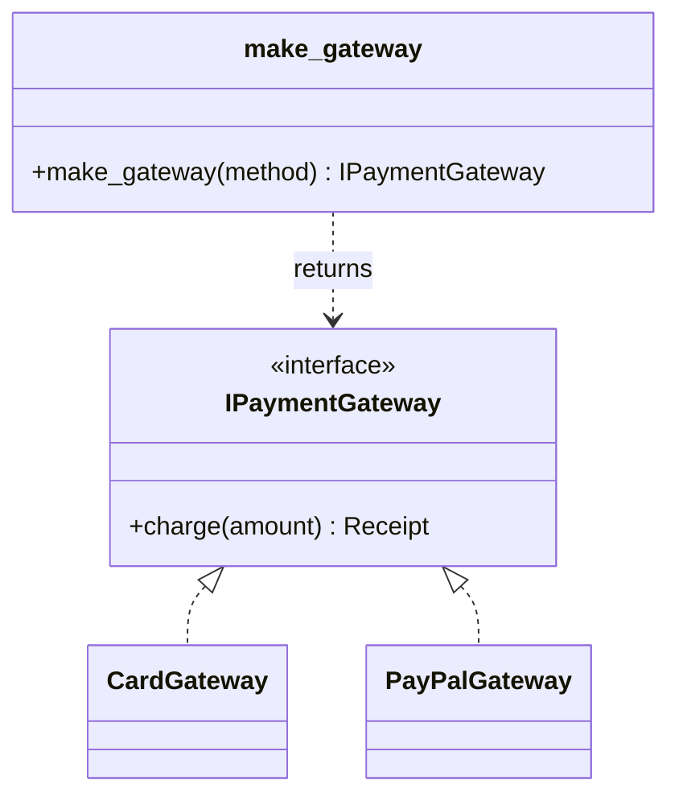
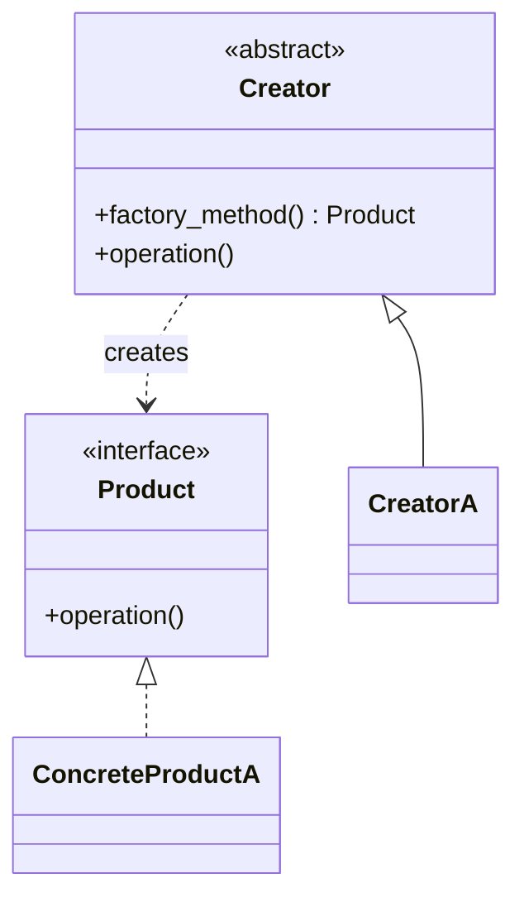

import { Tabs, TabItem, Aside } from '@astrojs/starlight/components';
import AICollab from '../../../components/AICollab.astro';
import VocabTable from '../../../components/VocabTable.astro';
import PromptCard from '../../../components/PromptCard.astro';
import TryIt from '../../../components/TryIt.astro';
import CheatSheet from '../../../components/CheatSheet.astro';

Welcome to the phrasebook. Part II gave you the principles; this part gives you the
named structures that apply them — and Chapter 8 already promised this one would
arrive. There we made *using* a payment gateway open-closed by injecting it through
an interface. But injection raises a question it doesn't answer: *who builds the
gateway?* This chapter is the creational family's answer. The unifying idea: **a
factory puts the knowledge of what to build in one place, so adding a type is a
registration, not an edit.**

## The Itch

Chapter 8 left checkout-lite injecting an `IPaymentGateway`, so `process_payment`
never has to change. Progress — but look at the code that calls it:

```python
def checkout(method: str, amount: float) -> Receipt:
    if method == "card":
        gateway = CardGateway()
    elif method == "paypal":
        gateway = PayPalGateway()
    else:
        raise ValueError(f"unknown payment method: {method}")
    return gateway.charge(amount)
```

The dispatch we removed from `process_payment` just moved up one level — and it
breeds. The refund flow has the same `if/elif`. So does the admin tool. So does the
retry job. Each knows the full list of concrete gateways and how to build each one,
and a new provider means finding and editing every copy. We made *use* open-closed
in Chapter 8; *construction* is still open for modification, in three places at once.

## The Concept

What we want is one place that owns construction:

- A single source of truth for "how do I build a gateway for this method?"
- Adding a provider is *registering* it, not editing call sites.
- Callers ask for a gateway by key and receive one, never naming a concrete class.

That place is a **factory**. In its Pythonic form it is not a class or a framework —
it is a function backed by a **registry dict** (the same registry idea from the
Strategy chapter, now pointed at construction). The insight that makes it tiny:
**a class is already a callable that constructs an instance**, so a dict whose values
are classes *is* a factory.



Callers depend only on `make_gateway` and the interface; the concrete classes sit
behind the factory, exactly as the principle of dependency direction (Chapter 5)
wants.

## Before / After

<Tabs>
  <TabItem label="Before">

```python
def checkout(method: str, amount: float) -> Receipt:
    if method == "card":
        gateway = CardGateway()
    elif method == "paypal":
        gateway = PayPalGateway()
    else:
        raise ValueError(f"unknown payment method: {method}")
    return gateway.charge(amount)

def refund(method: str, amount: float) -> Receipt:
    if method == "card":            # the same switch, copied
        gateway = CardGateway()
    elif method == "paypal":
        gateway = PayPalGateway()
    else:
        raise ValueError(f"unknown payment method: {method}")
    return gateway.charge(-amount)
```

  </TabItem>
  <TabItem label="After">

```python
from collections.abc import Callable

_GATEWAYS: dict[str, Callable[[], IPaymentGateway]] = {
    "card": CardGateway,
    "paypal": PayPalGateway,
}

def make_gateway(method: str) -> IPaymentGateway:
    try:
        return _GATEWAYS[method]()
    except KeyError:
        raise ValueError(f"unknown payment method: {method}") from None

def checkout(method: str, amount: float) -> Receipt:
    return make_gateway(method).charge(amount)

def refund(method: str, amount: float) -> Receipt:
    return make_gateway(method).charge(-amount)
```

  </TabItem>
</Tabs>

The construction knowledge now lives in `_GATEWAYS`, once. Adding Apple Pay is one
line in the registry; no call site changes. The `examples/ch10/` tests prove the
growth point literally: a `CryptoGateway` registered with a single dict entry is
immediately buildable through `make_gateway`, and an unknown method fails fast with a
located error (Chapter 7).

### The other two factory shapes

The factory function covers the overwhelming majority of cases. Two classical
variants exist for when it doesn't:

**Factory Method** — when a *class hierarchy* should each decide what to build. A base
class calls an overridable method to create its collaborator, and subclasses supply
the concrete type:

```python
class Checkout(ABC):
    @abstractmethod
    def make_gateway(self) -> IPaymentGateway: ...   # the factory method

    def run(self, amount: float) -> Receipt:
        return self.make_gateway().charge(amount)    # uses it without naming a type

class CardCheckout(Checkout):
    def make_gateway(self) -> IPaymentGateway:
        return CardGateway()
```

Reach for it only when you already have the hierarchy for other reasons — otherwise
it is a class ceremony around what a function does in one line.

**Abstract Factory** — when you must build a *family* of objects that have to stay
consistent: say a provider that comes with a matched gateway, refund handler, *and*
receipt format, and mixing a card gateway with a PayPal refund handler would be a bug.
An abstract factory bundles "make the whole family" behind one interface. It is
powerful and rarely needed; most "families" are one object wearing a crowd.

## Choosing among them

| You have… | Use |
|---|---|
| A concrete type to pick from data (a string, config) | **Factory function + registry** |
| A class hierarchy where each subclass builds its own collaborator | **Factory Method** |
| A family of related objects that must be created consistently | **Abstract Factory** |
| Exactly one type, always | **No factory — just construct it** |
| A need for one shared instance | **A module-level instance** (next section) |

The default is the top row. The bottom rows earn their place only on evidence of the
problem they solve — a factory with one product in its registry is the over-engineering
Chapter 9 warned about, wearing a creational hat.

## The Demoted Singleton

Sometimes you genuinely want exactly one of something — a connection pool, a shared
config. The classical answer is the **Singleton pattern**: a class that ensures a
single instance and offers global access to it. Agents reach for it constantly,
because global state feels convenient. It rarely is: a Singleton is global mutable
state by another name, it hides dependencies (code that uses it doesn't declare it),
and it fights testing, because you can't swap the one instance for a fake.

Python makes the whole pattern mostly unnecessary, because **a module is already a
singleton** — imported once, cached, shared by every importer. So the Pythonic "one
instance" is just a module-level object:

```python
# pool.py
pool = GatewayPool()          # created once, importable everywhere

# elsewhere
from pool import pool         # the same instance, no machinery
```

This gives you the single shared instance with none of the `__new__` or metaclass
ceremony — and, crucially, you can still inject `pool` as a parameter in tests to
substitute a fake. When your agent writes a `Singleton` metaclass, that is the push:
*"use a module-level instance, and inject it where it's used."*

## Pythonic Notes

The registry-of-classes is the whole trick: `{"card": CardGateway}` plus
`registry[key]()` is a complete factory, because the class is the constructor. You
will sometimes see `match` used for this dispatch instead — fine for a fixed, closed
set, but a `match` statement must be *edited* to add a case, while a registry dict
stays open for extension. And parse the raw key into an `Enum` at the boundary
(Chapter 7) when the set of methods is known, so `make_gateway` can never be handed a
typo'd string in the first place. For the singleton case, a module-level instance is
the first reach; `functools.lru_cache` on a factory function is a close second when
construction is expensive and you want it lazy.

## When NOT to Use

<Aside type="caution" title="Right-sizing">
Factories are the pattern agents most over-apply, and Chapter 9 named the smell
outright: *a factory that can only ever produce one type.* If there is one concrete
class and no second on the horizon, `CardGateway()` at the call site is the right
code — a factory adds a layer of indirection that buys nothing. Wait for two or more
types chosen at runtime from data before centralizing.

**Abstract Factory** is the high-ceremony end of this and the easiest to over-reach
for: it pays only when a genuine *family* must stay internally consistent. Demand to
see the family before you build the factory for it. And the **Singleton** is on this
list by its very placement — prefer the module-level instance almost every time. The
creational patterns are about *managing* construction; when there is nothing to
manage, construction is just a constructor call.
</Aside>

## 🤖 AI Collaboration

Construction is where agents reach for ceremony fastest — a `FooFactory` class, a
`Singleton` metaclass, an abstract factory for a single product. Most of your work
here is keeping the solution the size of the problem.

<AICollab>

### Vocabulary

<VocabTable>

| You say | The agent hears |
|---|---|
| "Use a factory function backed by a registry dict" | Centralize construction; a dict of classes, not a Factory class |
| "Adding a provider should be one registration" | The registry is the single growth point (open-closed) |
| "Use Factory Method here" | A hierarchy decides its own type via an overridable method |
| "Don't build an Abstract Factory without a real family" | No family of consistent objects → no abstract factory |
| "Use a module-level instance, not a Singleton class" | One shared instance via the module, injectable for tests |

</VocabTable>

### Prompt templates

<PromptCard title="Centralize construction">

This `if/elif` that builds a [gateway/handler] from a string is duplicated across
call sites. Replace it with a **factory function backed by a registry dict** (map the
key to the class — a class is already a callable). Adding a type should be one registry
entry. Raise a `ValueError` on an unknown key. Don't introduce a Factory class.

</PromptCard>

<PromptCard title="One instance, the Pythonic way">

We need a single shared [pool/config]. Use a **module-level instance**, not a
Singleton class or metaclass, and make it injectable as a parameter so tests can pass
a fake. Explain how the module already guarantees one instance.

</PromptCard>

### Review checklist

- [ ] Is there more than one concrete type, chosen at runtime? (else: no factory)
- [ ] Is construction centralized — one place to add a provider?
- [ ] Is the registry the growth point, not an `if/elif` or a `match`?
- [ ] Any `Singleton` class/metaclass where a module-level instance would do?
- [ ] Any Abstract Factory without a real, consistency-bound family?

### Agent failure modes

- **The one-product factory.** A `Factory` class with a single `create` returning one
  type — indirection with no payoff (Chapter 9's named smell).
- **The Singleton reflex.** A `Singleton` metaclass for shared state: global, hidden,
  untestable. Counter with the module-level instance.
- **Speculative Abstract Factory.** A family-creator for what is really one object.
  Ask to see the family.
- **The `match` that isn't open.** Dispatch via `match`/`if` instead of a registry, so
  every new type still edits the function.

</AICollab>

<TryIt starter="examples/ch10/before.py">

Take the duplicated construction switch in `before.py` (or a `build_*` if/elif of your
own) and run the **centralize-construction** prompt. Check the payoff: is adding a new
type genuinely one registry entry, with no call site touched? Then probe the two
over-reaches — did the agent wrap it in a `Factory` class it didn't need, and if a
"single instance" came up anywhere, did it reach for a Singleton instead of a
module-level object? Our worked factory and the singleton contrast, with tests, are in
`examples/ch10/`.

</TryIt>

## Pattern Cheat Sheet

<CheatSheet pattern="Factory">



**Intent:** centralize the choice of *which concrete type to build*, so callers
depend on an interface and adding a type doesn't edit them.

**Canonical** — Factory Method, the form your agent emits:

```python
class Creator(ABC):
    @abstractmethod
    def factory_method(self) -> Product: ...
    def operation(self) -> str:
        return self.factory_method().operation()  # uses product, not its type

class CreatorA(Creator):
    def factory_method(self) -> Product:
        return ConcreteProductA()
```

**Pythonic** — a registry of constructors *is* the factory:

```python
_PRODUCTS: dict[str, Callable[[], Product]] = {"a": ConcreteProductA}

def make_product(kind: str) -> Product:
    return _PRODUCTS[kind]()   # a class is already a callable
```

**Reach for it when** ≥2 concrete types are chosen at runtime from data ·
**not when** there's one type (just construct it) or you'd wrap a single product
in a `Factory` class. Family of consistent objects → Abstract Factory.
Runnable: `examples/ch10/concept_factory.py`.

</CheatSheet>

<CheatSheet pattern="Singleton (demoted)">

**Intent:** guarantee one shared instance. In Python, almost always reach for a
module-level object instead of the pattern.

**Canonical** — the Singleton pattern (rarely needed):

```python
class Singleton:
    _instance: "Singleton | None" = None
    def __new__(cls) -> "Singleton":
        if cls._instance is None:
            cls._instance = super().__new__(cls)
        return cls._instance
```

**Pythonic** — a module is already a singleton:

```python
# config.py
config = Config()          # created once, imported everywhere, injectable in tests
```

**Reach for it when** … almost never — prefer the module-level instance ·
**not when** you'd add a metaclass/`__new__` for global state you could inject.
Runnable: `examples/ch10/concept_singleton.py`.

</CheatSheet>

## Key Takeaways

- Injection (Chapter 8) decides *what to use*; a **factory** decides *what to build* —
  and centralizes that knowledge so adding a type is a registration, not an edit.
- The Pythonic factory is a **function plus a registry dict** of classes — a class is
  already a callable, so no `Factory` class is needed. Factory Method (a hierarchy
  picks its type) and Abstract Factory (a consistent family) are the rarer variants;
  reach for them only on evidence.
- The **Singleton** is demoted on purpose: a module is already a singleton, so prefer a
  **module-level instance** you can inject — not a Singleton class with global reach.
- Right-size hardest here: a factory for one product, or an abstract factory without a
  family, is creational ceremony. When there is nothing to manage, just call the
  constructor.
- **Glossary terms added:** *factory function · factory method · abstract factory ·
  Singleton (and the module-level alternative).*
