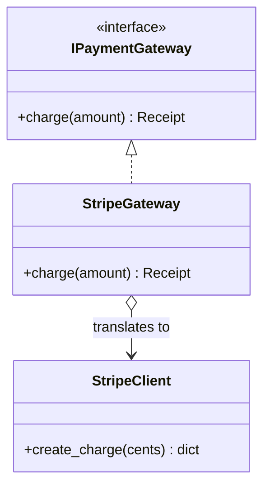
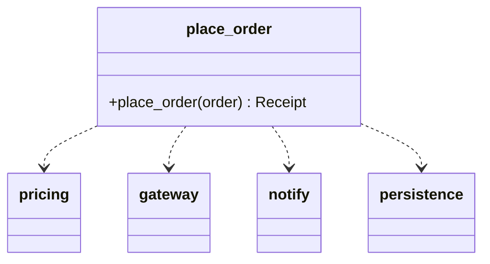
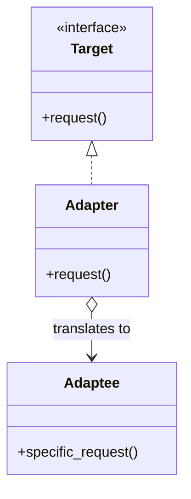
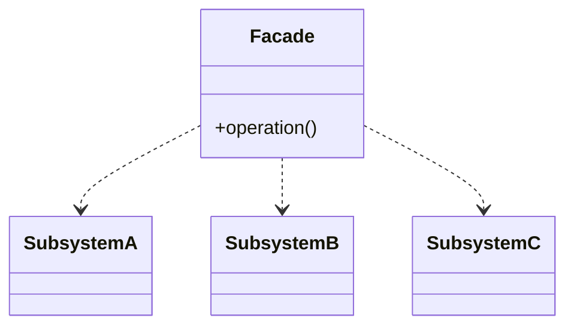

import { Tabs, TabItem, Aside } from '@astrojs/starlight/components';
import AICollab from '../../../components/AICollab.astro';
import VocabTable from '../../../components/VocabTable.astro';
import PromptCard from '../../../components/PromptCard.astro';
import TryIt from '../../../components/TryIt.astro';
import CheatSheet from '../../../components/CheatSheet.astro';

These are the two patterns you and your agent will reach for most, because most
real work is *integration*: making someone else's code fit yours, and taming a
subsystem that has grown too many moving parts. Adapter and Façade are both about
wrapping — one to make code **fit**, the other to make a subsystem **simple**. The
discipline that keeps both honest is a single question: **does the wrapper hide more
than it shows?**

## The Itch

checkout-lite has two integration pains, and they are the everyday texture of
modern coding.

First, payments. Chapters 8 and 10 built our own gateways behind `IPaymentGateway`,
whose contract is `charge(amount: float) -> Receipt`. Now the business wants Stripe,
and the SDK looks nothing like ours:

```python
class StripeClient:          # third-party — we don't own a line of it
    def create_charge(self, amount_cents: int, currency: str = "usd") -> dict: ...
```

Different method name, money in cents, a raw `dict` back. We can't make their class
inherit our ABC, and we *really* don't want cents-and-dicts leaking into pricing,
receipts, and refunds across the codebase.

Second, the checkout flow itself. Placing an order now means orchestrating four
subsystems in the right order — price it, charge it, notify the customer, save it —
and every caller (the web handler, the admin tool, the test fixture) has to know the
whole dance. The complexity is real, but no caller should have to learn it to place
one order.

## The Concept

### Adapter — make it fit

The **Adapter** pattern puts a translating layer between an interface you *expect*
(the **target**) and an object that doesn't match it (the **adaptee**). The adapter
implements the target interface and, inside each method, delegates to the adaptee
while translating the mismatch — names, types, units, return shapes.



The rest of checkout-lite keeps talking to `IPaymentGateway`; only `StripeGateway`
ever sees Stripe. That is the adapter earning its keep — it doesn't just rename a
method, it *translates* dollars to cents and a `dict` to a `Receipt`. An adapter that
only forwarded a call unchanged would be a pass-through (Chapter 9), not a design.

### Façade — make it simple

The **Façade** pattern puts one simple interface in front of a whole subsystem,
coordinating its parts so callers don't have to. It doesn't change what the
subsystem *can* do; it changes how much you must know to use it.



This is, in John Ousterhout's terms, a **depth-adding move**: a tiny interface
(`place_order`) over real functionality (four coordinated subsystems). A façade earns
its place by depth — if it merely forwarded each subsystem call one-to-one without
coordinating or simplifying, it would be another pass-through.

## Before / After

<Tabs>
  <TabItem label="Adapter — Before">

```python
# The SDK's shape leaks everywhere a payment happens:
client = StripeClient()
resp = client.create_charge(int(order_total * 100))   # remember: cents!
if resp["paid"]:
    confirmation = resp["id"]                          # dig through the dict
# ...and the same cents-and-dict ritual is copied into refunds, retries, admin...
```

  </TabItem>
  <TabItem label="Adapter — After">

```python
class StripeGateway(IPaymentGateway):
    def __init__(self, client: StripeClient) -> None:
        self._client = client

    def charge(self, amount: float) -> Receipt:
        resp = self._client.create_charge(int(round(amount * 100)))  # dollars → cents
        return Receipt("stripe", amount, resp["id"])                 # dict → Receipt

# everywhere else, Stripe is invisible:
gateway: IPaymentGateway = StripeGateway(StripeClient())
receipt = gateway.charge(order_total)
```

  </TabItem>
  <TabItem label="Façade — Before">

```python
# every caller orchestrates the whole subsystem by hand:
total = order_total(order)
confirmation = charge(total)
send_receipt(order, total)
save_order(order, total)
receipt = Receipt(total, confirmation)
```

  </TabItem>
  <TabItem label="Façade — After">

```python
def place_order(order: Order) -> Receipt:        # the one friendly door
    total = order_total(order)
    confirmation = charge(total)
    send_receipt(order, total)
    save_order(order, total)
    return Receipt(total, confirmation)

receipt = place_order(order)                      # callers know only this
```

  </TabItem>
</Tabs>

The full code, with tests that prove the adapter translates and the façade drives the
whole flow in one call, is in `examples/ch11/`.

## Choosing between Adapter and Façade

They are constantly confused, because both wrap. The difference is what they change:

| | Adapter | Façade |
|---|---|---|
| Changes | The *shape* of an interface | The *amount* you must know |
| Functionality | Same — just made to fit | Same — just made simple |
| Wraps | Usually **one** adaptee | A **whole subsystem** |
| One-liner | "Make it fit" | "Make it simple" |

If you're matching a square peg to a round hole, it's an Adapter. If you're putting a
reception desk in front of a busy office, it's a Façade. And both face the same test:
the wrapper must hide more than it exposes — otherwise it's a pass-through with a
pattern's name on it.

## Pythonic Notes

Here is where the book's interface rule (Chapter 8) pays off. You own your gateways,
so they inherit the `IPaymentGateway` ABC. But the third-party SDK can't inherit
anything of yours — so you depend on a **`Protocol`**, which matches by *shape*
instead of by name:

```python
@runtime_checkable
class SupportsCharge(Protocol):
    def charge(self, amount: float) -> Receipt: ...
```

This buys two things. If a foreign object *already* has the shape you need, it
satisfies the `Protocol` with **no adapter at all** — structural typing plus duck
typing. And when it *doesn't* (Stripe's `create_charge` is not `charge`), your adapter
conforms to the shape without nominal inheritance, and a type checker verifies it.
**You control both sides → ABC; you're retrofitting code you don't → `Protocol`.**

For Façade, the Pythonic form is often **not a class at all**. A module is a façade:
a module-level `place_order()` function is "one friendly door," and a curated
`__init__.py` that re-exports a small public API is a façade over a whole package
(more on that in Chapter 16). Reach for a Façade *class* only when the simplified
interface needs to hold state across calls.

## When NOT to Use

<Aside type="caution" title="Right-sizing">
Both patterns degrade into the same failure: the pass-through (Chapter 9).

**Adapter.** Don't write one that translates nothing — a method that just calls the
adaptee's method with the same arguments and returns its result unchanged is a rename,
not an adapter. And don't adapt code *you own*: if you can change the source to fit,
change it; an adapter is for code you can't touch. Beware adapter stacks — an adapter
wrapping an adapter usually means an interface that should have been redesigned.

**Façade.** Don't build one that forwards each subsystem call one-to-one — if
`place_order` had to expose `set_tax`, `pick_gateway`, `format_receipt`, and ten more,
it isn't simplifying, it's a directory. And don't hide access that callers legitimately
need at finer grain; a façade is an *additional*, simpler door, not a wall over the
subsystem. The test for both is Ousterhout's: depth. If the wrapper's interface is as
big as what it wraps, it has no depth, and no reason to exist.
</Aside>

## 🤖 AI Collaboration

Gluing libraries together is the single most common thing an agent does, which makes
these the patterns it reaches for most — and the ones it most often builds as
pass-throughs. Your review job is to check for *translation* and *depth*, not just for
a wrapper.

<AICollab>

### Vocabulary

<VocabTable>

| You say | The agent hears |
|---|---|
| "Adapt this SDK to our interface" | Implement our target interface; translate to the adaptee inside |
| "Depend on a Protocol (structural)" | Don't inherit their class; match by shape, verified by the type checker |
| "Put a Façade over this subsystem" | One simpler entry point that coordinates the parts |
| "One entry point" | Callers should learn one call, not the orchestration |
| "Does this wrapper add depth?" | Reject pass-throughs that rename or forward 1:1 |

</VocabTable>

### Prompt templates

<PromptCard title="Adapt a third-party SDK">

Wrap this third-party `[SDK]` behind our `[IPaymentGateway]` with an adapter. The
adapter implements our interface and **translates** to the SDK (names, units, return
types) so the SDK's shape never appears elsewhere. Depend on a **`Protocol`** for the
shape rather than making their class inherit ours. Don't add a layer that only renames.

</PromptCard>

<PromptCard title="Façade over a subsystem">

These call sites orchestrate `[pricing/gateway/notify/persistence]` by hand. Add a
**Façade** — a single `place_order(order)` function (a module-level function, not a
class, unless it must hold state) that coordinates them and returns the result. It
should *reduce* what a caller must know, not re-expose every subsystem method.

</PromptCard>

### Review checklist

- [ ] Does the adapter **translate** (names, units, shapes), not just rename?
- [ ] For third-party code, does it depend on a **`Protocol`** rather than inheriting?
- [ ] Are you adapting code you *don't own*? (If you own it, change it instead.)
- [ ] Does the façade **simplify** — fewer, cleaner calls — rather than forward 1:1?
- [ ] Does each wrapper hide more than it exposes (Ousterhout's depth test)?

### Agent failure modes

- **The pass-through wrapper.** An "adapter" or "façade" that forwards calls unchanged
  — ceremony with no depth. The most common failure for both patterns.
- **ABC for foreign code.** The agent tries to make a third-party class inherit your
  ABC (it can't, cleanly) instead of using a `Protocol`.
- **The leaky façade.** A façade whose signature re-exposes the whole subsystem — a
  directory, not a door.
- **Adapting your own code.** Wrapping code it could simply edit, adding a layer for
  nothing.

</AICollab>

<TryIt starter="examples/ch11/adapter.py">

Take a third-party library you've used whose API didn't match your code, and run the
**adapt-a-third-party-SDK** prompt to wrap it behind a small interface of your own.
Check the two things that matter: does the adapter genuinely translate (or did the
agent just rename one method?), and did it depend on a `Protocol` rather than trying
to subclass the library? Then point it at a multi-step flow and ask for a Façade —
and verify the new door is *smaller* than the subsystem behind it. Our worked adapter,
façade, and the Protocol contrast are in `examples/ch11/`.

</TryIt>

## Pattern Cheat Sheet

<CheatSheet pattern="Adapter">



**Intent:** make an existing class (usually one you don't own) satisfy the interface
your code expects, by translating between them.

**Canonical** — the form your agent emits:

```python
class Adapter(Target):
    def __init__(self, adaptee: Adaptee) -> None:
        self._adaptee = adaptee
    def request(self) -> str:
        raw = self._adaptee.specific_request()
        return f"translated({raw})"      # the real work: translate to Target
```

**Pythonic** — depend on a `Protocol`; a structural match needs no adapter:

```python
@runtime_checkable
class SupportsCharge(Protocol):
    def charge(self, amount: float) -> Receipt: ...
# a foreign class already shaped like this satisfies it with no wrapper
```

**Reach for it when** you must fit code you don't own to your interface ·
**not when** you own the code (change it) or the wrapper only renames (pass-through).
Runnable: `examples/ch11/concept_adapter.py`.

</CheatSheet>

<CheatSheet pattern="Façade">



**Intent:** offer one simple interface that coordinates a complex subsystem, so
callers learn one thing instead of many.

**Canonical** — a façade object over the subsystem:

```python
class Facade:
    def __init__(self) -> None:
        self._a, self._b, self._c = SubsystemA(), SubsystemB(), SubsystemC()
    def operation(self) -> str:
        return self._a.op_a() + self._b.op_b() + self._c.op_c()
```

**Pythonic** — a module-level function (or a curated `__init__.py`) is a façade:

```python
def operation() -> str:
    return SubsystemA().op_a() + SubsystemB().op_b() + SubsystemC().op_c()
```

**Reach for it when** callers repeatedly orchestrate the same subsystem ·
**not when** the façade just forwards each call 1:1 or re-exposes the whole subsystem.
Runnable: `examples/ch11/concept_facade.py`.

</CheatSheet>

## Key Takeaways

- **Adapter** changes an interface's *shape* to fit what a client expects; **Façade**
  reduces how much a client must *know* about a subsystem. Make it fit vs. make it
  simple.
- Adapter is for code you **don't own** and must **translate** — names, units, return
  shapes. This is where **`Protocol`** shines: depend on a shape, and a foreign class
  that already matches needs no adapter at all.
- The Pythonic Façade is often a **module-level function** or a curated `__init__.py`,
  not a class.
- Both collapse into Chapter 9's **pass-through** when they add no depth. Ousterhout's
  test decides it: a wrapper must hide more than it exposes.
- These are the AI era's workhorse patterns — and the ones agents most often build as
  ceremony. Review for translation and depth.
- **Glossary terms added:** *Adapter · Façade · Protocol (structural typing).*
