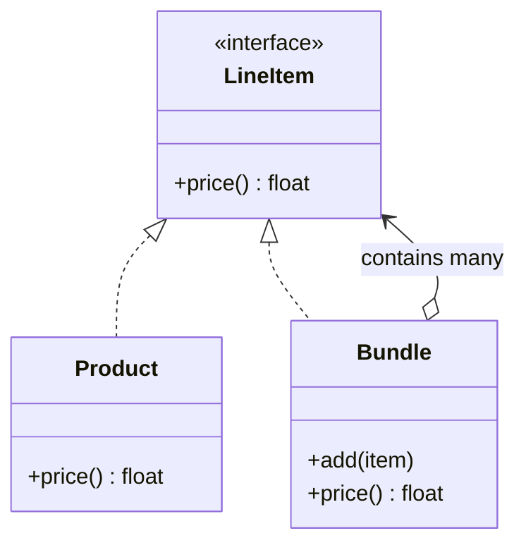
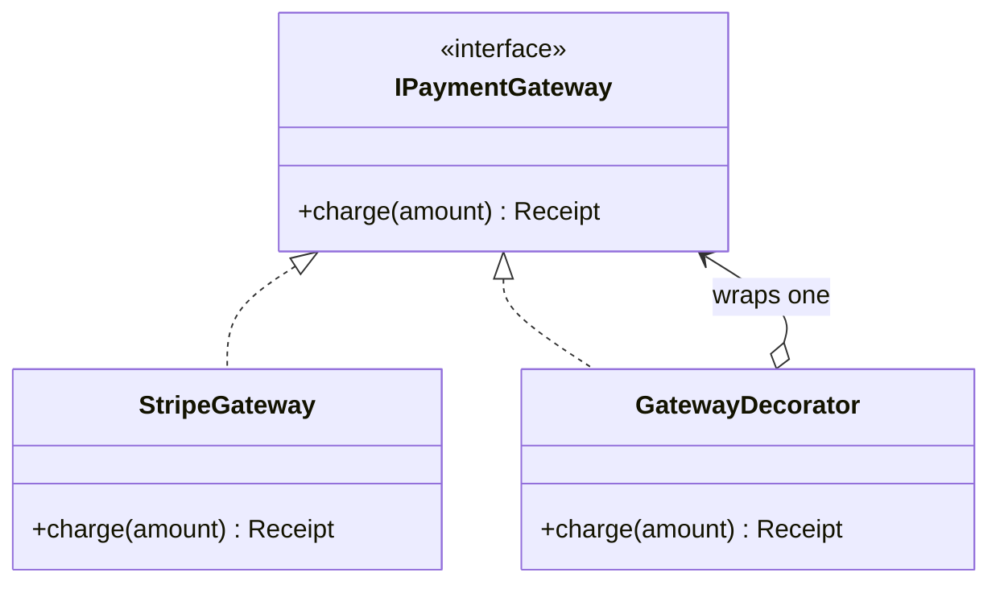
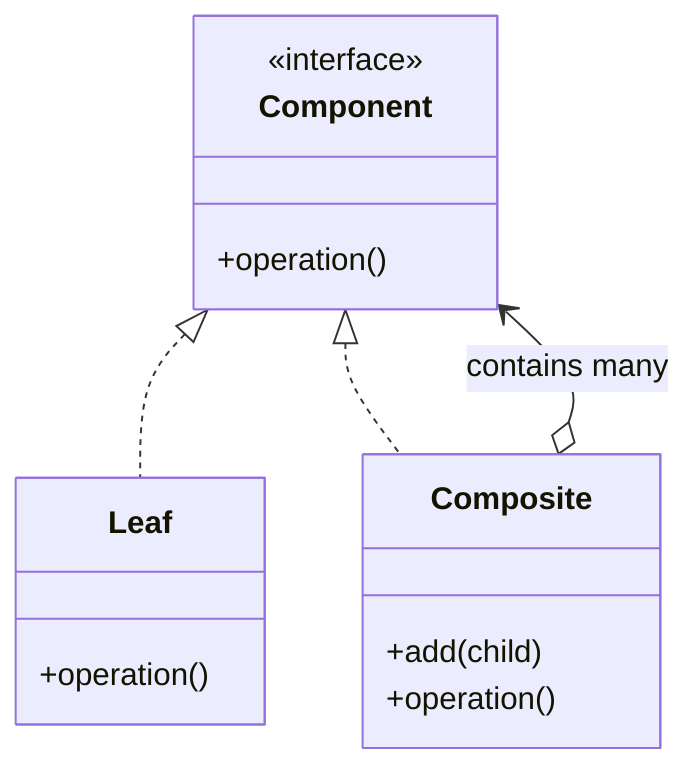
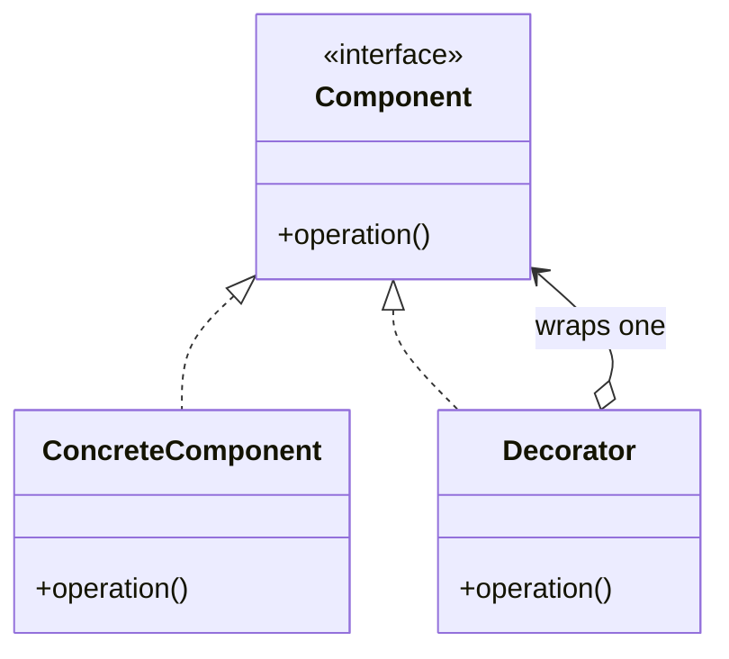

import { TabItem, Aside } from '@astrojs/starlight/components';
import LangTabs from '../../../components/LangTabs.astro';
import AICollab from '../../../components/AICollab.astro';
import VocabTable from '../../../components/VocabTable.astro';
import PromptCard from '../../../components/PromptCard.astro';
import TryIt from '../../../components/TryIt.astro';
import CheatSheet from '../../../components/CheatSheet.astro';

These two patterns are twins that mean opposite things. Both are **recursive
wrappers** — an object that holds a reference to its own interface — so their class
diagrams look nearly identical, and your agent confuses them constantly. The
difference is the whole lesson:

> **Composite holds *many* children and *aggregates* them. Decorator holds *one*
> child and *augments* it.** One-versus-many; sum-versus-add-a-layer.

Hold that sentence; everything below is a gloss on it.

## The Itch

checkout-lite has grown two structural pains, and both come from the same place:
something that *was* a single object now needs to behave like a small tree of them.

First, **bundles**. Marketing started selling kits — a "starter kit" is one thing in
the catalog, but it *contains* products, and sometimes a kit contains another kit (a
"gift set" that bundles the starter kit with a mug). Computing a cart total now means
asking, at every step, "is this a plain product or a bundle? if a bundle, do I recurse?"

<LangTabs>
  <TabItem label="Python">

```python
def cart_total(items: list) -> float:
    total = 0.0
    for item in items:
        if isinstance(item, Bundle):          # a branch — recurse
            total += cart_total(item.contents)
        else:                                  # a leaf — read its price
            total += item.price
    return total
# ...and the same isinstance fork is copied into receipts, inventory, refunds...
```

  </TabItem>
  <TabItem label="TypeScript">

```typescript
function cartTotal(items: Array<Product | Bundle>): number {
  let total = 0;
  for (const item of items) {
    if (item instanceof Bundle) {           // a branch — recurse
      total += cartTotal(item.contents);
    } else {                                 // a leaf — read its price
      total += item.price;
    }
  }
  return total;
}
// ...and the same instanceof fork is copied into receipts, inventory, refunds...
```

  </TabItem>
</LangTabs>

That `isinstance` fork is the smell. Every place that touches a cart has to know the
shape of the tree, and a new kind of node means editing all of them.

Second, **the gateway**. Chapters 8, 10, and 11 built our payments behind
`IPaymentGateway`. Now ops wants two cross-cutting behaviors on *every* charge:
**logging** (so failures are traceable) and **retry** (so a transient network blip
doesn't lose a sale). We don't own Stripe's internals, and we refuse to grow a
`LoggingRetryingStripeGateway` — then a `LoggingStripeGateway`, then a
`RetryingStripeGateway` — one class per combination. We want to add a behavior as a
*layer*, and stack the layers we need.

Both itches are the same itch: behavior that should compose, trapped in code that
only knows one fixed shape.

## The Concept

### Composite — treat a tree as one thing

The **Composite pattern** lets you compose objects into part-whole **trees** and then
treat an individual object (a **leaf**) and a whole tree (a **composite**) *uniformly*,
through one shared **component interface**. The composite implements the interface by
delegating to its children and combining their results — so the client never asks "leaf
or branch?"



The arrow that defines the pattern is `Bundle o--> LineItem`: a bundle *contains* line
items, and a line item may itself be a bundle. That recursive edge is what turns a flat
list into a tree, and `price()` walks it without a single type check.

### Decorator — wrap one thing to add behavior

The **Decorator pattern** attaches new behavior to a single object by **wrapping** it
in another object that implements the *same* interface. The wrapper forwards the call
to what it holds and adds its own work before or after. Because the wrapper *is* the
interface, you can wrap a wrapper — stacking behaviors at runtime.



Stare at that diagram next to the Composite one. They are almost the same picture —
an interface, a concrete implementer, and a wrapper that holds the interface. The only
structural difference is the multiplicity on the last arrow: Composite *contains many*,
Decorator *wraps one*. That tiny difference is the entire distinction between "a thing
made of things" and "a thing with extra layers."

### Choosing between Composite and Decorator

Because they share a skeleton, the way to keep them straight is to ask what the wrapper
*does* with what it holds:

| | Composite | Decorator |
|---|---|---|
| Holds | **Many** children | **One** wrapped component |
| Does | **Aggregates** (sum, concat, collect) | **Augments** (adds behavior around) |
| Models | A part-whole **tree** | A **stack** of responsibilities |
| One-liner | "A thing made of things" | "A thing with extra layers" |

If you're representing structure — a document of sections, a cart of bundles, a
filesystem of folders — it's a Composite. If you're adding behavior — logging, retry,
caching, compression — to something whose interface must not change, it's a Decorator.

## Before / After

### Composite

#### Before

The tangle is the `isinstance` fork from [The Itch](#the-itch): every caller must know
the tree's shape and recurse by hand.

<LangTabs>
  <TabItem label="Python">

```python
# every caller forks on the node type and recurses by hand:
def cart_total(items: list) -> float:
    total = 0.0
    for item in items:
        if isinstance(item, Bundle):
            total += cart_total(item.contents)
        else:
            total += item.price
    return total
```

  </TabItem>
  <TabItem label="TypeScript">

```typescript
// every caller forks on the node type and recurses by hand:
function cartTotal(items: Array<Product | Bundle>): number {
  let total = 0;
  for (const item of items) {
    total += item instanceof Bundle ? cartTotal(item.contents) : item.price;
  }
  return total;
}
```

  </TabItem>
</LangTabs>

#### After

Leaf and composite share one interface; the recursion lives *inside* `Bundle`, so the
client just calls `price()` — even on a bundle that contains a bundle.

<LangTabs>
  <TabItem label="Python">

```python
from abc import ABC, abstractmethod

class LineItem(ABC):                       # the component interface
    @abstractmethod
    def price(self) -> float: ...

class Product(LineItem):                   # a leaf
    def __init__(self, name: str, price: float) -> None:
        self.name, self._price = name, price
    def price(self) -> float:
        return self._price

class Bundle(LineItem):                    # a composite
    def __init__(self, name: str, items: list[LineItem] | None = None) -> None:
        self.name, self._items = name, list(items or [])
    def add(self, item: LineItem) -> None:
        self._items.append(item)
    def price(self) -> float:
        return sum(item.price() for item in self._items)   # recurse, uniformly

# one real nested level — a kit that contains a kit:
kit = Bundle("starter-kit", [Product("mug", 12.0),
                             Bundle("beans-duo", [Product("light", 9.0),
                                                  Product("dark", 9.0)])])
kit.price()   # 30.0 — no isinstance anywhere
```

  </TabItem>
  <TabItem label="TypeScript">

```typescript
interface LineItem {                       // the component interface
  price(): number;
}

class Product implements LineItem {        // a leaf
  constructor(readonly name: string, private readonly amount: number) {}
  price(): number {
    return this.amount;
  }
}

class Bundle implements LineItem {         // a composite
  private readonly items: LineItem[];
  constructor(readonly name: string, items: LineItem[] = []) {
    this.items = [...items];
  }
  add(item: LineItem): void {
    this.items.push(item);
  }
  price(): number {
    return this.items.reduce((sum, item) => sum + item.price(), 0); // recurse
  }
}

// one real nested level — a kit that contains a kit:
const kit = new Bundle("starter-kit", [
  new Product("mug", 12),
  new Bundle("beans-duo", [new Product("light", 9), new Product("dark", 9)]),
]);
kit.price(); // 30 — no instanceof anywhere
```

  </TabItem>
</LangTabs>

### Decorator

#### Before

Without wrapping, cross-cutting behavior either leaks into the gateway itself or
multiplies into a class per combination:

<LangTabs>
  <TabItem label="Python">

```python
# logging and retry tangled into the one gateway — and the next combination
# ("retry but don't log") forces yet another bespoke subclass:
class LoggingRetryingStripeGateway(IPaymentGateway):
    def charge(self, amount: float) -> Receipt:
        for _ in range(3):
            log(f"charging {amount:.2f}")
            try:
                return self._stripe.charge(amount)
            except TransientError:
                continue
        raise RuntimeError("gave up")
```

  </TabItem>
  <TabItem label="TypeScript">

```typescript
// logging and retry tangled into the one gateway — and the next combination
// ("retry but don't log") forces yet another bespoke subclass:
class LoggingRetryingStripeGateway implements IPaymentGateway {
  charge(amount: number): Receipt {
    for (let i = 0; i < 3; i++) {
      log(`charging ${amount.toFixed(2)}`);
      try {
        return this.stripe.charge(amount);
      } catch (e) {
        if (!(e instanceof TransientError)) throw e;
      }
    }
    throw new Error("gave up");
  }
}
```

  </TabItem>
</LangTabs>

#### After

Each concern becomes a thin decorator over `IPaymentGateway`. They stack at the call
site, in any order, and the real gateway never changes:

<LangTabs>
  <TabItem label="Python">

```python
class GatewayDecorator(IPaymentGateway):       # base: wraps ONE, forwards
    def __init__(self, wrapped: IPaymentGateway) -> None:
        self._wrapped = wrapped
    def charge(self, amount: float) -> Receipt:
        return self._wrapped.charge(amount)

class LoggingGateway(GatewayDecorator):
    def __init__(self, wrapped: IPaymentGateway, log: list[str]) -> None:
        super().__init__(wrapped)
        self._log = log
    def charge(self, amount: float) -> Receipt:
        self._log.append(f"charging {amount:.2f}")
        receipt = self._wrapped.charge(amount)         # delegate
        self._log.append(f"charged {receipt.confirmation}")
        return receipt                                 # augment around it

class RetryingGateway(GatewayDecorator):
    def __init__(self, wrapped: IPaymentGateway, retries: int = 2) -> None:
        super().__init__(wrapped)
        self._retries = retries
    def charge(self, amount: float) -> Receipt:
        last: Exception | None = None
        for _ in range(self._retries + 1):
            try:
                return self._wrapped.charge(amount)
            except TransientError as exc:
                last = exc
        assert last is not None
        raise last

# stack at runtime — retry wraps logging wraps the real gateway:
gateway = RetryingGateway(LoggingGateway(StripeGateway(), log))
gateway.charge(20.0)
```

  </TabItem>
  <TabItem label="TypeScript">

```typescript
class GatewayDecorator implements IPaymentGateway {  // base: wraps ONE, forwards
  constructor(protected readonly wrapped: IPaymentGateway) {}
  charge(amount: number): Receipt {
    return this.wrapped.charge(amount);
  }
}

class LoggingGateway extends GatewayDecorator {
  constructor(wrapped: IPaymentGateway, private readonly log: string[]) {
    super(wrapped);
  }
  override charge(amount: number): Receipt {
    this.log.push(`charging ${amount.toFixed(2)}`);
    const receipt = this.wrapped.charge(amount);       // delegate
    this.log.push(`charged ${receipt.confirmation}`);
    return receipt;                                     // augment around it
  }
}

class RetryingGateway extends GatewayDecorator {
  constructor(wrapped: IPaymentGateway, private readonly retries = 2) {
    super(wrapped);
  }
  override charge(amount: number): Receipt {
    let last: unknown;
    for (let attempt = 0; attempt <= this.retries; attempt++) {
      try {
        return this.wrapped.charge(amount);
      } catch (err) {
        if (!(err instanceof TransientError)) throw err;
        last = err;
      }
    }
    throw last;
  }
}

// stack at runtime — retry wraps logging wraps the real gateway:
const gateway = new RetryingGateway(new LoggingGateway(new StripeGateway(), log));
gateway.charge(20);
```

  </TabItem>
</LangTabs>

The combinatorial explosion never happens: two decorators give you every combination —
log-then-retry, retry-then-log, either alone, neither — by composing at the call site
instead of declaring a class for each. The full code, with tests proving the bundle
recurses and the decorators stack, is in `examples/ch12/py/` and `examples/ch12/ts/`.

## Language Notes

The Decorator *pattern* shares a name with a language *feature* in both Python and
TypeScript — and the collision is the most useful thing to understand here, because
they are the same idea at different scales.

<LangTabs>
  <TabItem label="Python">

Python's `@decorator` syntax **is** the Decorator pattern, applied to **functions**
instead of objects. A function decorator takes a callable, wraps it in another callable
that adds behavior, and returns the wrapper — exactly "augment one thing, preserve its
interface," at the function level:

```python
def retrying(fn):                       # a function decorator == Decorator-on-a-function
    def wrapper(*args, **kwargs):
        for _ in range(3):
            try:
                return fn(*args, **kwargs)
            except TransientError:
                continue
        raise RuntimeError("gave up")
    return wrapper

@retrying
def charge(amount: float) -> Receipt: ...
```

So when do you reach for the **object** Decorator (a class) instead of `@`? When the
thing you're wrapping is an **object with an interface and state**, when you must choose
and **stack** the layers at *runtime* (not fix them at definition time with `@`), or
when the wrapped behavior is several related methods, not one function. `@retrying`
decorates one function forever; `RetryingGateway(LoggingGateway(...))` is assembled per
call, in whatever order the situation needs.

Composite has a lighter Pythonic footprint: for a read-only tree you often don't need a
formal ABC at all — duck typing means any object with a `price()` slots in, and the
recursion is just `sum(item.price() for item in items)`. Reach for the ABC when you want
the interface enforced and documented, as the cheat sheet shows.

  </TabItem>
  <TabItem label="TypeScript">

TypeScript also has an `@decorator` syntax — but, confusingly, it is **not** the GoF
Decorator pattern. TS decorators are *annotations* that transform a class, method, or
field at definition time (`@Injectable()`, `@Component()`); they're a metaprogramming
hook, the kind frameworks use for dependency injection and ORM mapping:

```typescript
@Entity()                         // a TS decorator: metadata/transform at definition
class Payment {
  @Column() amount!: number;      // NOT the wrap-an-object pattern
}
```

The GoF Decorator is the runtime object-wrapping above — a class that `implements` the
interface and holds one instance of it. The shared word hides two different mechanics:
the language feature *annotates a declaration*; the pattern *wraps a value*. When you
mean "add behavior to an object without editing it, stackably," you want the pattern
(`new RetryingGateway(...)`), not the `@` syntax.

For the lightweight form, a decorator is often just a **higher-order function** —
`withRetry(gateway)` returning a new object with a wrapped `charge` — when there's no
state and a single method. Promote it to a `class … extends GatewayDecorator` when the
interface has several methods or the wrapper carries its own state. Composite's idiomatic
aggregate is `items.reduce((sum, i) => sum + i.price(), 0)` over a structural `LineItem`
interface — no `implements` needed on a plain object that already has `price()`.

  </TabItem>
</LangTabs>

## When NOT to Use

<Aside type="caution" title="Right-sizing">
Both patterns are cheap to add and easy to over-apply.

**Composite.** Don't impose a tree on a flat list. If your cart only ever holds plain
products and no one is asking for nesting, `sum(item.price for item in cart)` is the
right design — a `LineItem` ABC, a leaf class, and a composite class for a structure
that never recurses is three abstractions buying nothing. Add Composite when a node
*genuinely contains other nodes of the same kind* (YAGNI, Chapter 9).

**Decorator.** Don't reach for a decorator to add behavior to an object **you own and
can edit** — if `StripeGateway` should log, and you wrote `StripeGateway`, just add the
log. Decorators earn their place when you can't or shouldn't touch the wrapped class, or
when behaviors must **combine** in varying ways. And watch the depth of the stack: five
wrappers deep is a stack trace nobody can read, and often a sign the layers should be one
deliberate object. A decorator that adds nothing but a forwarded call is Chapter 9's
pass-through wearing a pattern's name.
</Aside>

## 🤖 AI Collaboration

These are patterns an agent will both *under-* and *over-*reach for: it will write the
`isinstance` fork instead of a Composite, and it will subclass-per-combination instead
of a Decorator — yet it will also wrap a class it could simply edit. Your review job is
to check the multiplicity (many vs one) and the justification (can you edit the original?).

<AICollab>

### Vocabulary

<VocabTable>

| You say | The agent hears |
|---|---|
| "Model this as a Composite" | One component interface; leaf and container both implement it; container recurses |
| "Treat leaf and container uniformly" | No `isinstance` / `instanceof` at the call site — the tree answers for itself |
| "Wrap it in a Decorator" | A class implementing the same interface, holding one instance, augmenting around it |
| "Stack the decorators" | Compose wrappers at runtime; don't make a class per combination |
| "Don't subclass per combination" | Reject the `LoggingRetryingX` explosion — layer instead |
| "This is the object pattern, not the `@` decorator" | The runtime wrapper, not the language annotation syntax |

</VocabTable>

### Prompt templates

<PromptCard title="Composite for a part-whole tree">

`[Bundle]` can contain `[Product]`s and other `[Bundle]`s, but every caller forks with
`isinstance`/`instanceof` and recurses by hand. Refactor to the **Composite pattern**:
one `[LineItem]` interface with `price()`, a leaf class, and a composite class that
recurses inside `price()`. Remove the type checks at the call sites. Keep it to these
classes — no visitor, no base "node" framework.

</PromptCard>

<PromptCard title="Decorator instead of subclass explosion">

Add **logging** and **retry** to `[IPaymentGateway]` without editing the concrete
gateway and without a class per combination. Use the **Decorator pattern**: a base
decorator that implements the interface and wraps one instance, then one thin decorator
per concern that delegates and augments. Show them **stacked at the call site**. This is
the object-wrapping pattern, not the language's `@decorator` syntax.

</PromptCard>

<PromptCard title="Right-size it first">

Before writing code: does `[this structure]` actually nest (a node containing nodes of
its own kind), and do I actually own `[this class]` I'd be wrapping? If the list is flat,
keep the loop; if I can edit the class, edit it. Answer those two questions in two
sentences, then recommend Composite, Decorator, or neither.

</PromptCard>

### Review checklist

- [ ] Composite: a single component interface, with the recursion **inside** the container — no `isinstance`/`instanceof` left at call sites
- [ ] Composite is justified by **real nesting** (a node contains nodes of its own kind), not a flat list
- [ ] Decorator: each wrapper **implements the interface** and holds **one** instance, delegating then augmenting
- [ ] Decorators **stack at the call site** — no `LoggingRetryingX` per-combination class
- [ ] You **can't or shouldn't edit** the wrapped class (else just edit it)
- [ ] No wrapper that only forwards (Chapter 9 pass-through); no five-deep stacks

### Agent failure modes

- **The `isinstance` cart.** Asked to total a tree, the agent writes the type-fork loop
  instead of a Composite — structure logic smeared across callers.
- **The subclass explosion.** Asked to add behaviors, it produces `LoggingGateway`,
  `RetryingGateway`, *and* `LoggingRetryingGateway` instead of stacking two decorators.
- **Wrapping code it owns.** It decorates a class it could have edited directly — a layer
  for nothing.
- **`@`-syntax confusion.** Asked for the Decorator pattern, it reaches for Python's
  `@decorator` or a TS `@annotation` when you needed a runtime, stackable object wrapper.
- **The Composite no one needed.** A leaf/composite hierarchy for a structure that never
  nests.

</AICollab>

<TryIt starter="examples/ch12/py/gateway_decorators.py">

Take a class in your own code that already mixes a core job with a cross-cutting concern
(logging, timing, caching, retry). Run the **"Decorator instead of subclass explosion"**
prompt to pull each concern into its own decorator, then grade the result with the
checklist — especially: did the agent leave the original class untouched, and can you now
get every combination by stacking? Then find a structure that *actually* nests (a menu of
sub-menus, a comment thread, a folder tree) and run the **Composite** prompt on it. Our
worked bundle, gateway decorators, and the conceptual skeletons are in
`examples/ch12/py/` (starters: `gateway_decorators.py`, `bundle.py`) and
`examples/ch12/ts/`.

</TryIt>

## Pattern Cheat Sheet

<CheatSheet pattern="Composite">



**Intent:** compose objects into part-whole trees and let clients treat a single object
and a whole tree uniformly, through one shared interface.

<LangTabs>
  <TabItem label="Python">

**Canonical** — the form your agent emits:

```python
class Component(ABC):
    @abstractmethod
    def operation(self) -> int: ...

class Leaf(Component):
    def __init__(self, value: int) -> None: self._value = value
    def operation(self) -> int: return self._value

class Composite(Component):
    def __init__(self) -> None: self._children: list[Component] = []
    def add(self, c: Component) -> None: self._children.append(c)
    def operation(self) -> int:
        return sum(c.operation() for c in self._children)   # aggregate
```

**Pythonic** — for a read-only tree, duck typing skips the ABC:

```python
def total(node) -> int:
    return sum(total(c) for c in node) if isinstance(node, list) else node
```

  </TabItem>
  <TabItem label="TypeScript">

**Canonical** — the form your agent emits:

```typescript
interface Component { operation(): number; }

class Leaf implements Component {
  constructor(private readonly value: number) {}
  operation(): number { return this.value; }
}

class Composite implements Component {
  private readonly children: Component[] = [];
  add(c: Component): void { this.children.push(c); }
  operation(): number {
    return this.children.reduce((s, c) => s + c.operation(), 0); // aggregate
  }
}
```

**Idiomatic** — a structural interface; `reduce` does the aggregate:

```typescript
const total = (items: readonly Component[]): number =>
  items.reduce((s, c) => s + c.operation(), 0);
```

  </TabItem>
</LangTabs>

**Reach for it when** a node genuinely contains other nodes of its own kind ·
**not when** the structure is flat (keep the loop) or it never recurses.
Runnable: `examples/ch12/py/concept_composite.py` · `examples/ch12/ts/conceptComposite.ts`.

</CheatSheet>

<CheatSheet pattern="Decorator">



**Intent:** attach responsibilities to a single object by wrapping it in another that
shares its interface — so behaviors stack at runtime without editing the original.

<LangTabs>
  <TabItem label="Python">

**Canonical** — the form your agent emits:

```python
class Decorator(Component):
    def __init__(self, wrapped: Component) -> None:
        self._wrapped = wrapped
    def operation(self) -> str:
        return self._wrapped.operation()          # base forwards

class LoudDecorator(Decorator):
    def operation(self) -> str:
        return f"LOUD({self._wrapped.operation()})"   # augment around it
```

**Pythonic** — the `@decorator` syntax is this pattern for *functions*:

```python
@retrying                       # wraps the function, adds behavior, same call shape
def charge(amount: float) -> Receipt: ...
```

  </TabItem>
  <TabItem label="TypeScript">

**Canonical** — the form your agent emits:

```typescript
class Decorator implements Component {
  constructor(protected readonly wrapped: Component) {}
  operation(): string { return this.wrapped.operation(); }   // base forwards
}

class LoudDecorator extends Decorator {
  override operation(): string {
    return `LOUD(${this.wrapped.operation()})`;              // augment around it
  }
}
```

**Idiomatic** — a higher-order function when there's no state:

```typescript
const loud = (c: Component): Component => ({
  operation: () => `LOUD(${c.operation()})`,
});
```

  </TabItem>
</LangTabs>

**Reach for it when** you must add stackable behavior to code you can't (or shouldn't)
edit · **not when** you own the class (edit it) or the wrapper only forwards (pass-through).
Note: this is the runtime object wrapper, **not** the `@decorator` *syntax* (a function
decorator in Python; a class/field annotation in TypeScript).
Runnable: `examples/ch12/py/concept_decorator.py` · `examples/ch12/ts/conceptDecorator.ts`.

</CheatSheet>

## Key Takeaways

- **Composite** and **Decorator** share a skeleton — a wrapper that holds its own
  interface — and mean opposite things. Composite *contains many* children and
  **aggregates**; Decorator *wraps one* and **augments**.
- Composite kills the `isinstance`/`instanceof` fork: leaf and container implement one
  **component interface**, and the recursion lives inside the container, so the client
  treats a tree as one value.
- Decorator kills the subclass-per-combination explosion: each concern is a thin wrapper,
  and you **stack** them at runtime to get every combination from a few classes.
- The Decorator *pattern* is not the `@decorator` *syntax* — Python's `@` is the same
  idea for functions; TypeScript's `@` is class/field annotation, a different mechanic.
- Both collapse into Chapter 9's **pass-through** when they add nothing. Right-size with
  two questions: does it *really* nest, and do you *own* the thing you'd wrap?
- **Glossary terms added:** *Composite pattern · Decorator pattern · component interface ·
  object decorator vs function decorator.*
