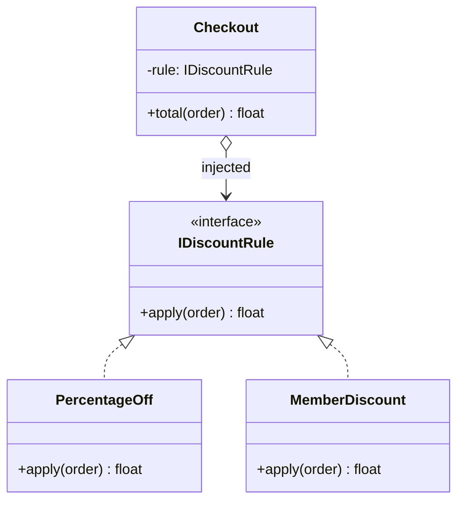
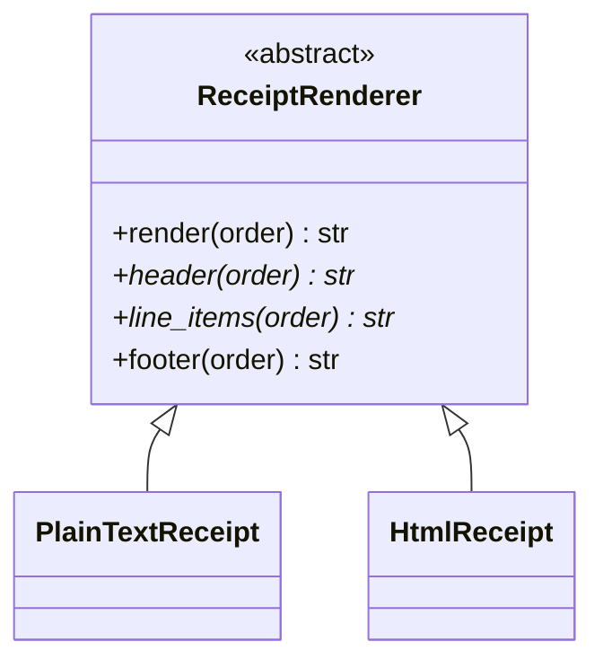

import { Tabs, TabItem, Aside } from '@astrojs/starlight/components';
import AICollab from '../../../components/AICollab.astro';
import VocabTable from '../../../components/VocabTable.astro';
import PromptCard from '../../../components/PromptCard.astro';
import TryIt from '../../../components/TryIt.astro';

<Aside type="note" title="The running example: checkout-lite">
Throughout the book we grow one small order-processing module, **checkout-lite**:
customers build an `Order` of line items, a price is computed (discounts, tax,
shipping), payment is taken, and a receipt goes out. It is deliberately ordinary —
the design pressure comes not from the domain but from *change*: marketing invents
promotions, carriers change rates, and every quarter someone wants a new receipt
format.
</Aside>

## The Itch

Marketing is happy with checkout-lite, which is the problem. Last quarter they asked
for a percentage discount. Then a fixed coupon. Then a member rate. Each request was
"just one more case", and now the pricing function looks like this:

```python
def apply_discount(order: Order, kind: str) -> float:
    """Return the order total after the given discount."""
    if kind == "none":
        return order.subtotal
    elif kind == "ten_percent":
        return order.subtotal * 0.90
    elif kind == "coupon5":
        return max(order.subtotal - 5.00, 0.0)
    elif kind == "member":
        if order.is_member:
            return order.subtotal * 0.85
        return order.subtotal
    else:
        raise ValueError(f"unknown discount: {kind}")
```

A "seasonal" promotion request just arrived, and you already know how this goes.
Every new rule edits the same function, so every new rule *can break the old ones*.
Testing the member rate means navigating a dispatch that has nothing to do with
membership. And when your agent adds the fifth branch, the diff touches the same
lines the previous four did — a reviewer can't see where one rule ends and the next
begins.

The algorithm isn't the problem. The problem is that *several* algorithms are
trapped in one body.

There's a second, quieter version of the same itch elsewhere in checkout-lite:
plain-text and HTML receipts are two functions that duplicate the same *sequence* —
header, line items, footer — differing only in how each step is rendered. Hold that
thought; it leads somewhere different.

## The Concept

### Strategy: make each algorithm a value

The **Strategy pattern** says: when an algorithm varies, pull each variant out
behind a common interface, and *hand* the chosen variant to the code that needs it.
The checkout stops deciding *how* to discount; it is told *what to use*.

What we want from the design, concretely:

- Adding a rule never edits existing rules — or the checkout.
- Each rule is testable alone, with no dispatch in the way.
- There is exactly one place where "which rules exist" is known.



The arrow worth staring at is the diamond: `Checkout` *has* a rule — composition.
Variation lives outside the thing that uses it, which is why the thing that uses it
stops changing.

### Template Method: fix the skeleton, vary the steps

The receipt itch is the mirror image. The *sequence* — header, then line items,
then footer — must never vary; that ordering is the algorithm. Only the individual
steps differ between plain text and HTML. The **Template Method pattern** puts the
fixed skeleton in a base class and lets subclasses fill in the steps:



`render()` is the template method — subclasses never override it. `header()` and
`line_items()` are abstract steps each format must supply. `footer()` is a **hook
method**: it has a sensible default, and overriding it is optional.

### Choosing between them

Both patterns answer "my algorithm varies" — with opposite mechanisms:

| | Strategy | Template Method |
|---|---|---|
| What varies | The **whole** algorithm | **Steps** inside a fixed skeleton |
| Mechanism | Composition — inject a value | Inheritance — override methods |
| Chosen | At runtime, per call or per object | At class-definition time |
| Relationship | Checkout *has a* rule | PlainTextReceipt *is a* renderer |

When the choice is genuinely unclear, default to Strategy. Composition keeps the
variation outside, swappable, and testable in isolation — the reasons Chapter 8
gave for preferring composition over inheritance apply verbatim here.

## Before / After

Here is the Strategy refactor in its classical, class-based form — the form your
agent is most likely to produce when you say only "use the Strategy pattern".

<Tabs>
  <TabItem label="Before">

```python
def apply_discount(order: Order, kind: str) -> float:
    """Return the order total after the given discount."""
    if kind == "none":
        return order.subtotal
    elif kind == "ten_percent":
        return order.subtotal * 0.90
    elif kind == "coupon5":
        return max(order.subtotal - 5.00, 0.0)
    elif kind == "member":
        if order.is_member:
            return order.subtotal * 0.85
        return order.subtotal
    else:
        raise ValueError(f"unknown discount: {kind}")
```

  </TabItem>
  <TabItem label="After (classical Strategy)">

```python
from abc import ABC, abstractmethod

class IDiscountRule(ABC):
    @abstractmethod
    def apply(self, order: Order) -> float:
        """Return the order total after this discount."""

class NoDiscount(IDiscountRule):
    def apply(self, order: Order) -> float:
        return order.subtotal

class PercentageOff(IDiscountRule):
    def __init__(self, rate: float) -> None:
        self._rate = rate

    def apply(self, order: Order) -> float:
        return order.subtotal * (1 - self._rate)

class MemberDiscount(IDiscountRule):
    def apply(self, order: Order) -> float:
        if order.is_member:
            return order.subtotal * 0.85
        return order.subtotal

def apply_discount(order: Order, rule: IDiscountRule) -> float:
    return rule.apply(order)
```

  </TabItem>
</Tabs>

Each rule now has its own body, its own tests, its own diff. `apply_discount`
will never change again, no matter what marketing invents. (Real money arithmetic
wants `Decimal` or integer cents; `float` keeps these examples short.)

And the receipt skeleton, as a Template Method:

<Tabs>
  <TabItem label="Before">

```python
def render_text_receipt(order: Order) -> str:
    lines = ["CHECKOUT-LITE RECEIPT"]                  # header
    for item in order.items:                           # line items
        lines.append(f"{item.name:<20} {item.price:>8.2f}")
    lines.append(f"Total: {order.subtotal:.2f}")       # footer
    return "\n".join(lines)

def render_html_receipt(order: Order) -> str:
    rows = "".join(
        f"<tr><td>{item.name}</td><td>{item.price:.2f}</td></tr>"
        for item in order.items
    )
    return "\n".join([
        "<h1>Checkout-lite receipt</h1>",              # header
        f"<table>{rows}</table>",                      # line items
        f"<p>Total: {order.subtotal:.2f}</p>",         # footer — same shape, duplicated
    ])
```

  </TabItem>
  <TabItem label="After (Template Method)">

```python
from abc import ABC, abstractmethod

class ReceiptRenderer(ABC):
    def render(self, order: Order) -> str:
        """The fixed skeleton. Subclasses supply steps, never the order of steps."""
        return "\n".join(
            [self.header(), self.line_items(order), self.footer(order)]
        )

    @abstractmethod
    def header(self) -> str: ...

    @abstractmethod
    def line_items(self, order: Order) -> str: ...

    def footer(self, order: Order) -> str:
        """Hook: sensible default, override only if the format needs to."""
        return f"Total: {order.subtotal:.2f}"

class PlainTextReceipt(ReceiptRenderer):
    def header(self) -> str:
        return "CHECKOUT-LITE RECEIPT"

    def line_items(self, order: Order) -> str:
        return "\n".join(
            f"{item.name:<20} {item.price:>8.2f}" for item in order.items
        )
    # no footer(): the hook's default is exactly right for plain text

class HtmlReceipt(ReceiptRenderer):
    def header(self) -> str:
        return "<h1>Checkout-lite receipt</h1>"

    def line_items(self, order: Order) -> str:
        rows = "".join(
            f"<tr><td>{item.name}</td><td>{item.price:.2f}</td></tr>"
            for item in order.items
        )
        return f"<table>{rows}</table>"

    def footer(self, order: Order) -> str:  # the hook, overridden
        return f"<p>Total: {order.subtotal:.2f}</p>"
```

  </TabItem>
</Tabs>

The duplication didn't just shrink — it became *impossible*. A new format cannot
get the step order wrong, because the order is owned by code it doesn't write. And
notice the hook earning its keep: `PlainTextReceipt` says nothing about footers and
inherits the default, while `HtmlReceipt` overrides it to wrap the total in a
paragraph tag. One required override point would have forced plain text to restate
the common case; one missing override point would have forced HTML to do without.

## Pythonic Notes

In most languages the Strategy pattern needs the ceremony above. In Python, an
algorithm is already a value — **a strategy is usually just a function**:

```python
from collections.abc import Callable

DiscountRule = Callable[[Order], float]

def no_discount(order: Order) -> float:
    return order.subtotal

def percentage_off(rate: float) -> DiscountRule:
    def rule(order: Order) -> float:
        return order.subtotal * (1 - rate)
    return rule

def member_discount(order: Order) -> float:
    return order.subtotal * 0.85 if order.is_member else order.subtotal

RULES: dict[str, DiscountRule] = {
    "none": no_discount,
    "ten_percent": percentage_off(0.10),
    "member": member_discount,
}

def apply_discount(order: Order, rule: DiscountRule) -> float:
    return rule(order)
```

The `RULES` dict is a **registry** (also called a *dispatch table*): the single
place where "which rules exist" is recorded. A new promotion is one function and
one line in the registry — existing code untouched. Note `percentage_off`: a
closure carries configuration the way `PercentageOff.__init__` did, without a
class.

You have been using this pattern for years: `sorted(names, key=str.lower)` is the
Strategy pattern — an algorithm passed in as a value. The stdlib's whole `key=`
convention is strategies all the way down.

So when do classes still win? When a strategy carries **state that evolves** or
needs **multiple methods** — a loyalty rule that accumulates points while
discounting, say. The rule of thumb the rest of this book will assume:

> **Functions first.** Reach for a class-based strategy only when the strategy has
> state or more than one behavior.

Template Method has a lightweight form too: pass the steps in as functions
(`render_receipt(order, header=..., line_items=...)`). That is honest and fine for
two or three steps — but once steps have defaults, share helpers, or come in
families, the ABC's named override points earn their keep. Inheritance is the
right tool *here* because the base class genuinely owns the invariant.

## When NOT to Use

<Aside type="caution" title="Right-sizing">
A pattern pays rent only when variation is *expected*. Checkout-lite has evidence:
four discount requests in two quarters. If your dispatch has **two stable branches
that nobody plans to extend** — say, `if order.is_gift: skip_invoice()` — the `if`
statement is the right design. Replacing it with a registry adds a level of
indirection that readers (and agents) must now follow, and buys nothing.

The same discipline applies to Template Method, where over-application hurts more:
a base class with one subclass is a skeleton nobody needed, and speculative hooks
("someone might want to override tax display someday") are dead weight with a
maintenance bill. Add the hook when the second format *asks* for it — YAGNI,
Chapter 9.
</Aside>

## 🤖 AI Collaboration

<AICollab>

### Vocabulary

<VocabTable>

| You say | The agent hears |
|---|---|
| "Refactor to the Strategy pattern" | Extract each varying algorithm behind a common interface; inject the chosen one |
| "Use functions as strategies" | Skip the class hierarchy; plain callables + a type alias |
| "Put them in a registry dict" | One dispatch table as the single growth point; new variants register, callers don't change |
| "Keep the dispatch table closed for modification" | New rules are added by registration only — existing code untouched (Open-Closed) |
| "Apply the Template Method pattern" | Fixed skeleton method in an ABC; varying steps as abstract methods |
| "Make `footer` a hook with a default" | Optional override point, not abstract — subclasses opt in |

</VocabTable>

### Prompt templates

<PromptCard title="Strategy, right-sized">

This module selects a discount with an `if/elif` chain on `kind`. Refactor to the
**Strategy pattern using functions as strategies** and a registry dict. Keep
`apply_discount`'s public signature unchanged. Do **not** introduce classes, new
dependencies, or new modules. Show the diff and explain the trade-off in two
sentences.

</PromptCard>

<PromptCard title="Template Method for a duplicated skeleton">

`render_text_receipt` and `render_html_receipt` duplicate the same step sequence.
Apply the **Template Method pattern**: one ABC owning the `render()` skeleton;
subclasses override `header` and `line_items`; `footer` is a **hook with a
default**. The skeleton must not be overridable in practice — no other new
abstractions, and keep both output strings byte-identical to before.

</PromptCard>

<PromptCard title="Propose before coding">

Pricing rules in this module will vary per marketing campaign (roughly monthly).
**Propose two designs before writing any code**: (a) Strategy with functions + a
registry dict, (b) class-based Strategy with an ABC. Give the trade-off of each in
three sentences, then recommend one for a codebase expecting ~5 rules this year.

</PromptCard>

### Review checklist

When your agent comes back, check:

- [ ] The public function signature is unchanged (callers untouched)
- [ ] Each strategy is testable alone — no dispatch needed in its tests
- [ ] The registry is the *only* growth point: a new rule = one function + one entry
- [ ] No ABC unless at least one strategy genuinely carries state
- [ ] Template Method only: subclasses override steps, never the skeleton method
- [ ] No hooks that nothing overrides yet

### Agent failure modes

- **The cathedral for two functions.** Asked for Strategy, the agent builds an ABC,
  four subclasses, a factory, and an enum — for two rules. The anti-phrase:
  *"functions as strategies; no classes."*
- **The invented config system.** The registry "helpfully" becomes a plugin loader
  reading YAML. Nobody asked. Constrain scope: *"the dict is the registry."*
- **The double dispatch.** The `if/elif` survives *alongside* the new registry —
  two sources of truth. Check the old chain is deleted.
- **Renaming "for clarity".** Public API renamed mid-refactor, breaking callers the
  agent can't see. Hence: *"keep the public signature unchanged"* in every prompt.

</AICollab>

<TryIt starter="examples/ch13/exercise/shipping.py">

The starter file computes shipping cost with an `if/elif` chain over four carrier
options — the same shape as the discount tangle. Run the **"Strategy,
right-sized"** prompt above against it (adapt the names), then grade your agent's
output with the review checklist. Two questions worth answering as you review:
which carrier option was the *hardest* to turn into a pure function, and did the
agent try to build more than the prompt allowed? Full instructions in
`examples/ch13/exercise/EXERCISE.md`.

</TryIt>

## Key Takeaways

- A growing `if/elif` over a `kind` is the Strategy itch: several algorithms
  trapped in one body. Strategy turns each into a value you inject.
- In Python, **a strategy is usually a function**; a registry dict is the single
  growth point. Classes earn their place only when a strategy has state or
  multiple behaviors.
- Template Method is the mirror image: the *skeleton* is the invariant, steps
  vary. It's one of the few places inheritance is the honest tool — when unsure,
  prefer Strategy and composition.
- Patterns pay rent only when variation is expected. Two stable branches → keep
  the `if`.
- **Glossary terms added:** *Strategy pattern · functions as strategies · registry
  (dispatch) dict · Template Method · hook method.*
