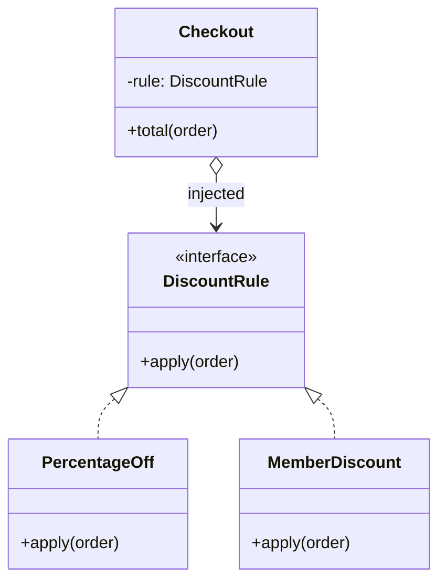
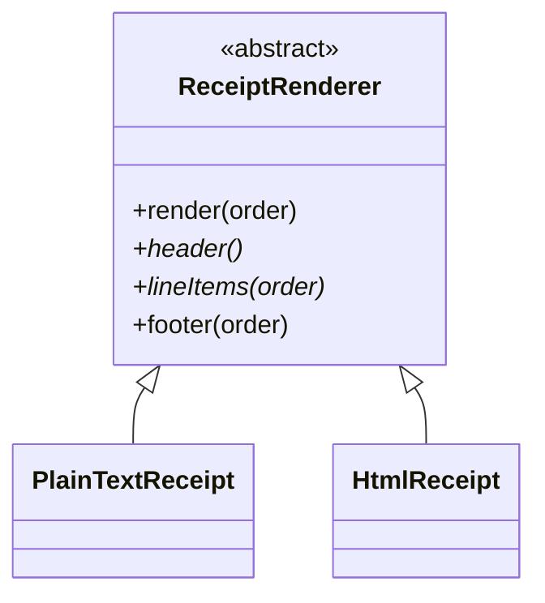
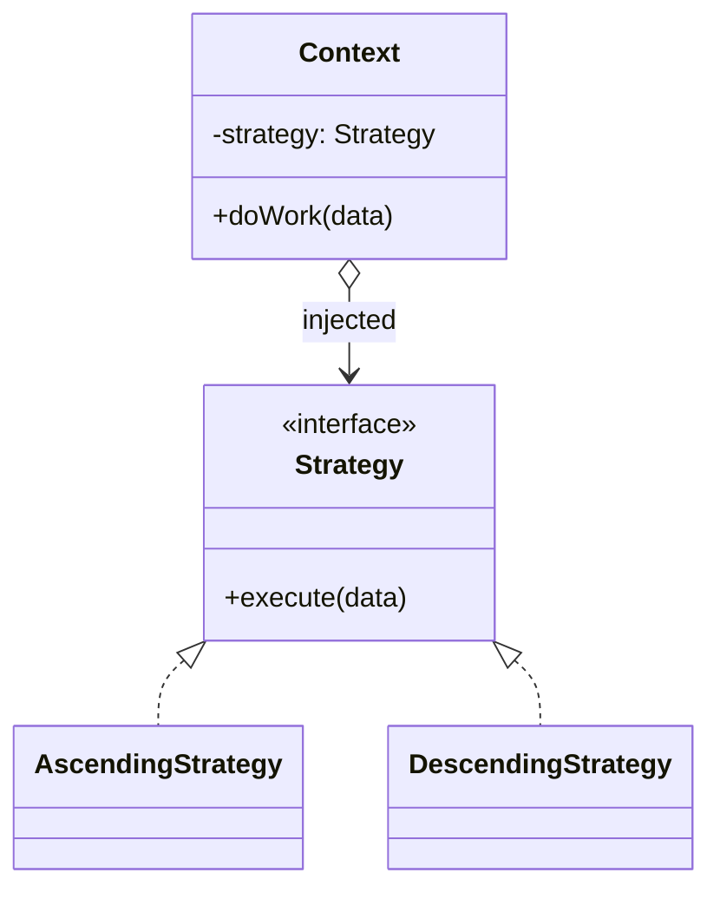
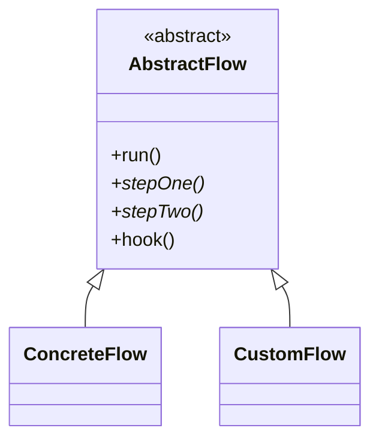

import { TabItem, Aside } from '@astrojs/starlight/components';
import LangTabs from '../../../components/LangTabs.astro';
import AICollab from '../../../components/AICollab.astro';
import VocabTable from '../../../components/VocabTable.astro';
import PromptCard from '../../../components/PromptCard.astro';
import TryIt from '../../../components/TryIt.astro';
import CheatSheet from '../../../components/CheatSheet.astro';

<Aside type="note" title="The running example: checkout-lite">
Throughout the book we grow one small order-processing module, **checkout-lite**:
customers build an `Order` of line items, a price is computed (discounts, tax,
shipping), payment is taken, and a receipt goes out. It is deliberately ordinary —
the design pressure comes not from the domain but from *change*: marketing invents
promotions, carriers change rates, and every quarter someone wants a new receipt
format.
</Aside>

<Aside type="tip" title="Two languages, one design">
From here on, code listings come in **Python** and **TypeScript** — pick the tab you
think in (your choice sticks across the whole book). The point of showing both is the
book's thesis made visible: the *design* is the constant; the language is just the
syntax it's written in.
</Aside>

## The Itch

Marketing is happy with checkout-lite, which is the problem. Last quarter they asked
for a percentage discount. Then a fixed coupon. Then a member rate. Each request was
"just one more case", and now the pricing function looks like this:

<LangTabs>
  <TabItem label="Python">

```python
def apply_discount(order: Order, kind: str) -> float:
    """Return the order total after the given discount."""
    if kind == "none":
        return order.subtotal
    elif kind == "ten_percent":
        return order.subtotal * 0.90
    elif kind == "coupon5":
        return max(order.subtotal - 5.00, 0.0)
    elif kind == "member":
        if order.is_member:
            return order.subtotal * 0.85
        return order.subtotal
    else:
        raise ValueError(f"unknown discount: {kind}")
```

  </TabItem>
  <TabItem label="TypeScript">

```typescript
function applyDiscount(order: Order, kind: string): number {
  switch (kind) {
    case "none":
      return subtotal(order);
    case "tenPercent":
      return subtotal(order) * 0.9;
    case "coupon5":
      return Math.max(subtotal(order) - 5, 0);
    case "member":
      return order.isMember ? subtotal(order) * 0.85 : subtotal(order);
    default:
      throw new Error(`unknown discount: ${kind}`);
  }
}
```

  </TabItem>
</LangTabs>

A "seasonal" promotion request just arrived, and you already know how this goes.
Every new rule edits the same function, so every new rule *can break the old ones*.
Testing the member rate means navigating a dispatch that has nothing to do with
membership. And when your agent adds the fifth branch, the diff touches the same
lines the previous four did — a reviewer can't see where one rule ends and the next
begins.

The algorithm isn't the problem. The problem is that *several* algorithms are
trapped in one body.

There's a second, quieter version of the same itch elsewhere in checkout-lite:
plain-text and HTML receipts are two functions that duplicate the same *sequence* —
header, line items, footer — differing only in how each step is rendered. Hold that
thought; it leads somewhere different.

## The Concept

### Strategy: make each algorithm a value

The **Strategy pattern** says: when an algorithm varies, pull each variant out
behind a common interface, and *hand* the chosen variant to the code that needs it.
The checkout stops deciding *how* to discount; it is told *what to use*.

What we want from the design, concretely:

- Adding a rule never edits existing rules — or the checkout.
- Each rule is testable alone, with no dispatch in the way.
- There is exactly one place where "which rules exist" is known.



The arrow worth staring at is the diamond: `Checkout` *has* a rule — composition.
Variation lives outside the thing that uses it, which is why the thing that uses it
stops changing.

### Template Method: fix the skeleton, vary the steps

The receipt itch is the mirror image. The *sequence* — header, then line items,
then footer — must never vary; that ordering is the algorithm. Only the individual
steps differ between plain text and HTML. The **Template Method pattern** puts the
fixed skeleton in a base class and lets subclasses fill in the steps:



`render()` is the template method — subclasses never override it. `header()` and
`lineItems()` are abstract steps each format must supply. `footer()` is a **hook
method**: it has a sensible default, and overriding it is optional.

### Choosing between them

Both patterns answer "my algorithm varies" — with opposite mechanisms:

| | Strategy | Template Method |
|---|---|---|
| What varies | The **whole** algorithm | **Steps** inside a fixed skeleton |
| Mechanism | Composition — inject a value | Inheritance — override methods |
| Chosen | At runtime, per call or per object | At class-definition time |
| Relationship | Checkout *has a* rule | PlainTextReceipt *is a* renderer |

When the choice is genuinely unclear, default to Strategy. Composition keeps the
variation outside, swappable, and testable in isolation — the reasons Chapter 8
gave for preferring composition over inheritance apply verbatim here.

## Before / After

### Strategy

The **Before** is the discount tangle from [The Itch](#the-itch). Here is the
classical, class-based refactor — the form your agent is most likely to produce when
you say only "use the Strategy pattern":

<LangTabs>
  <TabItem label="Python">

```python
from abc import ABC, abstractmethod

class IDiscountRule(ABC):
    @abstractmethod
    def apply(self, order: Order) -> float:
        """Return the order total after this discount."""

class NoDiscount(IDiscountRule):
    def apply(self, order: Order) -> float:
        return order.subtotal

class PercentageOff(IDiscountRule):
    def __init__(self, rate: float) -> None:
        self._rate = rate

    def apply(self, order: Order) -> float:
        return order.subtotal * (1 - self._rate)

class MemberDiscount(IDiscountRule):
    def apply(self, order: Order) -> float:
        if order.is_member:
            return order.subtotal * 0.85
        return order.subtotal

def apply_discount(order: Order, rule: IDiscountRule) -> float:
    return rule.apply(order)
```

  </TabItem>
  <TabItem label="TypeScript">

```typescript
interface DiscountRule {
  apply(order: Order): number;
}

class NoDiscount implements DiscountRule {
  apply(order: Order): number {
    return subtotal(order);
  }
}

class PercentageOff implements DiscountRule {
  constructor(private readonly rate: number) {}
  apply(order: Order): number {
    return subtotal(order) * (1 - this.rate);
  }
}

class MemberDiscount implements DiscountRule {
  apply(order: Order): number {
    return order.isMember ? subtotal(order) * 0.85 : subtotal(order);
  }
}

function applyDiscount(order: Order, rule: DiscountRule): number {
  return rule.apply(order);
}
```

  </TabItem>
</LangTabs>

Each rule now has its own body, its own tests, its own diff. `apply_discount`
will never change again, no matter what marketing invents. (Real money arithmetic
wants `Decimal` or integer cents; floating point keeps these examples short.)

### Template Method

#### Before

Two functions duplicating the same header → line-items → footer sequence:

<LangTabs>
  <TabItem label="Python">

```python
def render_text_receipt(order: Order) -> str:
    lines = ["CHECKOUT-LITE RECEIPT"]                  # header
    for item in order.items:                           # line items
        lines.append(f"{item.name:<20} {item.price:>8.2f}")
    lines.append(f"Total: {order.subtotal:.2f}")       # footer
    return "\n".join(lines)

def render_html_receipt(order: Order) -> str:
    rows = "".join(
        f"<tr><td>{item.name}</td><td>{item.price:.2f}</td></tr>"
        for item in order.items
    )
    return "\n".join([
        "<h1>Checkout-lite receipt</h1>",              # header
        f"<table>{rows}</table>",                      # line items
        f"<p>Total: {order.subtotal:.2f}</p>",         # footer — same shape, duplicated
    ])
```

  </TabItem>
  <TabItem label="TypeScript">

```typescript
function renderTextReceipt(order: Order): string {
  const lines = ["CHECKOUT-LITE RECEIPT"]; // header
  for (const item of order.items) {        // line items
    lines.push(`${item.name.padEnd(20)} ${item.price.toFixed(2).padStart(8)}`);
  }
  lines.push(`Total: ${subtotal(order).toFixed(2)}`); // footer
  return lines.join("\n");
}

function renderHtmlReceipt(order: Order): string {
  const rows = order.items
    .map((item) => `<tr><td>${item.name}</td><td>${item.price.toFixed(2)}</td></tr>`)
    .join("");
  return [
    "<h1>Checkout-lite receipt</h1>",          // header
    `<table>${rows}</table>`,                   // line items
    `<p>Total: ${subtotal(order).toFixed(2)}</p>`, // footer — same shape, duplicated
  ].join("\n");
}
```

  </TabItem>
</LangTabs>

#### After

One skeleton owns the sequence; subclasses fill in the steps, and `footer` is a
hook with a default:

<LangTabs>
  <TabItem label="Python">

```python
from abc import ABC, abstractmethod

class ReceiptRenderer(ABC):
    def render(self, order: Order) -> str:
        """The fixed skeleton. Subclasses supply steps, never the order of steps."""
        return "\n".join([self.header(), self.line_items(order), self.footer(order)])

    @abstractmethod
    def header(self) -> str: ...

    @abstractmethod
    def line_items(self, order: Order) -> str: ...

    def footer(self, order: Order) -> str:
        """Hook: sensible default, override only if the format needs to."""
        return f"Total: {order.subtotal:.2f}"

class PlainTextReceipt(ReceiptRenderer):
    def header(self) -> str:
        return "CHECKOUT-LITE RECEIPT"

    def line_items(self, order: Order) -> str:
        return "\n".join(
            f"{item.name:<20} {item.price:>8.2f}" for item in order.items
        )
    # no footer(): the hook's default is exactly right for plain text

class HtmlReceipt(ReceiptRenderer):
    def header(self) -> str:
        return "<h1>Checkout-lite receipt</h1>"

    def line_items(self, order: Order) -> str:
        rows = "".join(
            f"<tr><td>{item.name}</td><td>{item.price:.2f}</td></tr>"
            for item in order.items
        )
        return f"<table>{rows}</table>"

    def footer(self, order: Order) -> str:  # the hook, overridden
        return f"<p>Total: {order.subtotal:.2f}</p>"
```

  </TabItem>
  <TabItem label="TypeScript">

```typescript
abstract class ReceiptRenderer {
  render(order: Order): string {
    // The fixed skeleton. Subclasses supply steps, never the order of steps.
    return [this.header(), this.lineItems(order), this.footer(order)].join("\n");
  }

  protected abstract header(): string;
  protected abstract lineItems(order: Order): string;

  protected footer(order: Order): string {
    // Hook: sensible default, override only if the format needs to.
    return `Total: ${subtotal(order).toFixed(2)}`;
  }
}

class PlainTextReceipt extends ReceiptRenderer {
  protected header(): string {
    return "CHECKOUT-LITE RECEIPT";
  }
  protected lineItems(order: Order): string {
    return order.items
      .map((i) => `${i.name.padEnd(20)} ${i.price.toFixed(2).padStart(8)}`)
      .join("\n");
  }
  // no footer(): the hook's default is exactly right for plain text
}

class HtmlReceipt extends ReceiptRenderer {
  protected header(): string {
    return "<h1>Checkout-lite receipt</h1>";
  }
  protected lineItems(order: Order): string {
    const rows = order.items
      .map((i) => `<tr><td>${i.name}</td><td>${i.price.toFixed(2)}</td></tr>`)
      .join("");
    return `<table>${rows}</table>`;
  }
  protected override footer(order: Order): string {
    return `<p>Total: ${subtotal(order).toFixed(2)}</p>`;
  }
}
```

  </TabItem>
</LangTabs>

The duplication didn't just shrink — it became *impossible*. A new format cannot
get the step order wrong, because the order is owned by code it doesn't write. And
notice the hook earning its keep: `PlainTextReceipt` says nothing about footers and
inherits the default, while `HtmlReceipt` overrides it to wrap the total in a
paragraph tag. One required override point would have forced plain text to restate
the common case; one missing override point would have forced HTML to do without.
The full code, with tests proving each refactor matches the tangle, is in
`examples/ch13/`.

## Language Notes

The two languages reach the same design from different starting points — and the
difference between them is itself a lesson in what "the pattern" really is.

<LangTabs>
  <TabItem label="Python">

In most languages the Strategy pattern needs the class ceremony above. In Python, an
algorithm is already a value — **a strategy is usually just a function**:

```python
from collections.abc import Callable

DiscountRule = Callable[[Order], float]

def percentage_off(rate: float) -> DiscountRule:
    def rule(order: Order) -> float:
        return order.subtotal * (1 - rate)
    return rule              # a closure carries config, the way __init__ did

RULES: dict[str, DiscountRule] = {
    "none": lambda o: o.subtotal,
    "ten_percent": percentage_off(0.10),
    "member": lambda o: o.subtotal * 0.85 if o.is_member else o.subtotal,
}
```

The `RULES` dict is a **registry** (a *dispatch table*): the single place where
"which rules exist" is recorded. A new promotion is one function and one line —
existing code untouched.

You have been using this pattern for years: `sorted(names, key=str.lower)` is the
Strategy pattern — an algorithm passed in as a value. The stdlib's whole `key=`
convention is strategies all the way down.

> **Functions first.** Reach for a class-based strategy only when it carries
> **state that evolves** or needs **multiple methods** — a loyalty rule that
> accumulates points while discounting, say.

Template Method has a lightweight form too: pass the steps in as functions
(`render(order, header=..., line_items=...)`). Fine for two or three steps — but
once steps share defaults or come in families, the ABC's named override points earn
their keep.

  </TabItem>
  <TabItem label="TypeScript">

TypeScript's types are **structural**, so a strategy needs no `implements` and no
named interface to satisfy — a function literal already *is* the strategy:

```typescript
type DiscountRule = (order: Order) => number;

const percentageOff =
  (rate: number): DiscountRule =>
  (order) =>
    subtotal(order) * (1 - rate); // an arrow-returning-arrow closure carries config

const RULES: Record<string, DiscountRule> = {
  none: (o) => subtotal(o),
  tenPercent: percentageOff(0.1),
  member: (o) => (o.isMember ? subtotal(o) * 0.85 : subtotal(o)),
};
```

The `RULES` record is the **registry**: the single place where "which rules exist"
is recorded. A new promotion is one function and one entry.

You have been doing this for years too: `[...names].sort((a, b) => a.localeCompare(b))`
hands `sort` a comparator — Strategy, built into the language. Any time you pass a
callback, you are injecting a strategy.

> **Functions first.** Reach for a `class implements DiscountRule` only when it
> carries **state** or needs **multiple methods** — the same rule as Python, since
> the design, not the syntax, decides it.

Template Method's lightweight form is the same move: pass the steps as functions —
`render(order, { header, lineItems })` — and earn the `abstract class` only when
steps share defaults or come in families. (A discriminated union + exhaustive
`switch` is TypeScript's other answer when the *variants* are a closed, known set.)

  </TabItem>
</LangTabs>

## When NOT to Use

<Aside type="caution" title="Right-sizing">
A pattern pays rent only when variation is *expected*. Checkout-lite has evidence:
four discount requests in two quarters. If your dispatch has **two stable branches
that nobody plans to extend** — say, "gift orders skip the invoice" — the plain
conditional is the right design. Replacing it with a registry adds a level of
indirection that readers (and agents) must now follow, and buys nothing.

The same discipline applies to Template Method, where over-application hurts more:
a base class with one subclass is a skeleton nobody needed, and speculative hooks
("someone might want to override tax display someday") are dead weight with a
maintenance bill. Add the hook when the second format *asks* for it — YAGNI,
Chapter 9.
</Aside>

## 🤖 AI Collaboration

<AICollab>

### Vocabulary

<VocabTable>

| You say | The agent hears |
|---|---|
| "Refactor to the Strategy pattern" | Extract each varying algorithm behind a common interface; inject the chosen one |
| "Use functions as strategies" | Skip the class hierarchy; plain functions + a type alias (Python) / function type (TS) |
| "Put them in a registry" | One dispatch table (`dict` / `Record`) as the single growth point; callers don't change |
| "Keep the dispatch table closed for modification" | New rules are added by registration only — existing code untouched (Open-Closed) |
| "Apply the Template Method pattern" | Fixed skeleton method in a base class (ABC / `abstract class`); varying steps as abstract methods |
| "Make `footer` a hook with a default" | Optional override point, not abstract — subclasses opt in |

</VocabTable>

### Prompt templates

<PromptCard title="Strategy, right-sized">

This module selects a discount with a conditional chain on `kind`. Refactor to the
**Strategy pattern using functions as strategies** and a registry. Keep the public
function signature unchanged. Do **not** introduce classes, new dependencies, or new
modules. Show the diff and explain the trade-off in two sentences.

</PromptCard>

<PromptCard title="Template Method for a duplicated skeleton">

The two receipt renderers duplicate the same step sequence. Apply the **Template
Method pattern**: one base class owning the `render()` skeleton; subclasses override
`header` and `lineItems`; `footer` is a **hook with a default**. The skeleton must
not be overridable in practice — no other new abstractions, and keep both output
strings byte-identical to before.

</PromptCard>

<PromptCard title="Propose before coding">

Pricing rules in this module will vary per marketing campaign (roughly monthly).
**Propose two designs before writing any code**: (a) Strategy with functions + a
registry, (b) class-based Strategy. Give the trade-off of each in three sentences,
then recommend one for a codebase expecting ~5 rules this year.

</PromptCard>

### Review checklist

When your agent comes back, check:

- [ ] The public function signature is unchanged (callers untouched)
- [ ] Each strategy is testable alone — no dispatch needed in its tests
- [ ] The registry is the *only* growth point: a new rule = one function + one entry
- [ ] No class hierarchy unless at least one strategy genuinely carries state
- [ ] Template Method only: subclasses override steps, never the skeleton method
- [ ] No hooks that nothing overrides yet

### Agent failure modes

- **The cathedral for two functions.** Asked for Strategy, the agent builds a full
  interface, four classes, a factory, and an enum — for two rules. The anti-phrase:
  *"functions as strategies; no classes."*
- **The invented config system.** The registry "helpfully" becomes a plugin loader
  reading YAML. Nobody asked. Constrain scope: *"the dict/record is the registry."*
- **The double dispatch.** The conditional chain survives *alongside* the new
  registry — two sources of truth. Check the old chain is deleted.
- **Renaming "for clarity".** Public API renamed mid-refactor, breaking callers the
  agent can't see. Hence: *"keep the public signature unchanged"* in every prompt.

</AICollab>

<TryIt starter="examples/ch13/py/exercise/shipping.py">

The starter computes shipping cost with a conditional chain over four carrier
options — the same shape as the discount tangle (Python:
`examples/ch13/py/exercise/shipping.py` · TypeScript:
`examples/ch13/ts/exercise/shipping.ts`). Run the **"Strategy, right-sized"** prompt
above against it (adapt the names), then grade your agent's output with the review
checklist. Two questions worth answering as you review: which carrier option was the
*hardest* to turn into a pure function, and did the agent try to build more than the
prompt allowed?

</TryIt>

## Pattern Cheat Sheet

<CheatSheet pattern="Strategy">



**Intent:** encapsulate interchangeable algorithms behind one interface and inject
the chosen one, so adding a variant never edits the existing ones.

<LangTabs>
  <TabItem label="Python">

**Canonical** — the form your agent emits:

```python
class Strategy(ABC):
    @abstractmethod
    def execute(self, data): ...

class Context:
    def __init__(self, strategy: Strategy) -> None:
        self._strategy = strategy
    def do_work(self, data):
        return self._strategy.execute(data)
```

**Pythonic** — a strategy is a function; a registry selects one:

```python
STRATEGIES: dict[str, Callable] = {"asc": sorted,
                                   "desc": lambda d: sorted(d, reverse=True)}
```

  </TabItem>
  <TabItem label="TypeScript">

**Canonical** — the form your agent emits:

```typescript
interface Strategy { execute(data: number[]): number[]; }

class Context {
  constructor(private readonly strategy: Strategy) {}
  doWork(data: number[]): number[] { return this.strategy.execute(data); }
}
```

**Idiomatic** — a strategy is a function; a record selects one:

```typescript
const STRATEGIES: Record<string, (d: number[]) => number[]> = {
  asc: (d) => [...d].sort((a, b) => a - b),
  desc: (d) => [...d].sort((a, b) => b - a),
};
```

  </TabItem>
</LangTabs>

**Reach for it when** the *whole* algorithm varies and variation is expected ·
**not when** there are two stable branches (keep the conditional) or a class
hierarchy exists only to hold one method.
Runnable: `examples/ch13/py/concept_strategy.py` · `examples/ch13/ts/conceptStrategy.ts`.

</CheatSheet>

<CheatSheet pattern="Template Method">



**Intent:** fix an algorithm's *skeleton* in a base method; let subclasses supply
the varying steps. The step order is the invariant they cannot change.

<LangTabs>
  <TabItem label="Python">

**Canonical** — the skeleton plus abstract steps and an optional hook:

```python
class AbstractFlow(ABC):
    def run(self):                       # the template method — never overridden
        return [self.step_one(), self.step_two(), self.hook()]
    @abstractmethod
    def step_one(self): ...
    @abstractmethod
    def step_two(self): ...
    def hook(self): return "default"     # optional override

class ConcreteFlow(AbstractFlow):
    def step_one(self): return "one"
    def step_two(self): return "two"
```

**Pythonic** — for a couple of steps, pass them as functions instead of subclassing:
`run(step_one=..., step_two=...)`. Earn the ABC when steps share defaults.

  </TabItem>
  <TabItem label="TypeScript">

**Canonical** — the skeleton plus abstract steps and an optional hook:

```typescript
abstract class AbstractFlow {
  run(): string[] {                      // the template method — never overridden
    return [this.stepOne(), this.stepTwo(), this.hook()];
  }
  protected abstract stepOne(): string;
  protected abstract stepTwo(): string;
  protected hook(): string { return "default"; } // optional override
}

class ConcreteFlow extends AbstractFlow {
  protected stepOne(): string { return "one"; }
  protected stepTwo(): string { return "two"; }
}
```

**Idiomatic** — for a couple of steps, pass them as functions:
`run({ stepOne, stepTwo })`. Earn the `abstract class` when steps share defaults.

  </TabItem>
</LangTabs>

**Reach for it when** the sequence is invariant but steps differ ·
**not when** the whole algorithm varies (that's Strategy) or there's one subclass.
Runnable: `examples/ch13/py/concept_template_method.py` · `examples/ch13/ts/conceptTemplateMethod.ts`.

</CheatSheet>

## Key Takeaways

- A growing conditional chain over a `kind` is the Strategy itch: several algorithms
  trapped in one body. Strategy turns each into a value you inject.
- **A strategy is usually just a function** in a registry — a Python callable, a
  TypeScript function literal. Same design, two idioms; reach for a class only when a
  strategy carries state or multiple behaviors.
- Template Method is the mirror image: the *skeleton* is the invariant, steps vary.
  It's one of the few places inheritance is the honest tool — when unsure, prefer
  Strategy and composition.
- Patterns pay rent only when variation is expected. Two stable branches → keep the
  conditional.
- **Glossary terms added:** *Strategy pattern · functions as strategies · registry
  (dispatch) dict · Template Method · hook method.*
