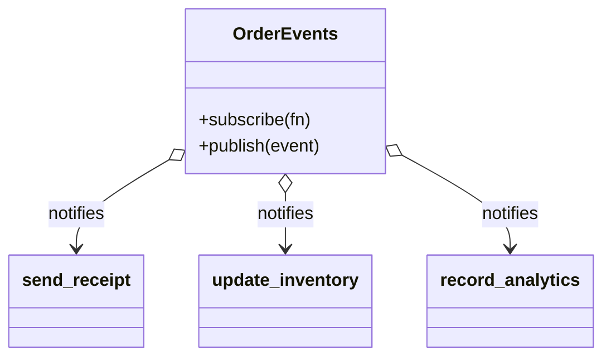
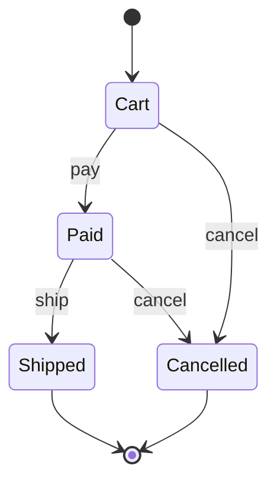
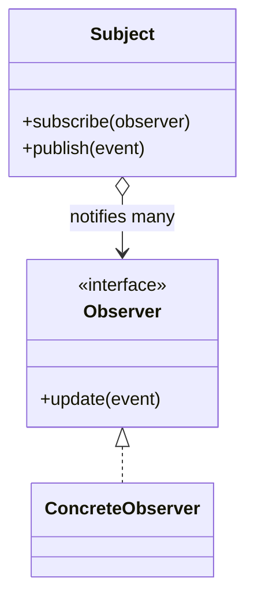
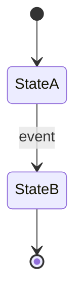

import { TabItem, Aside } from '@astrojs/starlight/components';
import LangTabs from '../../../components/LangTabs.astro';
import AICollab from '../../../components/AICollab.astro';
import VocabTable from '../../../components/VocabTable.astro';
import PromptCard from '../../../components/PromptCard.astro';
import TryIt from '../../../components/TryIt.astro';
import CheatSheet from '../../../components/CheatSheet.astro';

Both patterns in this chapter are about behavior that changes over time — but along
opposite axes. One pushes change *outward*; the other pulls behavior *inward*:

> **Observer** decouples *who reacts* when something happens — a one-to-many broadcast,
> triggered by an external **event**. **State** decouples *how an object behaves now* —
> one object that acts differently in each phase of its **lifecycle**.

Observer answers "something happened — who needs to know?" State answers "what am I
right now, and what may I do in this phase?"

## The Itch

checkout-lite has two pains that both come from change, pulling in different directions.

First, **the swelling flow**. The `place_order` function from Chapter 11 started as one
clean coordinator. Then every team bolted their reaction onto it — email the receipt,
decrement inventory, ping analytics, enqueue a fraud check — until the function knows
about four subsystems that have nothing to do with the act of placing an order:

<LangTabs>
  <TabItem label="Python">

```python
def place_order(order: Order) -> None:
    save(order)
    send_receipt(order)        # marketing's
    decrement_inventory(order) # warehouse's
    record_analytics(order)    # data team's
    enqueue_fraud_check(order) # risk's — and tomorrow, one more...
```

  </TabItem>
  <TabItem label="TypeScript">

```typescript
function placeOrder(order: Order): void {
  save(order);
  sendReceipt(order);        // marketing's
  decrementInventory(order); // warehouse's
  recordAnalytics(order);    // data team's
  enqueueFraudCheck(order);  // risk's — and tomorrow, one more...
}
```

  </TabItem>
</LangTabs>

Every new reaction edits the core flow, and a function that should say "place an order"
instead enumerates everyone who cares.

Second, **the lifecycle thicket**. An `Order` moves through phases — cart, paid, shipped,
delivered, cancelled — and the methods that move it are riddled with status checks:

<LangTabs>
  <TabItem label="Python">

```python
def ship(order: Order) -> None:
    if order.status == "paid":
        order.status = "shipped"
    elif order.status == "cart":
        raise ValueError("can't ship an unpaid order")
    elif order.status == "cancelled":
        raise ValueError("can't ship a cancelled order")
    # ...and cancel(), refund(), pay() each repeat this same fragile ladder
```

  </TabItem>
  <TabItem label="TypeScript">

```typescript
function ship(order: Order): void {
  if (order.status === "paid") {
    order.status = "shipped";
  } else if (order.status === "cart") {
    throw new Error("can't ship an unpaid order");
  } else if (order.status === "cancelled") {
    throw new Error("can't ship a cancelled order");
  }
  // ...and cancel(), refund(), pay() each repeat this same fragile ladder
}
```

  </TabItem>
</LangTabs>

The transition rules are smeared across every method, no single place says which moves
are legal, and nothing structurally *stops* you from shipping a cancelled order — only
your vigilance does.

## The Concept

### Observer — broadcast a change to whoever cares

The **Observer pattern** lets an object (the **subject**) maintain a list of dependents
(**observers**) and notify them automatically when something happens. The subject knows
*that* it must announce, never *who* is listening — observers subscribe and unsubscribe
on their own. This is **publish/subscribe** at codebase scale.



The flow publishes one `OrderPlaced` event; the subscribers fan out. Adding a fourth
reaction is one `subscribe()` call and zero edits to `place_order` — the open-closed
principle (Chapter 8) applied to *reactions*.

### State — be a different thing in each phase

The **State pattern** lets an object alter its behavior when its internal state changes,
by delegating the behavior to a separate **state object**. Each state is its own class
that knows two things: what it does, and which transitions out of it are legal. The
**context** (the `Order`) just forwards to its current state. The natural design artifact
is a state diagram:



Every arrow in that diagram is a legal transition; every *missing* arrow is one the
design should forbid. The State pattern makes the diagram executable: a transition that
isn't drawn simply isn't a method on that state, so it can't happen.

### Choosing between Observer and State

These two are rarely confused for each other — the value is seeing them as two answers to
"behavior that changes," chosen by *what* changes:

| | Observer | State |
|---|---|---|
| Trigger | An external **event** happened | The object's own **lifecycle** moved |
| Shape | **One-to-many** broadcast | **One** object, many behaviors |
| Decouples | *Who* reacts to a change | *How* an object behaves now |
| One-liner | "Tell whoever cares" | "Be a different thing in each phase" |

If the question is "who needs to know this happened?", reach for Observer. If it's "this
object should behave differently depending on what phase it's in," reach for State.

## Before / After

### Observer

#### Before

The tangle is `place_order` from [The Itch](#the-itch): the flow hardcodes every reaction.

<LangTabs>
  <TabItem label="Python">

```python
def place_order(order: Order) -> None:
    save(order)
    send_receipt(order)        # every reaction is wired into the core flow,
    decrement_inventory(order) # so each new one edits this function
    record_analytics(order)
```

  </TabItem>
  <TabItem label="TypeScript">

```typescript
function placeOrder(order: Order): void {
  save(order);
  sendReceipt(order);        // every reaction is wired into the core flow,
  decrementInventory(order); // so each new one edits this function
  recordAnalytics(order);
}
```

  </TabItem>
</LangTabs>

#### After

The flow publishes an event; reactions subscribe. `place_order` no longer names a single
subscriber, and a new reaction never touches it.

<LangTabs>
  <TabItem label="Python">

```python
from collections.abc import Callable
from dataclasses import dataclass

@dataclass(frozen=True)
class OrderPlaced:
    order_id: str
    total: float

Subscriber = Callable[[OrderPlaced], None]

class OrderEvents:                              # the subject
    def __init__(self) -> None:
        self._subscribers: list[Subscriber] = []
    def subscribe(self, subscriber: Subscriber) -> None:
        self._subscribers.append(subscriber)
    def publish(self, event: OrderPlaced) -> None:
        for subscriber in self._subscribers:
            subscriber(event)

def place_order(order_id: str, total: float, events: OrderEvents) -> OrderPlaced:
    event = OrderPlaced(order_id, total)
    events.publish(event)                       # announce; who listens isn't our concern
    return event

# wiring, done once at the edge — not inside place_order:
events = OrderEvents()
events.subscribe(send_receipt)
events.subscribe(update_inventory)
```

  </TabItem>
  <TabItem label="TypeScript">

```typescript
interface OrderPlaced {
  readonly orderId: string;
  readonly total: number;
}

type Subscriber = (event: OrderPlaced) => void;

class OrderEvents {                             // the subject
  private readonly subscribers: Subscriber[] = [];
  subscribe(subscriber: Subscriber): void {
    this.subscribers.push(subscriber);
  }
  publish(event: OrderPlaced): void {
    for (const subscriber of this.subscribers) subscriber(event);
  }
}

const placeOrder = (orderId: string, total: number, events: OrderEvents): OrderPlaced => {
  const event: OrderPlaced = { orderId, total };
  events.publish(event); // announce; who listens isn't our concern
  return event;
};

// wiring, done once at the edge — not inside placeOrder:
const events = new OrderEvents();
events.subscribe(sendReceipt);
events.subscribe(updateInventory);
```

  </TabItem>
</LangTabs>

### State

#### Before

The tangle is the status-string ladder from [The Itch](#the-itch), repeated in every
method that moves the order.

<LangTabs>
  <TabItem label="Python">

```python
def ship(order: Order) -> None:
    if order.status == "paid":
        order.status = "shipped"
    elif order.status == "cart":
        raise ValueError("can't ship an unpaid order")
    # ...the same ladder reappears in pay(), cancel(), refund()
```

  </TabItem>
  <TabItem label="TypeScript">

```typescript
function ship(order: Order): void {
  if (order.status === "paid") order.status = "shipped";
  else if (order.status === "cart") throw new Error("can't ship an unpaid order");
  // ...the same ladder reappears in pay(), cancel(), refund()
}
```

  </TabItem>
</LangTabs>

#### After

Each state is a class that allows only its legal transitions. The base state makes every
move illegal by default, so a state enables a transition simply by overriding it — and an
unlisted move raises automatically.

<LangTabs>
  <TabItem label="Python">

```python
class IllegalTransition(Exception): ...

class OrderState:                          # base: every move illegal by default
    name = "base"
    def pay(self, order: "Order") -> None:
        raise IllegalTransition(f"cannot pay from {self.name}")
    def ship(self, order: "Order") -> None:
        raise IllegalTransition(f"cannot ship from {self.name}")
    def cancel(self, order: "Order") -> None:
        raise IllegalTransition(f"cannot cancel from {self.name}")

class Cart(OrderState):
    name = "cart"
    def pay(self, order: "Order") -> None:
        order.state = Paid()               # the only legal moves from a cart:
    def cancel(self, order: "Order") -> None:
        order.state = Cancelled()          # pay or cancel

class Paid(OrderState):
    name = "paid"
    def ship(self, order: "Order") -> None:
        order.state = Shipped()
    def cancel(self, order: "Order") -> None:
        order.state = Cancelled()

class Shipped(OrderState):
    name = "shipped"                       # terminal: nothing overridden → all raise

class Cancelled(OrderState):
    name = "cancelled"                     # terminal

class Order:                               # the context: delegates to its state
    def __init__(self) -> None:
        self.state: OrderState = Cart()
    def pay(self) -> None: self.state.pay(self)
    def ship(self) -> None: self.state.ship(self)
    def cancel(self) -> None: self.state.cancel(self)
    @property
    def status(self) -> str: return self.state.name
```

  </TabItem>
  <TabItem label="TypeScript">

```typescript
class IllegalTransition extends Error {}

interface OrderState {
  readonly name: string;
  pay(order: Order): void;
  ship(order: Order): void;
  cancel(order: Order): void;
}

abstract class BaseState implements OrderState {  // base: every move illegal by default
  abstract readonly name: string;
  pay(_order: Order): void { throw new IllegalTransition(`cannot pay from ${this.name}`); }
  ship(_order: Order): void { throw new IllegalTransition(`cannot ship from ${this.name}`); }
  cancel(_order: Order): void { throw new IllegalTransition(`cannot cancel from ${this.name}`); }
}

class Cart extends BaseState {
  readonly name = "cart";
  override pay(order: Order): void { order.state = new Paid(); }      // the only legal
  override cancel(order: Order): void { order.state = new Cancelled(); } // moves from a cart
}

class Paid extends BaseState {
  readonly name = "paid";
  override ship(order: Order): void { order.state = new Shipped(); }
  override cancel(order: Order): void { order.state = new Cancelled(); }
}

class Shipped extends BaseState { readonly name = "shipped"; }   // terminal → all throw
class Cancelled extends BaseState { readonly name = "cancelled"; }

class Order {                                  // the context: delegates to its state
  state: OrderState = new Cart();
  pay(): void { this.state.pay(this); }
  ship(): void { this.state.ship(this); }
  cancel(): void { this.state.cancel(this); }
  get status(): string { return this.state.name; }
}
```

  </TabItem>
</LangTabs>

Shipping a cart no longer needs a guard clause — `Cart` simply has no `ship`, so it
inherits the base's refusal. The legal transitions *are* the overridden methods; the
state diagram and the code can't drift apart. The full code, with tests proving the
broadcast reaches every subscriber and the lifecycle rejects illegal moves, is in
`examples/ch14/py/` and `examples/ch14/ts/`.

## Language Notes

Both patterns have a heavyweight classical form and a much lighter idiomatic one — and in
both languages the lightweight form is what you should usually reach for.

<LangTabs>
  <TabItem label="Python">

**Observer is just a list of callables.** Python has first-class functions, so you almost
never need an `Observer` base class with an `update()` method — a subscriber is any
`Callable`, and the registry is a plain `list`. That is exactly the `examples/ch14/py`
design: `subscribe` appends a function, `publish` calls each one.

**State has an `Enum` + `match` form.** When states carry no behavior of their own and you
just need legal transitions, a class per state can be more ceremony than the problem
deserves. Model the states as an `Enum` and the transition table as a `match`:

```python
from enum import Enum, auto

class Status(Enum):
    CART = auto(); PAID = auto(); SHIPPED = auto(); CANCELLED = auto()

def ship(status: Status) -> Status:
    match status:
        case Status.PAID:
            return Status.SHIPPED
        case _:
            raise IllegalTransition(f"cannot ship from {status.name}")
```

Reach for the **class-per-state** form when each state owns real behavior or data (a
`Paid` state that holds the transaction id, a `Shipped` state that computes a tracking
ETA). Reach for **`Enum` + `match`** when the states are just labels and only the
transitions vary.

  </TabItem>
  <TabItem label="TypeScript">

**Observer is just an array of functions.** TypeScript's structural typing means a
subscriber is any value of type `(event: E) => void` — no `Observer` interface to
implement, no `update()` method to name. The browser's own `EventTarget`/`addEventListener`
is this pattern in the platform; for codebase-scale events, the array-of-callbacks in
`examples/ch14/ts` is usually all you need.

**State has a discriminated-union form.** When states are labels rather than
behavior-rich objects, model them as a discriminated union and the transition as a
function with an exhaustive `switch`. The compiler enforces totality through a `never`
check — add a state and forget a case, and the build fails:

```typescript
type Status = "cart" | "paid" | "shipped" | "cancelled";

function ship(status: Status): Status {
  switch (status) {
    case "paid":
      return "shipped";
    default:
      throw new IllegalTransition(`cannot ship from ${status}`);
  }
}
```

Reach for the **class-per-state** form when a state owns behavior or data; reach for the
**union + `switch`** when the states are just labels — the same decision rule as Python,
made by the design rather than the syntax.

  </TabItem>
</LangTabs>

## When NOT to Use

<Aside type="caution" title="Right-sizing">
Both patterns add indirection, and both have a clear over-application failure mode.

**Observer.** Don't introduce publish/subscribe for a single, known caller. If exactly
one thing reacts and always will, just *call it* — an event bus for one subscriber turns
a readable function call into an un-greppable "who handles `OrderPlaced`?" mystery. The
pattern earns its place when reactions are *several and open-ended*. And beware the global
event bus that becomes a dumping ground: when everything publishes and everything
subscribes, control flow vanishes into the wiring.

**State.** Two stable states do not need a class hierarchy. An on/off toggle is a boolean,
not a `StateOn`/`StateOff` pair. The State pattern pays rent when transitions are *many*
and the illegal ones must be *impossible*, not merely discouraged. Below that bar, a
status field and a couple of guard clauses are the honest, right-sized design (Chapter 9).
</Aside>

## 🤖 AI Collaboration

An agent reaches for the heavyweight form of both patterns by reflex — a full `EventBus`
framework for two listeners, a class per state for an on/off flag. It also tends to leave
the *old* mechanism in place beside the new one. Your review job: check the weight, and
check that the thing you replaced is actually gone.

<AICollab>

### Vocabulary

<VocabTable>

| You say | The agent hears |
|---|---|
| "Make this Observer / publish-subscribe" | A subject holds subscribers and notifies them; callers subscribe, the subject doesn't know who |
| "Subscribers are just callables" | No Observer base class — a list of functions (Python) / array of callbacks (TS) |
| "Model the lifecycle with the State pattern" | One class per state, each owning its legal transitions; the context delegates |
| "Illegal transitions should be impossible" | A move that isn't legal from a state isn't a method on it — it raises, not silently passes |
| "Use enum + match / a discriminated union instead" | States are labels; a transition table, not a class hierarchy |
| "Don't add an event bus for one listener" | Keep the direct call; reach for Observer only when reactions are many |

</VocabTable>

### Prompt templates

<PromptCard title="Observer for a swelling flow">

`[place_order]` hardcodes a growing list of side-effects. Refactor to the **Observer
pattern**: the flow publishes one `[OrderPlaced]` event; each reaction becomes a
subscriber registered at the edge. Subscribers are **plain functions** (a list of
callables / array of callbacks) — no `Observer` base class. `[place_order]` must not name
any individual subscriber after the refactor.

</PromptCard>

<PromptCard title="State for a lifecycle thicket">

The `[Order]` lifecycle is enforced by `status`-string `if`-ladders repeated across
methods. Refactor to the **State pattern**: one class per state, a base state where every
transition is illegal by default, and each state overriding only its legal moves. Illegal
transitions must **raise**, not fall through. Delete the old `status` ladders — don't
leave them beside the new states.

</PromptCard>

<PromptCard title="Right-size it first">

Before coding: how many things react to `[this event]`, and how many states does
`[this object]` really have? If one known caller reacts, keep the direct call. If there
are two stable states, keep a boolean and a guard. Answer in two sentences, then
recommend Observer, State, or neither.

</PromptCard>

### Review checklist

- [ ] Observer: the subject holds a list of subscribers and **doesn't name** any of them
- [ ] Subscribers are **plain functions** unless one genuinely needs state/multiple methods
- [ ] The published flow no longer hardcodes individual reactions
- [ ] State: one state per class (or enum/union case); the **context delegates**, no `status` ladder left behind
- [ ] Illegal transitions **raise** — they are not methods that quietly do nothing
- [ ] Neither pattern was added below its threshold (one subscriber; two stable states)

### Agent failure modes

- **The framework for two listeners.** Asked for Observer, the agent writes an `EventBus`
  with topics, priorities, and async dispatch — for two synchronous reactions.
- **The double source of truth.** The new states (or event) are added, but the old
  `status` ladder / inline side-effects survive alongside them. Check the old path is gone.
- **The class-per-state for a boolean.** A `StateOn`/`StateOff` hierarchy where a flag and
  a guard would do.
- **Silent illegal transitions.** A state "handles" a move it shouldn't allow by doing
  nothing, instead of raising — the bug the State pattern was supposed to prevent.

</AICollab>

<TryIt starter="examples/ch14/py/order_state.py">

Take a class in your own code that carries a `status`/`kind`/`mode` string and branches on
it in several methods (a job runner, a connection, a document). Run the **"State for a
lifecycle thicket"** prompt, then grade the result with the checklist — especially: did
illegal transitions become impossible, and did the agent delete the old string-branching?
Then find a function that has accreted side-effects and run the **Observer** prompt on it.
Our worked event subject, lifecycle states, and the lightweight `enum`/union forms are in
`examples/ch14/py/` (starters: `order_state.py`, `events.py`) and `examples/ch14/ts/`.

</TryIt>

## Pattern Cheat Sheet

<CheatSheet pattern="Observer">



**Intent:** define a one-to-many dependency so that when one object changes state, all its
dependents are notified automatically — without it knowing who they are.

<LangTabs>
  <TabItem label="Python">

**Canonical** — the form your agent emits:

```python
class Subject:
    def __init__(self) -> None:
        self._observers: list[Observer] = []
    def subscribe(self, o: Observer) -> None:
        self._observers.append(o)
    def publish(self, event) -> None:
        for o in self._observers:
            o.update(event)
```

**Pythonic** — a subscriber is just a callable; the registry is a list:

```python
subscribers: list[Callable[[Event], None]] = []
subscribers.append(send_receipt)          # any function will do
for fn in subscribers: fn(event)
```

  </TabItem>
  <TabItem label="TypeScript">

**Canonical** — the form your agent emits:

```typescript
class Subject {
  private readonly observers: Observer[] = [];
  subscribe(o: Observer): void { this.observers.push(o); }
  publish(event: Event): void { for (const o of this.observers) o.update(event); }
}
```

**Idiomatic** — a subscriber is a function; the registry is an array:

```typescript
const subscribers: Array<(e: Event) => void> = [];
subscribers.push(sendReceipt);            // any function will do
for (const fn of subscribers) fn(event);
```

  </TabItem>
</LangTabs>

**Reach for it when** several open-ended reactions follow one event ·
**not when** a single known caller reacts (just call it) or control flow must stay obvious.
Runnable: `examples/ch14/py/concept_observer.py` · `examples/ch14/ts/conceptObserver.ts`.

</CheatSheet>

<CheatSheet pattern="State">



**Intent:** let an object change its behavior when its internal state changes, by
delegating to a state object — so each phase owns its behavior and its legal transitions.

<LangTabs>
  <TabItem label="Python">

**Canonical** — a class per state; the context delegates:

```python
class State(ABC):
    @abstractmethod
    def handle(self, ctx: "Context") -> str: ...

class Active(State):
    def handle(self, ctx: "Context") -> str:
        ctx.state = Done(); return "active->done"

class Context:
    def __init__(self) -> None: self.state: State = Active()
    def request(self) -> str: return self.state.handle(self)
```

**Pythonic** — for label-only states, an `Enum` + `match` transition table:

```python
def ship(status: Status) -> Status:
    match status:
        case Status.PAID: return Status.SHIPPED
        case _: raise IllegalTransition(status.name)
```

  </TabItem>
  <TabItem label="TypeScript">

**Canonical** — a class per state; the context delegates:

```typescript
interface State { handle(ctx: Context): string; }

class Active implements State {
  handle(ctx: Context): string { ctx.state = new Done(); return "active->done"; }
}

class Context {
  state: State = new Active();
  request(): string { return this.state.handle(this); }
}
```

**Idiomatic** — for label-only states, a union + exhaustive `switch`:

```typescript
function ship(s: Status): Status {
  switch (s) {
    case "paid": return "shipped";
    default: throw new IllegalTransition(s);
  }
}
```

  </TabItem>
</LangTabs>

**Reach for it when** transitions are many and illegal ones must be impossible ·
**not when** there are two stable states (a boolean and a guard suffice).
Runnable: `examples/ch14/py/concept_state.py` · `examples/ch14/ts/conceptState.ts`.

</CheatSheet>

## Key Takeaways

- **Observer** and **State** both model behavior that changes over time, on opposite axes:
  Observer broadcasts an **event** to *whoever cares*; State makes one object **behave
  differently in each phase** of its life.
- Observer decouples *who reacts* — the subject holds subscribers and never names them, so
  a new reaction is one `subscribe()` and zero edits to the flow (open-closed for
  reactions).
- State decouples *how an object behaves now* — each state owns its legal transitions, so
  the illegal ones become **impossible** rather than guarded against. A `stateDiagram` is
  its blueprint.
- Both have a lightweight idiomatic form: a **list/array of callables** for Observer, and
  **`enum` + `match` / a discriminated union** for label-only State. Reach for classes only
  when subscribers or states carry real behavior.
- Right-size both: no event bus for one listener; no class-per-state for a boolean.
- **Glossary terms added:** *Observer pattern · publish/subscribe (event) · State pattern ·
  explicit state machine.*
