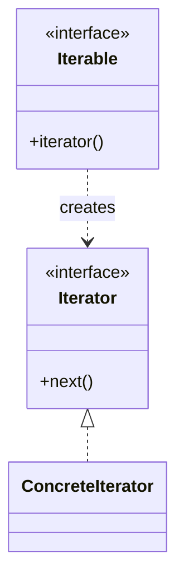
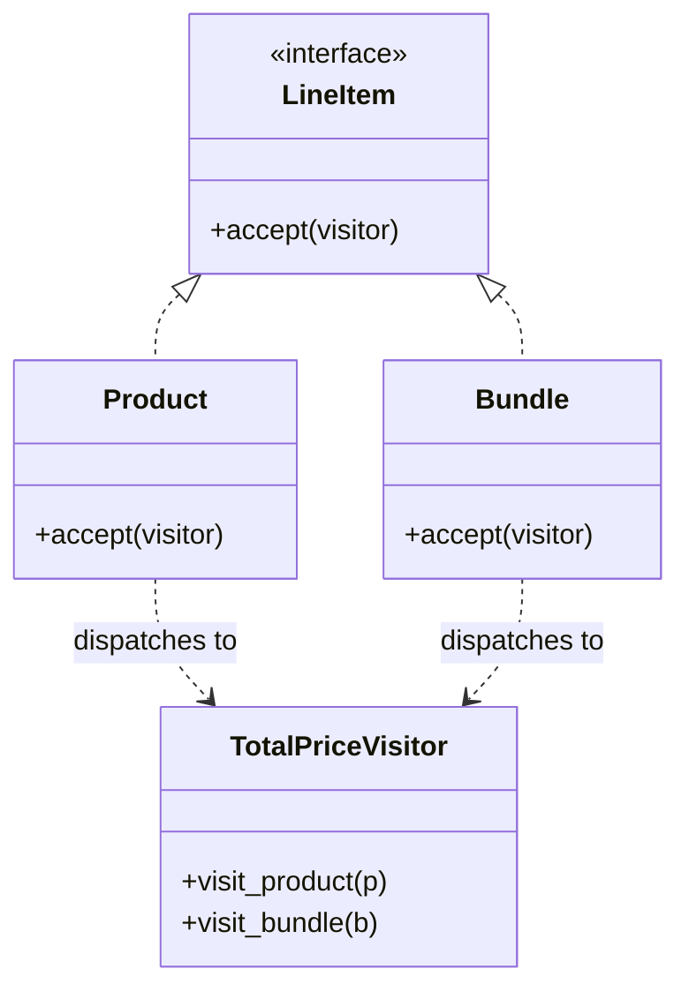
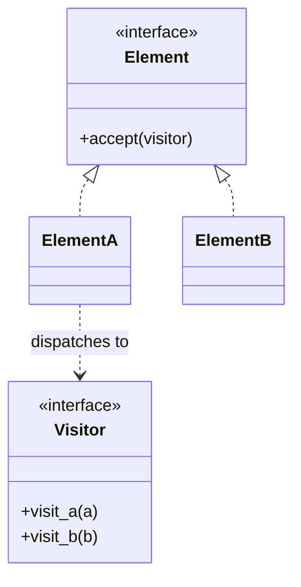

import { TabItem, Aside } from '@astrojs/starlight/components';
import LangTabs from '../../../components/LangTabs.astro';
import AICollab from '../../../components/AICollab.astro';
import VocabTable from '../../../components/VocabTable.astro';
import PromptCard from '../../../components/PromptCard.astro';
import TryIt from '../../../components/TryIt.astro';
import CheatSheet from '../../../components/CheatSheet.astro';

These two patterns close Part III, and they share an unusual property: the language has
*absorbed* most of them. Both are still worth knowing — not so you'll hand-build the
classical form, but so you'll recognize it when your agent does, and reach for the
idiomatic replacement instead.

> **Iterator** decouples *how you traverse* a collection from the collection itself.
> **Visitor** decouples *operations on a structure* from the structure's element types.

Both separate something from the data it runs over — and both have a modern, lighter
answer your language hands you: generators for Iterator, structural matching for Visitor.

## The Itch

checkout-lite has two traversal pains.

First, **a leaky container**. The `Catalog` exposes its storage so callers can loop over
products — which means every caller depends on the storage being a list, and any change to
how the catalog holds its data ripples outward:

<LangTabs>
  <TabItem label="Python">

```python
class Catalog:
    def __init__(self, products: list[Product]) -> None:
        self._products = products
    def get_items(self) -> list[Product]:
        return self._products          # hands out the internal list

for product in catalog.get_items():    # callers reach through the container
    ...
```

  </TabItem>
  <TabItem label="TypeScript">

```typescript
class Catalog {
  constructor(private products: Product[]) {}
  getItems(): Product[] {
    return this.products;              // hands out the internal array
  }
}

for (const product of catalog.getItems()) { // callers reach through the container
  // ...
}
```

  </TabItem>
</LangTabs>

Second, **a method per operation on a tree**. Reusing the Composite line-item tree from
Chapter 12 (`Product` leaves, `Bundle` composites), every new thing you want to compute
over the tree — total price, item count, a tax report, a JSON export — means adding a
method to *every* node class. The structure gets edited each time an operation is added:

<LangTabs>
  <TabItem label="Python">

```python
class Bundle(LineItem):
    def price(self) -> float: ...      # added last quarter
    def count(self) -> int: ...        # added this quarter
    def to_json(self) -> dict: ...      # added today — editing every node again
```

  </TabItem>
  <TabItem label="TypeScript">

```typescript
class Bundle implements LineItem {
  price(): number { /* ... */ }        // added last quarter
  count(): number { /* ... */ }        // added this quarter
  toJson(): object { /* ... */ }       // added today — editing every node again
}
```

  </TabItem>
</LangTabs>

One itch is about *getting through* a collection without coupling to it; the other is about
*adding operations* to a structure without editing it.

## The Concept

### Iterator — traverse without exposing the container

The **Iterator pattern** provides a way to access the elements of a collection
sequentially without exposing its underlying representation. The collection hands out an
iterator — an object that knows how to produce the next element — so callers loop without
ever touching the storage.



Both languages have this protocol built in — `for x in collection` (Python) and
`for (const x of collection)` (TypeScript) ask the collection for an iterator behind the
scenes. The pattern is so thoroughly absorbed that the idiomatic form is rarely a hand-
written iterator class at all.

### Visitor — add operations without editing the structure

The **Visitor pattern** lets you define a new operation over a set of element types
*without changing those types*. Each element exposes an `accept(visitor)` method that calls
back the visitor's type-specific method — a technique called **double dispatch**: the call
resolves on both the element's type and the visitor's.



Now a new operation is a new visitor class, and the node types are never touched. The
trade-off — and it's the crux of the chapter's *When NOT* — is the **Expression Problem**:
Visitor makes adding *operations* cheap but adding *node types* expensive (every visitor
must grow a new method).

### Choosing between Iterator and Visitor

Both decouple something from a structure; they're chosen by *what* you're separating:

| | Iterator | Visitor |
|---|---|---|
| Separates | **Traversal** from the collection | **Operations** from the element types |
| Lets you vary | How you walk / what storage backs it | What you compute, without editing nodes |
| Modern form | A **generator** (`yield` / `function*`) | A **`match` / discriminated-union `switch`** |
| Trigger | "I want to loop without leaking storage" | "I want to add operations without touching the elements" |

If you're walking elements one at a time, it's Iterator. If you're applying a growing set
of operations across a fixed set of types, it's Visitor.

## Before / After

### Iterator

#### Before

The tangle is the leaky `get_items()` from [The Itch](#the-itch): the container hands out
its storage.

<LangTabs>
  <TabItem label="Python">

```python
class Catalog:
    def get_items(self) -> list[Product]:
        return self._products    # callers now depend on it being a list
```

  </TabItem>
  <TabItem label="TypeScript">

```typescript
class Catalog {
  getItems(): Product[] {
    return this.products;        // callers now depend on it being an array
  }
}
```

  </TabItem>
</LangTabs>

#### After

The catalog becomes *iterable* — callers loop over it directly, knowing nothing about its
storage — and a generator streams batches lazily instead of building them all at once.

<LangTabs>
  <TabItem label="Python">

```python
from collections.abc import Iterator

class Catalog:
    def __init__(self, products: list[Product]) -> None:
        self._products = products
    def __iter__(self) -> Iterator[Product]:
        return iter(self._products)      # expose iteration, not the list

def paged(products: list[Product], size: int) -> Iterator[list[Product]]:
    for start in range(0, len(products), size):
        yield products[start : start + size]   # a generator: lazy, one batch at a time

for product in catalog:                  # no get_items(); storage stays private
    ...
```

  </TabItem>
  <TabItem label="TypeScript">

```typescript
class Catalog implements Iterable<Product> {
  constructor(private readonly products: Product[]) {}
  [Symbol.iterator](): Iterator<Product> {
    return this.products[Symbol.iterator](); // expose iteration, not the array
  }
}

function* paged(products: Product[], size: number): Generator<Product[]> {
  for (let start = 0; start < products.length; start += size) {
    yield products.slice(start, start + size); // a generator: lazy, one batch at a time
  }
}

for (const product of catalog) {         // no getItems(); storage stays private
  // ...
}
```

  </TabItem>
</LangTabs>

### Visitor

#### Before

The tangle is a method per operation, bolted onto every node — editing the structure each
time a new computation is wanted.

<LangTabs>
  <TabItem label="Python">

```python
class Product(LineItem):
    def price(self) -> float: ...
    def count(self) -> int: ...    # every new operation edits Product AND Bundle
class Bundle(LineItem):
    def price(self) -> float: ...
    def count(self) -> int: ...
```

  </TabItem>
  <TabItem label="TypeScript">

```typescript
class Product implements LineItem {
  price(): number { /* ... */ }
  count(): number { /* ... */ }    // every new operation edits Product AND Bundle
}
class Bundle implements LineItem {
  price(): number { /* ... */ }
  count(): number { /* ... */ }
}
```

  </TabItem>
</LangTabs>

#### After

Each node implements one `accept`; operations move out into visitors. Adding "count items"
is a new visitor class, and `Product`/`Bundle` are never touched again.

<LangTabs>
  <TabItem label="Python">

```python
from typing import Generic, TypeVar
T = TypeVar("T")

class LineItemVisitor(ABC, Generic[T]):
    @abstractmethod
    def visit_product(self, product: "Product") -> T: ...
    @abstractmethod
    def visit_bundle(self, bundle: "Bundle") -> T: ...

class Product(LineItem):
    def accept(self, visitor: LineItemVisitor[T]) -> T:
        return visitor.visit_product(self)   # double dispatch: type + visitor

class Bundle(LineItem):
    def accept(self, visitor: LineItemVisitor[T]) -> T:
        return visitor.visit_bundle(self)

class TotalPriceVisitor(LineItemVisitor[float]):
    def visit_product(self, product: "Product") -> float:
        return product.price
    def visit_bundle(self, bundle: "Bundle") -> float:
        return sum(item.accept(self) for item in bundle.items)

# a new operation = a new visitor; the nodes never change:
class CountItemsVisitor(LineItemVisitor[int]):
    def visit_product(self, product: "Product") -> int: return 1
    def visit_bundle(self, bundle: "Bundle") -> int:
        return sum(item.accept(self) for item in bundle.items)
```

  </TabItem>
  <TabItem label="TypeScript">

```typescript
interface LineItemVisitor<T> {
  visitProduct(product: Product): T;
  visitBundle(bundle: Bundle): T;
}

class Product implements LineItem {
  constructor(readonly name: string, readonly price: number) {}
  accept<T>(visitor: LineItemVisitor<T>): T {
    return visitor.visitProduct(this);       // double dispatch: type + visitor
  }
}

class Bundle implements LineItem {
  constructor(readonly name: string, readonly items: LineItem[] = []) {}
  accept<T>(visitor: LineItemVisitor<T>): T {
    return visitor.visitBundle(this);
  }
}

class TotalPriceVisitor implements LineItemVisitor<number> {
  visitProduct(product: Product): number { return product.price; }
  visitBundle(bundle: Bundle): number {
    return bundle.items.reduce((sum, item) => sum + item.accept(this), 0);
  }
}

// a new operation = a new visitor; the nodes never change:
class CountItemsVisitor implements LineItemVisitor<number> {
  visitProduct(_product: Product): number { return 1; }
  visitBundle(bundle: Bundle): number {
    return bundle.items.reduce((sum, item) => sum + item.accept(this), 0);
  }
}
```

  </TabItem>
</LangTabs>

That `accept`/`visit_*` ceremony is exactly what the modern replacement removes — see the
Language Notes. The full code, with both visitors walking one shared Chapter-12 tree and
the structural-match replacement agreeing with them, is in `examples/ch15/py/` and
`examples/ch15/ts/`.

## Language Notes

This is the chapter where "the language gives it to you" is the whole point: both patterns
have idiomatic replacements that you should reach for first.

<LangTabs>
  <TabItem label="Python">

**Iterator is a generator.** You almost never write `__next__`. A function with `yield`
*is* an iterator — it produces values lazily, remembers where it left off, and stops when
it returns. `paged()` above is the idiomatic Iterator; a hand-written iterator class is a
smell unless you need iteration state that a generator genuinely can't express. (`yield
from` delegates to a sub-iterator, which is how you flatten nested structures cleanly.)

**Visitor is structural `match`.** Since 3.10, structural pattern matching replaces most
double dispatch with a single function — no `accept`, no `visit_*`, no visitor classes:

```python
def total(item: LineItem) -> float:
    match item:
        case Product(price=price):
            return price
        case Bundle(items=items):
            return sum(total(child) for child in items)
    raise TypeError(f"unknown line item: {item!r}")
```

This inverts the Expression Problem: `match` makes adding *operations* trivial (write
another function) but offers no compiler help when you add a *node type* — you must
remember to update each `match`. Classical Visitor is the opposite trade. Choose by which
axis actually changes in your code.

  </TabItem>
  <TabItem label="TypeScript">

**Iterator is a generator.** A `function*` produces an iterator with `yield`; an object
becomes iterable by implementing `[Symbol.iterator]`. `paged()` above is the idiomatic
form. Hand-writing `{ next() {...} }` (as the conceptual example does, to show the
protocol) is something you'll almost never need in real code — reach for `function*`.

**Visitor is a discriminated union + exhaustive `switch`.** Model the nodes as a union
with a `kind` tag, and write operations as functions. The compiler turns the Expression
Problem into a *feature*: a `never` check makes a missed case a **compile error**:

```typescript
type Node =
  | { readonly kind: "product"; readonly price: number }
  | { readonly kind: "bundle"; readonly items: readonly Node[] };

function total(node: Node): number {
  switch (node.kind) {
    case "product": return node.price;
    case "bundle":  return node.items.reduce((s, c) => s + total(c), 0);
    default: {
      const _exhaustive: never = node;   // add a node kind, forget a case → build fails
      return _exhaustive;
    }
  }
}
```

Adding an *operation* is a new function; adding a *node kind* makes every `switch` fail to
compile until you handle it — the type checker enforcing the very completeness classical
Visitor relied on convention for.

  </TabItem>
</LangTabs>

## When NOT to Use

<Aside type="caution" title="Right-sizing">
These two are over-built more often than almost any other pattern, precisely because the
language already provides them.

**Iterator.** Don't hand-write an iterator class when a generator or the built-in protocol
does the job — a `class CatalogIterator` with `__next__`/`next()` beside a plain list is
pure ceremony. And don't make something iterable that isn't conceptually a sequence; not
every object should answer `for x in it`.

**Visitor.** The classical double-dispatch form is overkill for most codebases — a `match`
or a discriminated-union `switch` is lighter and clearer. Reserve real Visitor for the case
that genuinely fits it: a **stable set of node types** with a **growing set of operations**,
where each operation wants to live in one place (a compiler's AST is the textbook example).
If your *types* change more often than your operations, Visitor makes every change worse —
use the structural replacement, or reconsider whether you need either.
</Aside>

## 🤖 AI Collaboration

These are the patterns where an agent most reliably *over-builds*: ask it to iterate and it
writes an iterator class; ask it to operate over a tree and it generates the full Visitor
double-dispatch scaffold. Your review job is mostly subtraction — is the language feature
the better answer here?

<AICollab>

### Vocabulary

<VocabTable>

| You say | The agent hears |
|---|---|
| "Make this iterable" | Implement the iteration protocol (`__iter__` / `[Symbol.iterator]`); don't expose the storage |
| "Use a generator" | `yield` / `function*` — lazy, stateful traversal, no iterator class |
| "Don't hand-write an iterator class" | The built-in protocol or a generator is enough here |
| "Add this operation with a Visitor" | Move the operation out of the node types via `accept` + double dispatch |
| "Use structural match / a discriminated union instead" | One function over a tagged union; skip the visitor classes |
| "The types are stable; operations grow" | Visitor fits (Expression Problem); otherwise prefer match |

</VocabTable>

### Prompt templates

<PromptCard title="Iterator via the language, not a class">

`[Catalog]` exposes its internal list through `[get_items]`. Make it **iterable** using the
language protocol (`__iter__` in Python / `[Symbol.iterator]` in TypeScript) so callers
loop over it without seeing the storage, and add a **generator** that streams results in
batches. Do **not** hand-write an iterator class with an explicit `next`.

</PromptCard>

<PromptCard title="Operations over a tree — pick the right form">

I need to add operations (total, count, export) over the `[Product]`/`[Bundle]` tree
without editing the node classes for each one. Show **two** options: (a) the classical
**Visitor** with `accept` + double dispatch, and (b) the **structural replacement**
(`match` in Python / a discriminated-union `switch` in TypeScript). Recommend one for a
codebase where **operations grow but node types are stable**, in three sentences.

</PromptCard>

<PromptCard title="Resist the scaffold">

Before generating a Visitor: do the node **types** change more often than the
**operations**? If types change more, don't use Visitor — use `match`/`switch`. If you do
use Visitor, no `Element` framework beyond `accept` and the visitor interface. State your
choice and why in two sentences first.

</PromptCard>

### Review checklist

- [ ] Iterator: uses the **built-in protocol or a generator** — no hand-rolled iterator class unless truly needed
- [ ] The container **doesn't hand out its storage** (no `return self._list`)
- [ ] Generators are used for **lazy** traversal where the whole sequence isn't needed at once
- [ ] Visitor: chosen only when **types are stable and operations grow**; otherwise `match`/`switch`
- [ ] The node types are **not edited** to add an operation (that was the point)
- [ ] TypeScript: the union `switch` has a `never` **exhaustiveness check**

### Agent failure modes

- **The hand-rolled iterator.** A full `__iter__`/`__next__` (or `{ next() }`) class where
  `yield` / the built-in protocol would do.
- **The leaky fix.** "Iterable" is added but `get_items()` still returns the internal list
  beside it.
- **The Visitor scaffold for a `match`.** Full double-dispatch ceremony where a single
  structural-match function is lighter and clearer.
- **Visitor against the grain.** Visitor chosen when node *types* are what's growing, so
  every new type forces edits to every visitor — the Expression Problem on the wrong side.

</AICollab>

<TryIt starter="examples/ch15/py/visitor.py">

Take a custom collection class in your code that exposes its contents through a getter, and
run the **"Iterator via the language"** prompt — then check the storage is no longer
handed out and that a generator appeared where laziness helps. Next, point your agent at a
small tree or shape hierarchy and run the **"Operations over a tree"** prompt to see the
classical Visitor and the `match`/`switch` replacement side by side; decide which axis
(types vs operations) is really changing in your code. Our worked catalog, the Chapter-12
tree under both a Visitor and structural matching, and the conceptual skeletons are in
`examples/ch15/py/` (starters: `visitor.py`, `catalog.py`) and `examples/ch15/ts/`.

</TryIt>

## Pattern Cheat Sheet

<CheatSheet pattern="Iterator">


**Intent:** access the elements of a collection sequentially without exposing its
underlying representation.

<LangTabs>
  <TabItem label="Python">

**Canonical** — the form your agent emits:

```python
class CountUp:
    def __init__(self, limit: int) -> None:
        self._limit, self._n = limit, 0
    def __iter__(self) -> "CountUp": return self
    def __next__(self) -> int:
        if self._n >= self._limit: raise StopIteration
        self._n += 1
        return self._n
```

**Pythonic** — a generator is the same protocol with `yield`:

```python
def count_up(limit: int):
    for n in range(1, limit + 1):
        yield n
```

  </TabItem>
  <TabItem label="TypeScript">

**Canonical** — the form your agent emits:

```typescript
class CountUp implements Iterable<number> {
  constructor(private readonly limit: number) {}
  [Symbol.iterator](): Iterator<number> {
    let n = 0; const limit = this.limit;
    return { next: () => n < limit ? { done: false, value: ++n } : { done: true, value: undefined } };
  }
}
```

**Idiomatic** — a generator function:

```typescript
function* countUp(limit: number): Generator<number> {
  for (let n = 1; n <= limit; n++) yield n;
}
```

  </TabItem>
</LangTabs>

**Reach for it when** callers must traverse without coupling to storage ·
**not when** a generator or the built-in protocol already does it (almost always).
Runnable: `examples/ch15/py/concept_iterator.py` · `examples/ch15/ts/conceptIterator.ts`.

</CheatSheet>

<CheatSheet pattern="Visitor">



**Intent:** represent an operation to be performed over a set of element types, so you can
add operations without changing the types (double dispatch).

<LangTabs>
  <TabItem label="Python">

**Canonical** — `accept` + double dispatch:

```python
class ElementA(Element):
    def accept(self, v: Visitor) -> str: return v.visit_a(self)

class NameVisitor(Visitor):
    def visit_a(self, e: "ElementA") -> str: return "A"
    def visit_b(self, e: "ElementB") -> str: return "B"
```

**Pythonic** — structural `match` replaces most visitors:

```python
def name(e) -> str:
    match e:
        case ElementA(): return "A"
        case ElementB(): return "B"
```

  </TabItem>
  <TabItem label="TypeScript">

**Canonical** — `accept` + double dispatch:

```typescript
class ElementA implements Element {
  accept<T>(v: Visitor<T>): T { return v.visitA(this); }
}

class NameVisitor implements Visitor<string> {
  visitA(_e: ElementA): string { return "A"; }
  visitB(_e: ElementB): string { return "B"; }
}
```

**Idiomatic** — a discriminated-union `switch` with a `never` check:

```typescript
function name(e: Element): string {
  switch (e.kind) {
    case "a": return "A";
    case "b": return "B";
    default: { const _x: never = e; return _x; }
  }
}
```

  </TabItem>
</LangTabs>

**Reach for it when** node types are stable and operations grow (Expression Problem) ·
**not when** types change more than operations, or a `match`/`switch` is enough (usually).
Runnable: `examples/ch15/py/concept_visitor.py` · `examples/ch15/ts/conceptVisitor.ts`.

</CheatSheet>

## Key Takeaways

- **Iterator** and **Visitor** both separate something from a structure — traversal from
  the collection, operations from the element types — and both are *mostly absorbed into
  the language*.
- The idiomatic **Iterator** is a **generator** (`yield` / `function*`) or the built-in
  protocol; a hand-written iterator class is almost always over-engineering. Don't let a
  container hand out its storage.
- The idiomatic **Visitor** is **structural `match`** (Python) or a **discriminated-union
  `switch` with a `never` check** (TypeScript). Classical double dispatch is reserved for a
  stable set of types with a growing set of operations.
- The **Expression Problem** is the deciding lens: Visitor (and `match`) make adding
  *operations* easy; adding *types* is the cost. TypeScript's `never` check turns that cost
  into a compile-time guarantee.
- These are the patterns to *recognize and simplify* in agent output more than to build —
  the review is mostly subtraction.
- **Glossary terms added:** *Iterator protocol · generator · Visitor pattern · structural
  pattern matching.*
